# DevOps项目实战

## **一、**DevOps介绍

软件开发最开始是由两个团队组成：

- 开发计划由开发团队从头开始设计和整体系统的构建。需要系统不停的迭代更新。

- 运维团队将开发团队的Code进行测试后部署上线。希望系统稳定安全运行。

这看似两个目标不同的团队需要协同完成一个软件的开发。

在开发团队指定好计划并完成coding后，需要提供到运维团队。

运维团队向开发团队反馈需要修复的BUG以及一些需要返工的任务。

这时开发团队需要经常等待运维团队的反馈。这无疑延长了事件并推迟了整个软件开发的周期。

会有一种方式，在开发团队等待的时候，让开发团队转移到下一个项目中。等待运维团队为之前的代码提供反馈。

可是这样就意味着一个完整的项目需要一个更长的周期才可以开发出最终代码。

基于现在的互联网现状，更推崇敏捷式开发，这样就导致项目的迭代速度更快，但是由于开发团队与运维团队的沟通问题，会导致新版本上线的时间成本很高。这又违背的敏捷式开发的最初的目的。

那么如果让开发团队和运维团队整合到成一个团队，协同应对一套软件呢？这就被称为DevOps。

DevOps，字面意思是Development &Operations的缩写，也就是开发&运维。

虽然字面意思只涉及到了开发团队和运维团队，其实QA测试团队也是参与其中的。

网上可以查看到DevOps的符号类似于一个无穷大的符号


这表明DevOps是一个不断提高效率并且持续不断工作的过程。DevOps的方式可以让公司能够更快地应对更新和市场发展变化，开发可以快速交付，部署也更加稳定。核心就在于简化Dev和Ops团队之间的流程，使整体软件开发过程更快速。

整体的软件开发流程包括：

- PLAN：开发团队根据客户的目标制定开发计划
- CODE：根据PLAN开始编码过程，需要将不同版本的代码存储在一个库中。
- BUILD：编码完成后，需要将代码构建并且运行。
- TEST：成功构建项目后，需要测试代码是否存在BUG或错误。
- DEPLOY：代码经过手动测试和自动化测试后，认定代码已经准备好部署并且交给运维团队。
- OPERATE：运维团队将代码部署到生产环境中。
- MONITOR：项目部署上线后，需要持续的监控产品。
- INTEGRATE：然后将监控阶段收到的反馈发送回PLAN阶段，整体反复的流程就是DevOps的核心，即持续集成、持续部署。

为了保证整体流程可以高效的完成，各个阶段都有比较常见的工具，如下图：


最终可以给DevOps下一个定义：**DevOps 强调的是高效组织团队之间如何通过自动化的工具协作和沟通来完成软件的生命周期管理，从而更快、更频繁地交付更稳定的软件。自动化的工具协作和沟通来完成软件的生命周期管理。**

## 二、CODE阶段

在code阶段，我们需要将不同版本的代码存储到一个仓库中，常见的版本控制工具就是SVN或者Git，这里我们采用Git作为版本控制工具，GitLab作为远程仓库。

### 2.1 Git安装

https://git-scm.com/（傻瓜式安装）

### 2.2 Gitlab安装

单独准备服务器，采用docker的方式安装。

#### 1. 拉取镜像

``` shell
docker search gitlab/gitlab-ce
docker pull gitlab/gitlab-ce
cd /usr/local/docker/gitlib-docker
```

#### 2. 准备docker-compose.yml文件

```
vim docker-compose.yml
```

docker-compse.yml的内容

``` yaml
version: '3.1'
services:
  gitlab:
    image: 'gitlab/gitlab-ce:latest'
    container_name: gitlab
    restart: always
    environment:
     GITLAB_OMNIBUS_CONFIG: |
      external_url 'http://192.168.201.112:8929'
      gitlab_rails['gitlab_shell_ssh_port'] = 2224
    ports:
      - '8929:8929'
      - '2224:2224'
    volumes:
      - './config:/etc/gitlab'
      - './logs:/var/log/gitlab'
      - './data:/var/opt/gitlab'
```

#### 3. 启动gitlab容器

``` shell
# 启动
docker-compose up -d

# 查看是否完成，这一步比较耗时
docker-compose logs -f
```

#### 4. 访问gitlab地址

浏览器访问

192.168.201.112:8929

#### 5. 查看gitlab初始密码

``` shell
# 进入容器
docker exec -it gitlab bash
# 查看密码root初始密码
cat /etc/gitlab/initial_root_password

kxxRmsBnqcxzDbRnyfpQxdzXgjdZS96SZvocmcOMPmQ=

修改后的账号密码：root/Yuanhewei@123
```


#### 6. 登录root用户

第一次登录需要 修改密码，搞定后跟github和gitee一样。

## 三、Build阶段

构建Java项目的工具一般有两种选择，一个是Maven，一个是Gradle。

这里我们选择Maven作为项目的编译工具。

具体安装Maven流程不做阐述，但是需要确保配置好Maven仓库私服以及JDK编译版本。

## 四、Operate阶段

部署过程，会采用Docker进行部署，暂时只安装Docker即可，后续还需安装Kubenetes

#### 1. docker安装

``` bash
# 1. 卸载旧版本
yum remove docker \
                  docker-client \
                  docker-client-latest \
                  docker-common \
                  docker-latest \
                  docker-latest-logrotate \
                  docker-logrotate \
                  docker-engine
                  
# 2. 使用存储库安装
yum install -y yum-utils

# 3. 设置镜像仓库(修改为国内源地址)
yum-config-manager \
    --add-repo \
    http://mirrors.aliyun.com/docker-ce/linux/centos/docker-ce.repo

# 5. 更新索引
yum makecache fast

# 4. 安装docker相关的依赖 默认最新版(docker-ce:社区版 ee:企业版)
yum install docker-ce docker-ce-cli containerd.io -y

#5. 安装特定docker版本(先列出列出可用版本)
yum list docker-ce --showduplicates | sort -r
yum install docker-ce-19.03.9 docker-ce-cli-19.03.9 containerd.io

# 6. 启动docker
systemctl start docker
systemctl enable docker

# 7. 查看版本
[root@k8s-master ~]# docker --version
Docker version 19.03.11, build 42e35e61f3
# 8. 配置镜像
cat <<EOF >  /etc/docker/daemon.json
{
  "exec-opts": ["native.cgroupdriver=systemd"],
  "registry-mirrors": [
    "https://docker.m.daocloud.io",
    "https://dockerhub.icu",
    "https://registry.aliyuncs.com",
    "https://docker.nju.edu.cn"
  ]
}
EOF


# 1. 卸载依赖
yum remove docker-ce docker-ce-cli containerd.io

# 2. 删除资源(默认工作路径)
rm -rf /var/lib/docker

```

#### 2. docker-compose安装

1. 下载 Docker Compose：
   您可以使用 curl 命令下载 Docker Compose 的当前稳定版本。首先，打开终端，并运行以下命令：

``` bash
sudo curl -L "https://github.com/docker/compose/releases/download/v2.5.0/docker-compose-$(uname -s)-$(uname -m)" -o /usr/local/bin/docker-compose
```

这个命令下载 Docker Compose 并将其保存到 /usr/local/bin/docker-compose。请确保更改上面的 URL 中的版本号为您想要安装的最新版本。

2. 使二进制文件可执行接下来，将下载的文件设置为可执行：

``` bash
sudo chmod +x /usr/local/bin/docker-compose
```

测试安装： 为了验证是否正确安装了 Docker Compose，您可以运行：

``` bash
docker-compose --version
```

这应该会显示安装的 Docker Compose 版本。

## 五、Integrate工具

持续集成、持续部署的工具很多，其中Jenkins是一个开源的持续集成平台。

Jenkins涉及到将编写完毕的代码发布到测试环境和生产环境的任务，并且还涉及到了构建项目等任务。

Jenkins需要大量的插件保证工作，安装成本较高，下面会基于Docker搭建Jenkins。


### 1. Jenkins介绍

Jenkins是一个开源软件项目，是基于Java开发的一种持续集成工具

Jenkins应用广泛，大多数互联网公司都采用Jenkins配合GitLab、Docker、K8s作为实现DevOps的核心工具。

Jenkins最强大的就在于插件，Jenkins官方提供了大量的插件库，来自动化CI/CD过程中的各种琐碎功能。

Jenkins最主要的工作就是将GitLab上可以构建的工程代码拉取并且进行构建，再根据流程可以选择发布到测试环境或是生产环境。

一般是GitLab上的代码经过大量的测试后，确定发行版本，再发布到生产环境。

CI/CD可以理解为：

- CI过程即是通过Jenkins将代码拉取、构建、制作镜像交给测试人员测试。
  - 持续集成：让软件代码可以持续的集成到主干上，并自动构建和测试。

- CD过程即是通过Jenkins将打好标签的发行版本代码拉取、构建、制作镜像交给运维人员部署。

  - 持续交付：让经过持续集成的代码可以进行手动部署。

  - 持续部署：让可以持续交付的代码随时随地的自动化部署

### 2. Jenkins安装

1. 下载镜像

``` bash
docker pull jenkins/jenkins:2.319.1-lts

docker pull jenkins/jenkins:2.346.3-lts

docker pull jenkins/jenkins:lts-jdk8
```

2. 编写docker-compose.yml

``` yaml
version: "3.1"
services:
  jenkins:
    image: jenkins/jenkins:2.319.1-lts
    container_name: jenkins
    ports:
      - 8080:8080
      - 50000:50000
    volumes:
      - ./data/:/var/jenkins_home/
```

首次启动会因为数据卷data目录没有权限导致启动失败，设置data目录写权限。

``` bash
# 启动
docker-compose -up -d

# 没有给data授权，会启动失败，添加权限
chmod -R a+w data/

# 重新启动jenkins，jenkins初始化密码
docker-compose logs -f jenkins

cat /var/jenkins_home/secrets/initialAdminPassword

cfd687191b0349e8b6ea18416e99773c

# 修改后的账号密码：root
```

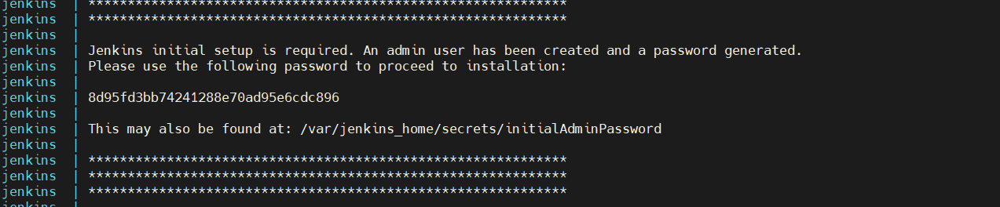

重新启动Jenkins容器后，由于Jenkins需要下载大量内容，但是由于默认下载地址下载速度较慢，需要重新设置下载地址为国内镜像站

``` shell
vim /usr/local/docker/jenkins_docker/data/hudson.model.UpdateCenter.xml
```

修改配置

``` xml
# 修改数据卷中的hudson.model.UpdateCenter.xml文件
<?xml version='1.1' encoding='UTF-8'?>
<sites>
    <site>
        <id>default</id>
        <url>https://updates.jenkins.io/update-center.json</url>
    </site>
</sites>

# 将下载地址替换为http://mirror.esuni.jp/jenkins/updates/update-center.json
<?xml version='1.1' encoding='UTF-8'?>
<sites>
<site>
    <id>default</id>
    <url>http://mirror.esuni.jp/jenkins/updates/update-center.json</url>
</site>
</sites>
# 清华大学的插件源也可以
https://mirrors.tuna.tsinghua.edu.cn/jenkins/updates/update-center.json
```

选择下载插件，然后点击安装。

**注意：**

```txt
本人在下载了

docker pull jenkins/jenkins:2.319.1-lts

docker pull jenkins/jenkins:2.346.3-lts

这两个版本，插件都安装不了，最后下载了 jenkins:2.472版本，也就是最新的，插件安装成功了，很多插件都不支持拉版本了，需要下载新版本的Jenkins。
```

### 3. Jenkins配置

由于Jenkins需要从Git拉取代码、需要本地构建、甚至需要直接发布自定义镜像到Docker仓库，所以Jenkins需要配置大量内容。

#### 1. 准备工作

插件下载完成之后，创建个人账号，然后登陆进来。进入到下面的页面：

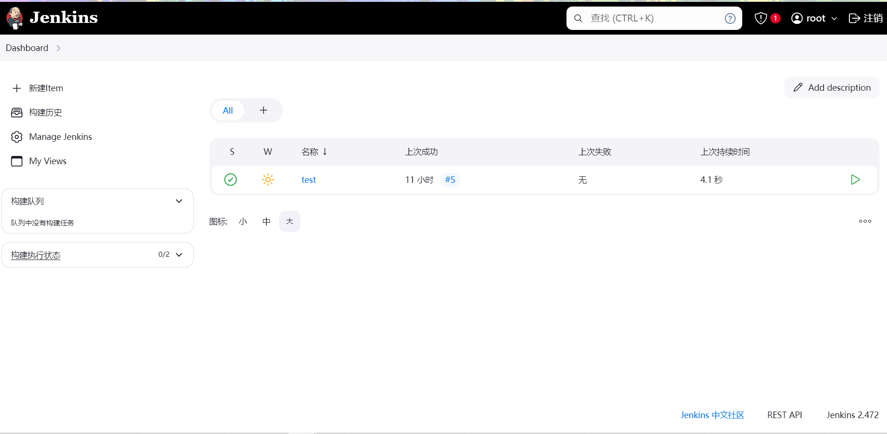

#### 2. 插件下载安装

点击管理Jenkins进入到下面的页面，如果有插件下载失败的可以到插件管理重新下载，要是还是失败，记得修改上面说的配置文件，或者自己下载之后，导入也可以，具体步骤就不做赘述了，网上有很多。

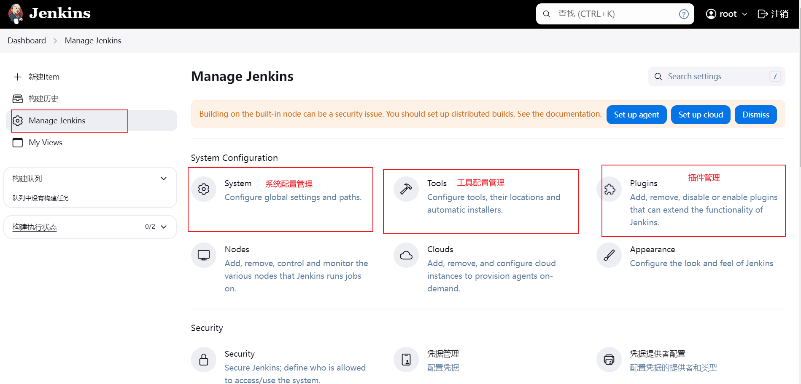


安装**git parameter，publish over ssh** 插件，一个是拉取代码，一个是推送。

#### 4. 配置Jenkins的JDK，Maven

代码拉取到Jenkins本地后，需要在Jenkins中对代码进行构建，这里需要Maven的环境，而Maven需要Java的环境，接下来需要在Jenkins中安装JDK和Maven，并且配置到Jenkins服务。

**配置Maven构建代码**

- 解压压缩包，并配置Maven的settings.xml。

``` xml
<!-- 阿里云镜像地址 -->
<mirror>
<id>alimaven</id>
<name>aliyun maven</name>
<url>http://maven.aliyun.com/nexus/content/groups/public/</url>
<mirrorOf>central</mirrorOf>
</mirror>
<!-- JDK1.8编译插件 -->
<profile>
<id>jdk-1.8</id>
<activation>
<activeByDefault>true</activeByDefault>
<jdk>1.8</jdk>
</activation>
<properties>
<maven.compiler.source>1.8</maven.compiler.source>
<maven.compiler.target>1.8</maven.compiler.target>
<maven.compiler.compilerVersion>1.8</maven.compiler.compilerVersion>
</properties>
</profile>
```

- 把安装的JDK和Maven放到Jenkins的数据卷的目录下面

``` bash 
# 这里写自己挂载的目录
cd /usr/local/docker/jenkins_docker/data 
mv /usr/local/jdk ./  
mv /usr/local/maven ./  

# 进入到jenkins容器
docker exec -it jenkins bash

cd /var/jenkins_home
ls -l

```

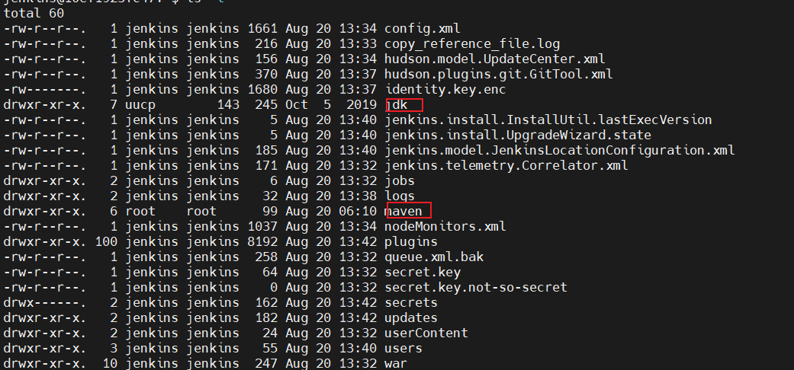

已经映射到容器的内部了。

- 配置Jenkins任务构建代码，到jenkins页面，全局配置中就是Tool配置

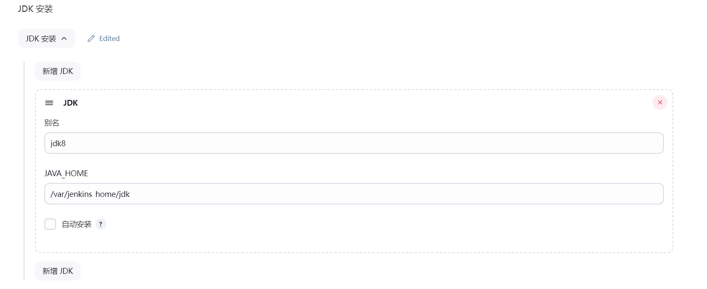

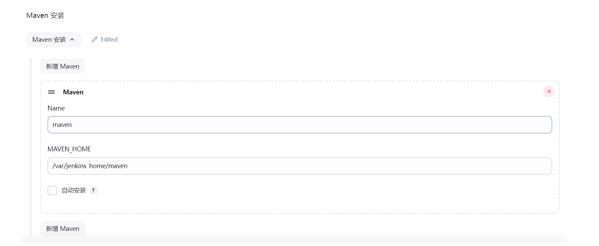

配置自己的jdk和maven目录即可，完成后点击保存。

现在我们的jenkins可以拉取代码，可以编译代码，下面配置把编译好jar包推送到目标服务器。用到插件publish over ssh，确保已经安装好。

#### 5.  配置Publish发布&远程操作

jar包构建好之后，就可以根据情况发布到测试或生产环境，这里需要用到之前下载好的插件Publish Over SSH。

进入系统配置，system里面，找到pulish over ssh。

- 配置Publish Over SSH连接测试、生产环境，配置任务的构建后操作，发布jar包到目标服务

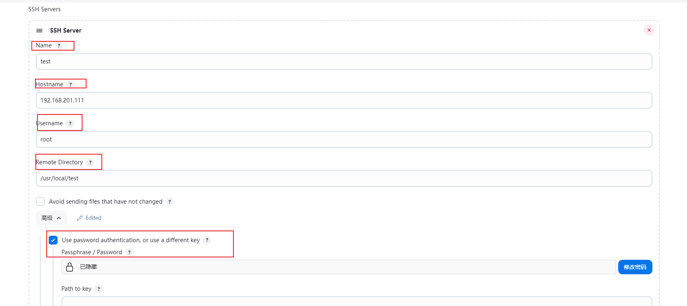

目标服务器名称：test

服务器地址：192.168.201.111

用户：用户名

远程目录：/usr/local/test (没有目录提前创建即可)

确保目标服务器已经安装docker，docker-comgpose。最后应用，保存。

- 立即构建任务，并去目标服务查看

## 六、 CI/CD入门操作

基于Jenkins拉取GitLab的SpringBoot代码进行构建发布到测试环境实现持续集成

基于Jenkins拉取GitLab指定发行版本的SpringBoot代码进行构建发布到生产环境实现CD实现持续部署

### 1. 创建springboot项目

编写简单的程序

- 修改pom.xml，添加打包的名称配置

``` xml
<build>
        <!-- 打包的名称 -->
        <finalName>test</finalName>
        <plugins>
            <plugin>
                <groupId>org.apache.maven.plugins</groupId>
                <artifactId>maven-compiler-plugin</artifactId>
                <version>3.8.1</version>
                <configuration>
                    <source>1.8</source>
                    <target>1.8</target>
                    <encoding>UTF-8</encoding>
                </configuration>
            </plugin>
        </plugins>
    </build>
```


- 创建Dockerfile，docker-compose.yml

Dockerfile文件

``` dockerfile
FROM openjdk:8-jdk-alpine
COPY test.jar /usr/local/
WORKDIR /usr/local/
CMD java -jar test.jar
```

docker-compose.yml文件

``` yaml
version: '3.1'
services:
  test:
    build:
      context: ./
      dockerfile: Dockerfile
    image: test:v1.0.0
    container_name: test
    ports:
      - 8080:8080
```

- 提交代码，推送到gitlab上

### 2. 持续交付、部署

程序代码在经过多次集成操作到达最终可以交付，持续交付整体流程和持续集成类似，不过需要选取指定的发行版本

#### 1. Jenkins中创建一个item

在Jenkins的首页，点击新建Item

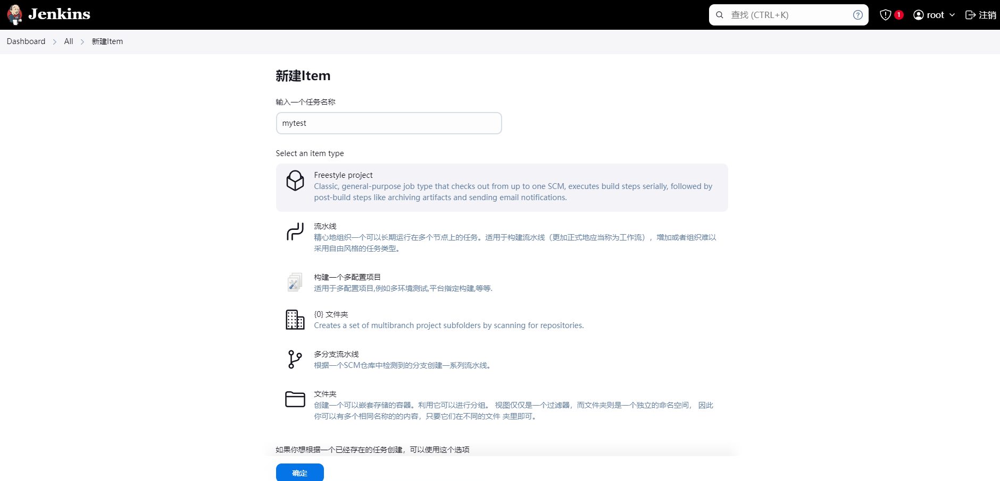


#### 2. 配置Item的git仓库

进入新建的Item中，配置Git的远程仓库

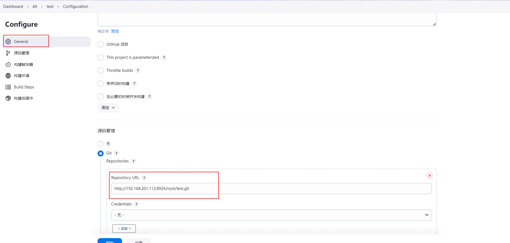

#### 3. 配置Item的Build Steps

然后配置maven，拉取代码后需要用maven打包。选择调用顶层maven目标，选择你的maven。

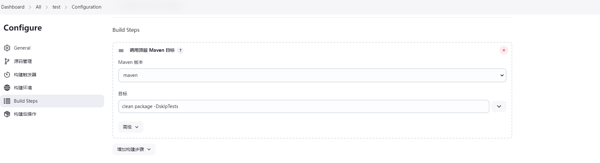

构建后操作，把jar推送至目标服务器，然后运行。

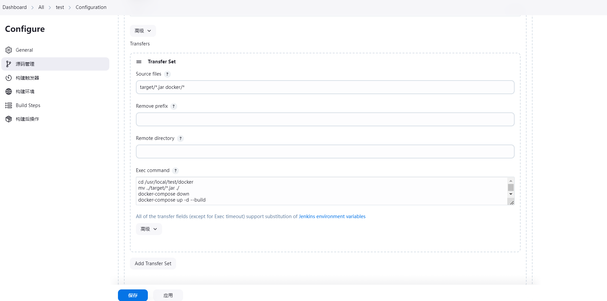

Jenkins点击立即构建，jenkins会拉取最近的代码，重新构建，然后把打包后的文件上传到容器根目录下的workspace

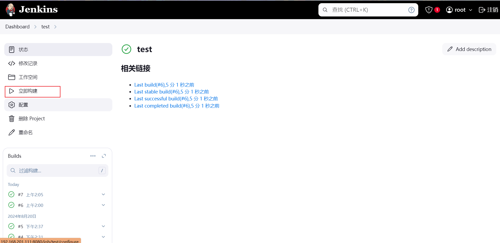


要想运行上传过来的文件，还需要进行 以下操作；

点击配置，找到构建后操作

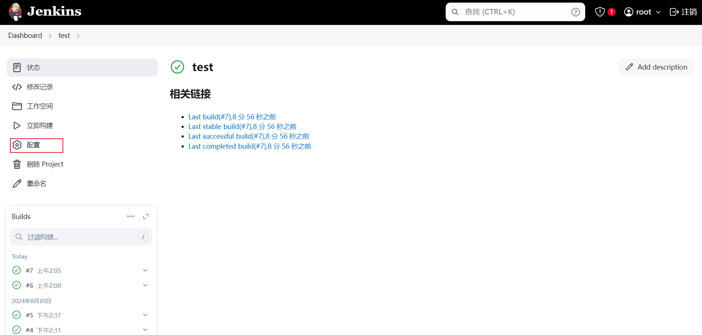


进入配置页面后，找到构建后操作

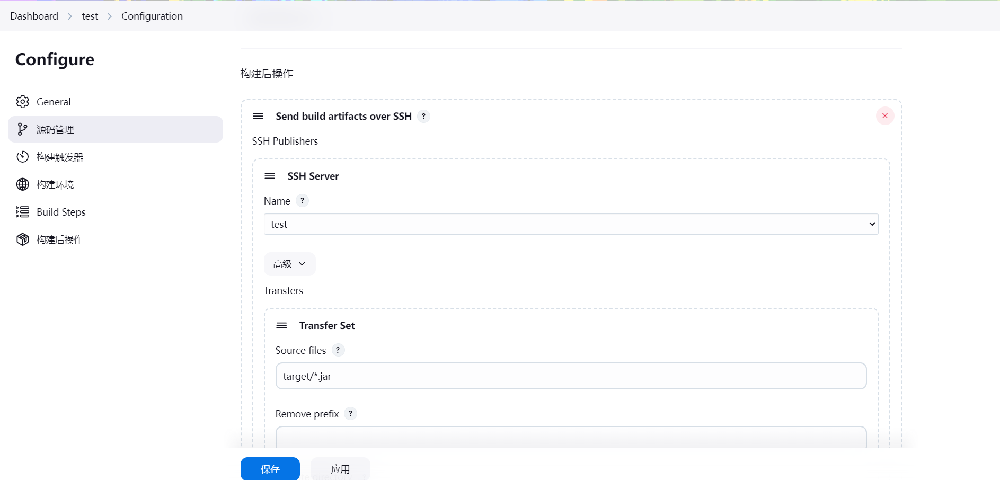

修改 Source files下面的配置，添加docker配置的目录

``` txt
target/*.jar docker/*
```

Exec command下面添加下面配置

``` bash
cd docker 
mv ../target/*.jar ./
docker-compose down
docker-compose up -d --build

```

点击应用，保存。然后再次构建，再次构建后，发现构建失败，报了下面的问题：

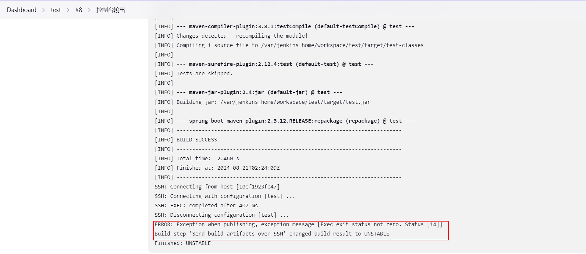

**解决方法：**

1.cd docker 要采用绝对路径

Exec command下面添加下面配置

``` bash
cd /usr/local/test/docker 
mv ../target/*.jar ./
docker-compose down
docker-compose up -d --build

```

2.宿主机的端口号已经被Jenkins占用，修改docker-compose.yml文件中宿主机映射的端口号

``` yaml
version: '3.1'
services:
  test:
    build:
      context: ./
      dockerfile: Dockerfile
    image: test:v1.0.0
    container_name: test
    ports:
      - 8081:8080
```

完成上述步骤之后，再次构建，构建成功。然后去宿主机查看docker容器，`docker ps`发现容器运行失败了。

**这也是一个小插曲。查看日志**

``` bash
[root@clear test]# docker logs -f 64b464420c8d
no main manifest attribute, in test.jar
```

修改项目的pox.xml

1. 添加下面配置

``` xml
<packaging>jar</packaging>
```

2. 检查<plugin>中<configuration>标签下面是否有个 <skip>true</skip>，有则去掉这个标签。

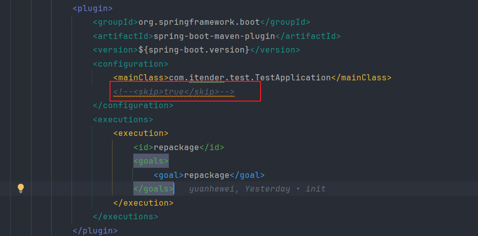

操作完成后，再次重新构建，docker-ps查看容器，成功了。

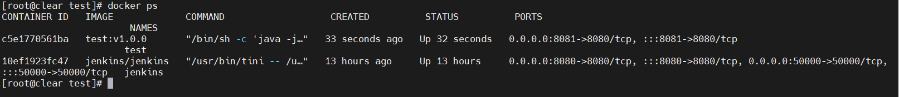

访问192.168.201.111:8081，成功了


虽然已经可以访问，但是还存在一个小问题，就是我修改代码，重新构建之后，原来的重名的镜像都变成了none，

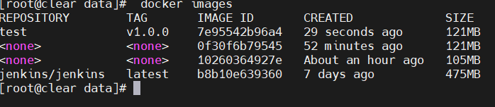

需要一个命令，添加到构建后执行的命令中

``` bash
# 删除为none的镜像
docker image prune -f 

# 完整命令
cd /usr/local/test/docker 
mv ../target/*.jar ./
docker-compose down
docker-compose up -d --build
docker image prune -f 
```

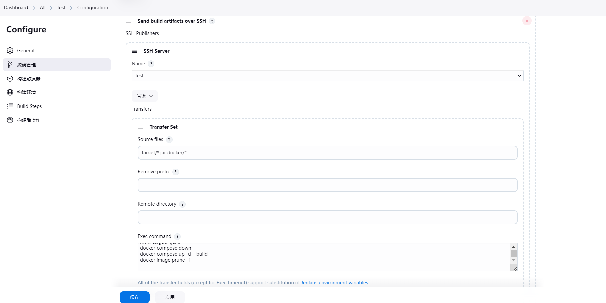

CI的整个流程就搞定了，但是我们每次都是拉取最新的代码进行构建的，我们需要不同的环境进行不同的部署。这就需要git pameter插件了。

配置git参数。

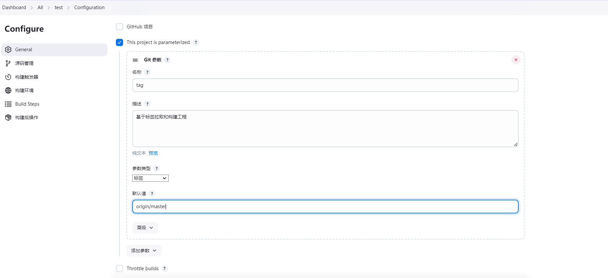


配置把代码切换到当前的tag上，选择不同的提交点。需要在maven打包之前，先切换代码的提交点。

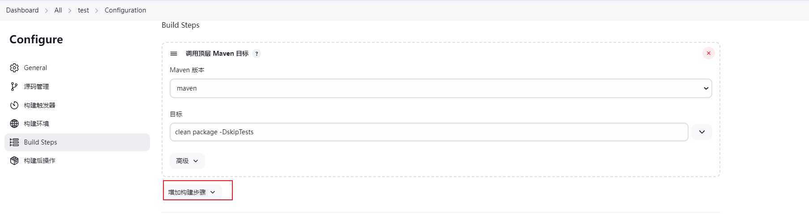

添加配置 git checkout $tag，切换提交点。

**把执行步骤拖到maven构建的前面**

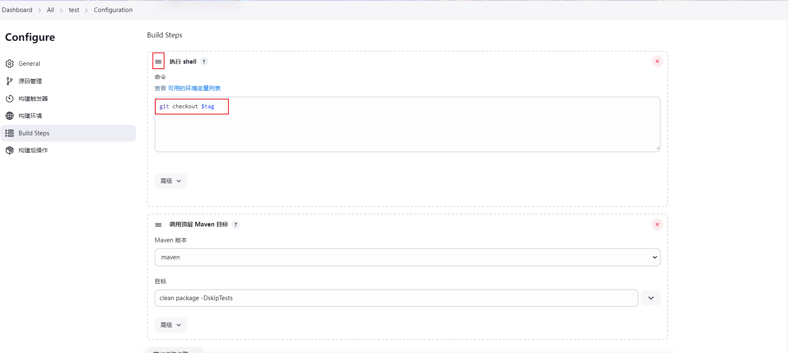

给代码打上不同的标签。

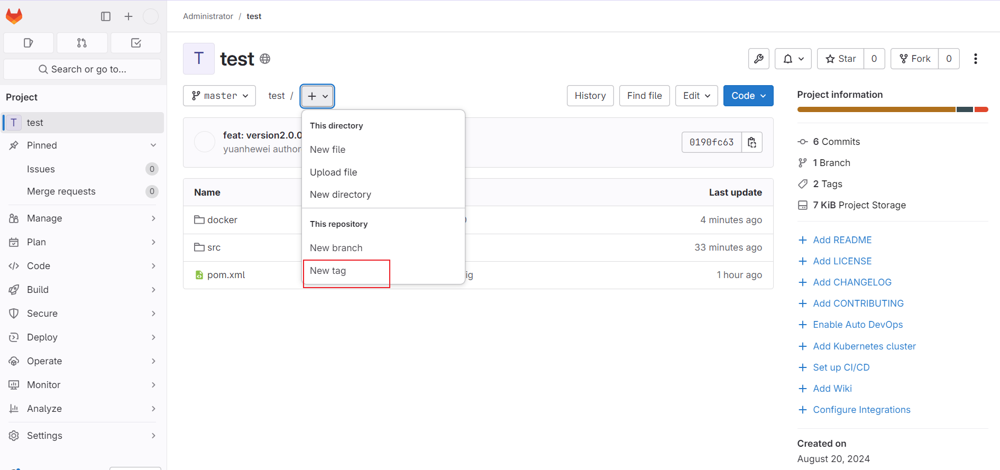

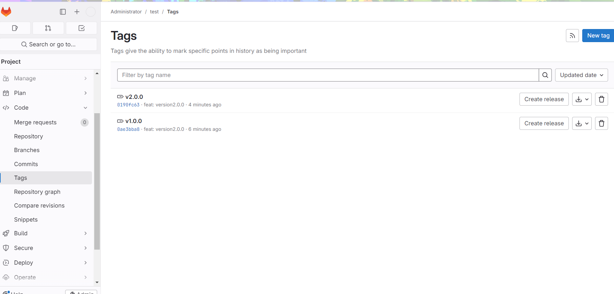

再次到构建的页面，就可以选择对应的标签进行构建了。

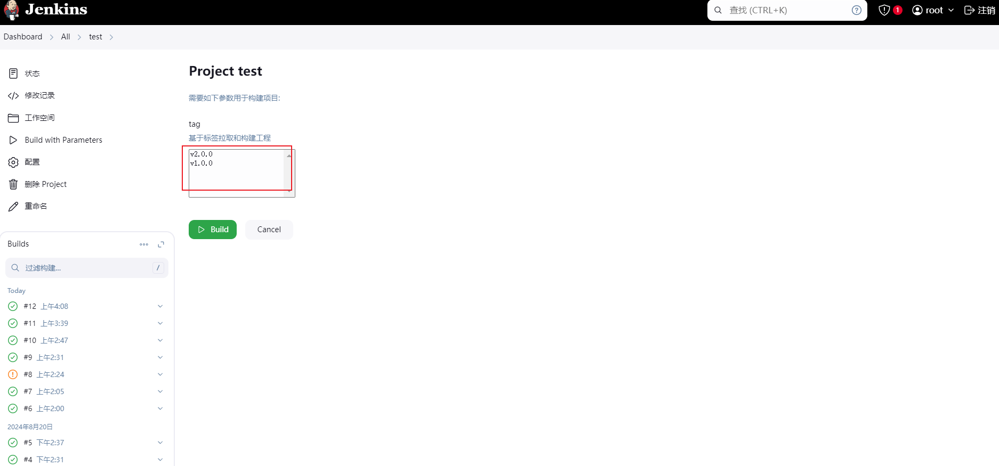


##  七、集成Sonar Qube

### 1. SonarQube介绍

Sonar Qube是一个开源的代码分析平台，支持Java、Python、PHP、JavaScript、CSS等25种以上的语

言，可以检测出重复代码、代码漏洞、代码规范和安全性漏洞的问题。

Sonar Qube可以与多种软件整合进行代码扫描，比如Maven，Gradle，Git，Jenkins等，并且会将代码

检测结果推送回Sonar Qube并且在系统提供的UI界面上显示出来

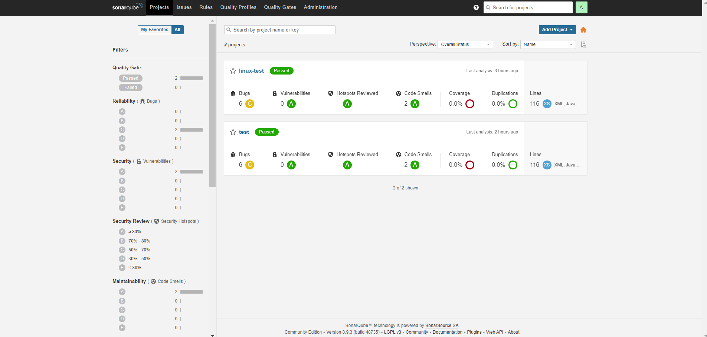

### 2. Sonar Qube安装

sonarqube官网：https://www.sonarsource.com/products/sonarqube/downloads/

Sonar Qube在7.9版本中已经放弃了对MySQL的支持，并且建议在商业环境中采用PostgreSQL，那么

安装Sonar Qube时需要依赖PostgreSQL。并且这里会安装Sonar Qube的长期支持版本9.9

1. 拉取镜像

``` bash
docker pull postgres
docker pull sonarqube

docker pull sonarqube:8.9.3-community
```

2.  编写docker-compose.yml

``` yml
version: "3.1"
services:
  db:
    image: postgres
    container_name: db
    ports:
      - 5432:5432
    networks:
      - sonarnet
    environment:
      POSTGRES_USER: sonar
      POSTGRES_PASSWORD: sonar
  sonarqube:
    image: sonarqube
    container_name: sonarqube
    depends_on:
      - db
    ports:
      - "9000:9000"
    networks:
      - sonarnet
    environment:
      SONAR_JDBC_URL: jdbc:postgresql://db:5432/sonar
      SONAR_JDBC_USERNAME: sonar
      SONAR_JDBC_PASSWORD: sonar
networks:
  sonarnet:
    driver: bridge
```


``` yml
version: "3.1"
services:
  db:
    image: postgres
    container_name: db
    ports:
      - 5432:5432
    networks:
      - sonarnet
    environment:
      POSTGRES_USER: sonar
      POSTGRES_PASSWORD: sonar
  sonarqube:
    image: sonarqube:8.9.3-community
    container_name: sonarqube
    depends_on:
      - db
    ports:
      - "9000:9000"
    networks:
      - sonarnet
    environment:
      SONAR_JDBC_URL: jdbc:postgresql://db:5432/sonar
      SONAR_JDBC_USERNAME: sonar
      SONAR_JDBC_PASSWORD: sonar
networks:
  sonarnet:
    driver: bridge
```

3. 运行容器

``` bash
docker-compose up -d
# 查看日志 
docker-compose logs -f
```

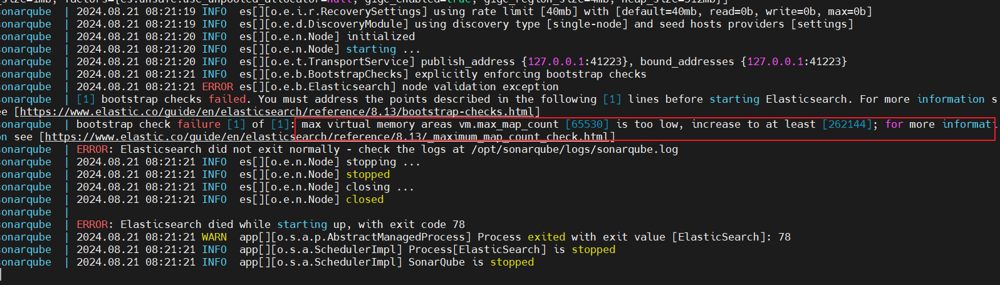

查看日志发现报错了，要修改最大虚拟内存

``` bash
vim /etc/sysctl.conf
# 添加下面的配置
vm.max_map_count=262144

sysctl -p

#重新启动容器
docker-compose up -d
```

启动完成后，访问页面

http://192.168.201.111:9000/

默认用户名/密码都是admin  修改后的密码Yuanhewei@123

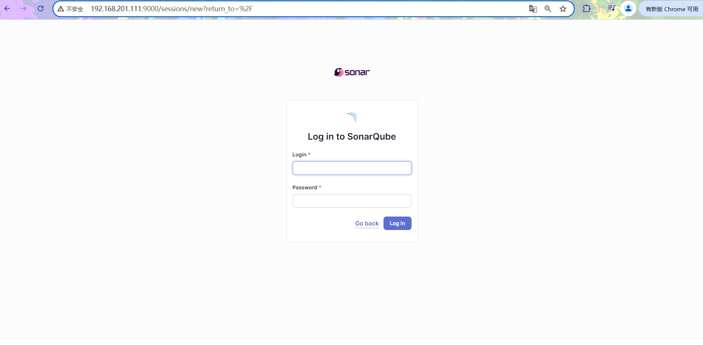

登陆进去后安装中文插件，安装后需要重启

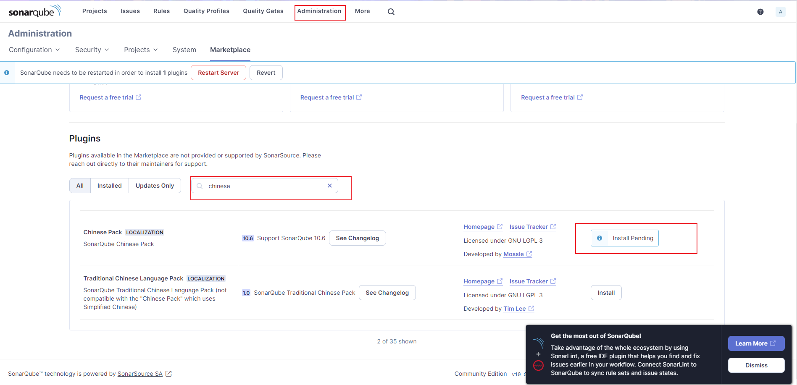

### 4. SonarQube使用

- **Maven的方式**

1. 在maven的settings.xml中添加下面配置

``` xml
    <profile>
        <id>sonar</id>
        <activation>
            <activeByDefault>true</activeByDefault>
        </activation>
        <properties>
            <sonar.login>admin</sonar.login>
            <sonar.password>password</sonar.password>
            <sonar.host.url>http://192.168.201.111:9000</sonar.host.url>
        </properties>
    </profile>
```

2. 在代码位置执行命令：mvn sonar:sonar，然后进入sonarqube页面，进入项目已经有代码扫描结果了

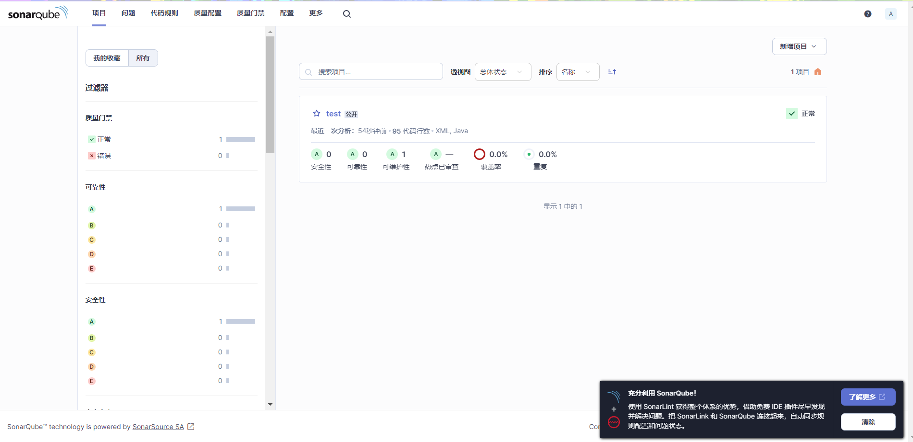

**SonarScanner的方式**

1. 下载并安装

下载：https://docs.sonarsource.com/sonarqube/latest/analyzing-source-code/scanners/sonarscanner/

下载完成后上传的我们的服务器上，然后解压。

安装解压命令

``` bash
yum -y install unzip

unzip sonar-scanner-cli-6.1.0.4477-linux-x64.zip
# sonarscanner移动到jenkins挂载目录下
cd /usr/local/docker/jenkins_docker/data/
mv ~/sonar-scanner ./
```

2. 修改配置

``` bash
cd sonar-scanner/conf/
vim sonar-scanner.properties
# 查看sonarscanner的命令
cd /usr/local/docker/jenkins_docker/data/sonar-scanner/bin
```

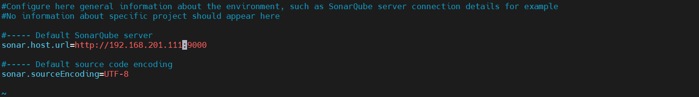


进入到要检测的代码的路径下，执行代码检测命令

``` bash
# 在项目所在目录执行以下命令 

/usr/local/docker/jenkins_docker/data/sonar-scanner/bin/sonar-scanner -Dsonar.sources=./ -Dsonar.projectname=linux-test -Dsonar.token=squ_162b811d946f00bfc5299629ce63f0c5b88e8813 -Dsonar.projectKey=linux-test -Dsonar.java.binaries=./target/

/usr/local/docker/jenkins_docker/data/sonar-scanner/bin/sonar-scanner -Dsonar.sources=./ -Dsonar.projectname=linux-test -Dsonar.login=65a1741c6f4191105f68096278fe77adaa1d15a1 -Dsonar.projectKey=linux-test -Dsonar.java.binaries=./target/

```

**生成sonar的token  account/password:admin/Yuanhewei@123**

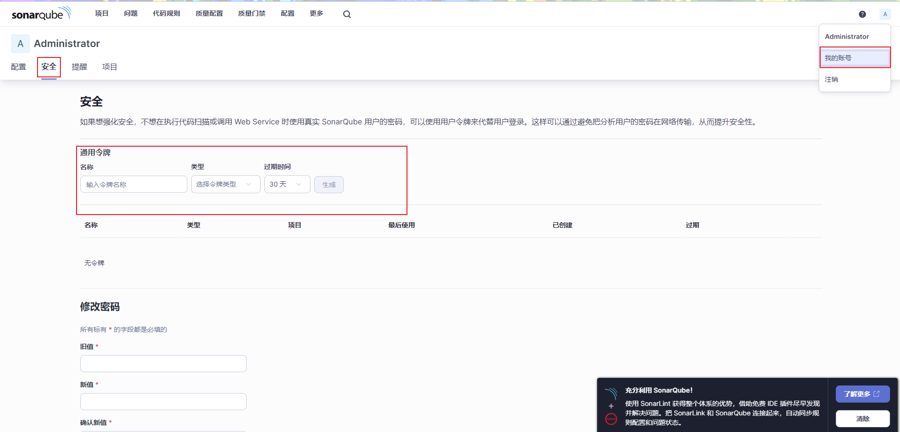

Ps：主要查看我的sonar-scanner执行命令的位置， 在项目所在目录执行以下命令

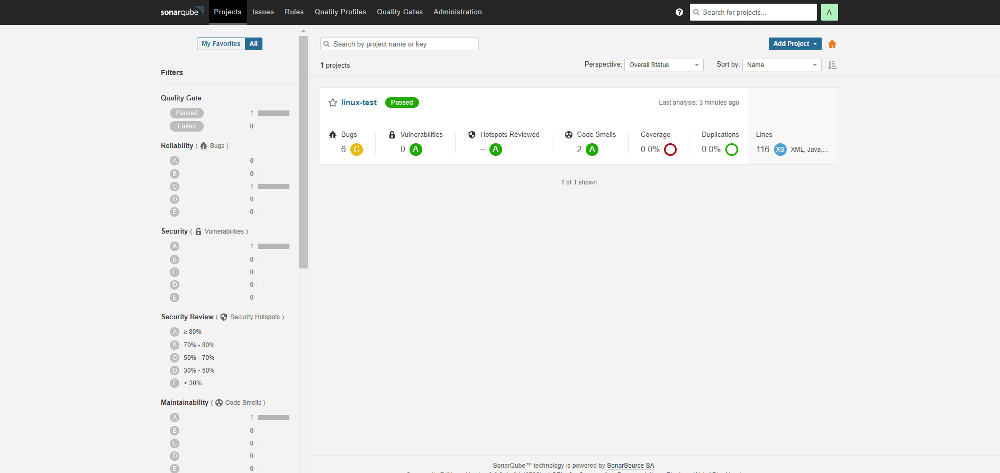

###  5. Jenkins集成Sonar Qube

1. 首先要到Jenkins**插件管理**页面安装sonar qube插件，安装插件的方法之前已经说过了
2. 在**系统管理**页面配置Sonar Qube，设置名称，地址和密码，**密码可能一上来无法点击，可以先填写完成名称地址保存后，在重新进入页面就可以填写了**。

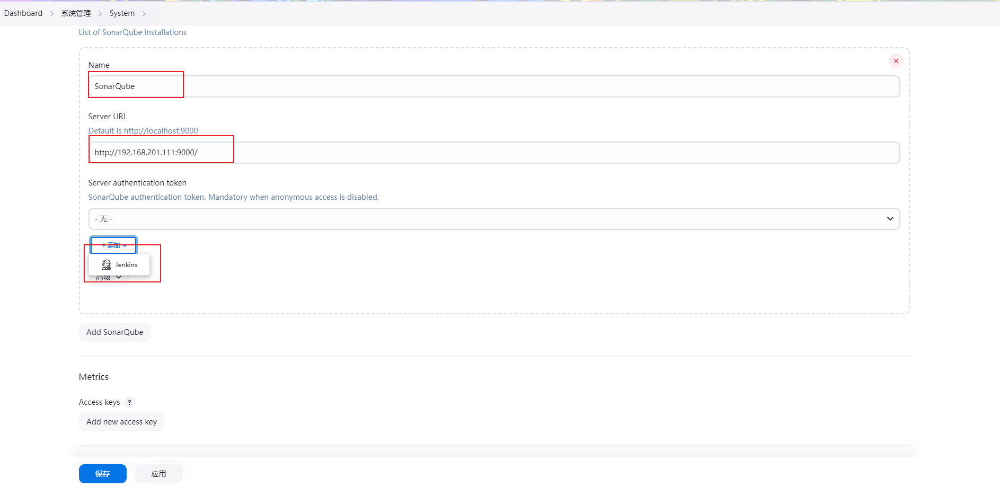


设置密码，这里可以选择用户名，密码的方式，也可以使用token的方式，填写完成保存即可。

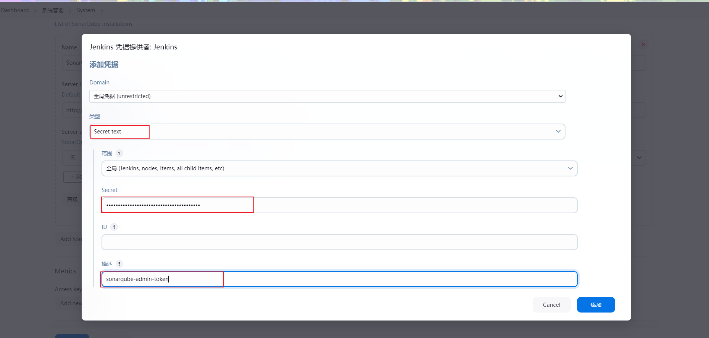

3. 想到全局配置中配置Sonar Scanner

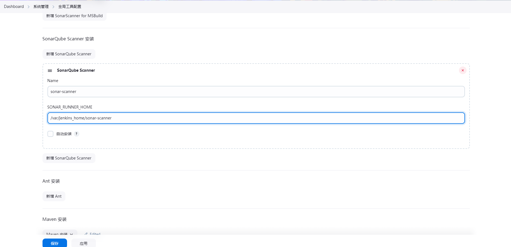

4. 在Jenkins的任务中添加配置项，在构建代码成功之后


选择执行 SonarQube Scanner

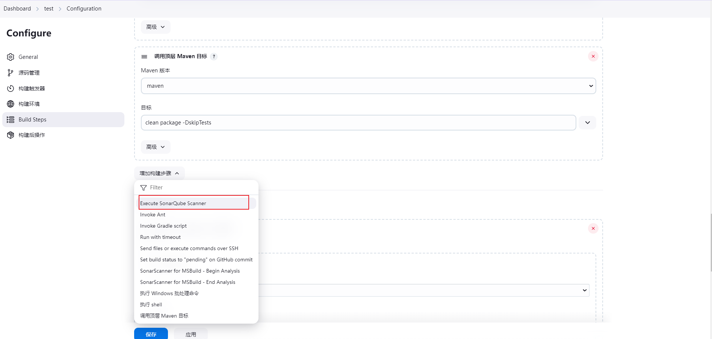

添加下面的配置，应用保存

``` properties
sonar.sources=./ 
sonar.projectname=${JOB_NAME}
sonar.login=ec31c5247b2be2d80a4797da0c13fb6c413a0fa7 
sonar.projectKey=${JOB_NAME}
sonar.java.binaries=target
```

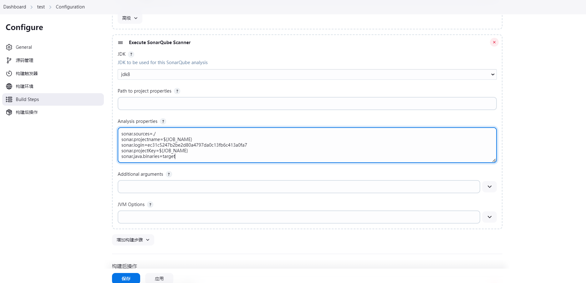

重新构建查看日志，发现有个报错

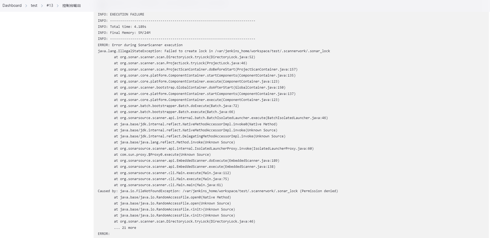

解决方案也很简单，因为我们之前测试过，生成了.scannerwork/文件夹，直接到项目代码文件夹删除即可。

``` bash
[root@clear ~]# cd /usr/local/docker/jenkins_docker/data/workspace/test/
[root@clear test]# ls -a
[root@clear test]# rm -rf .scannerwork/

```

删除之后，再次执行构建，查看日志，构建成功了，然后原有了扫描记录。

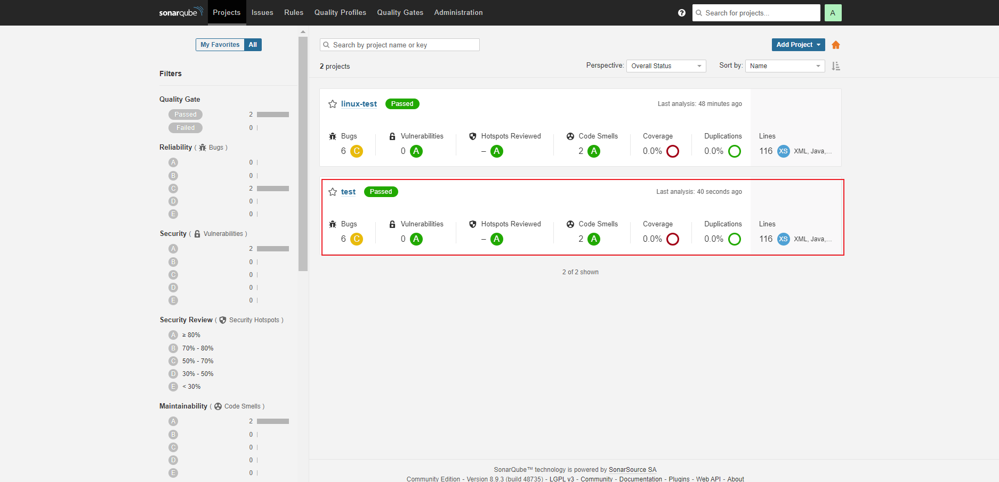

## 八、集成Harbor

### 1. Harbor介绍

前面在部署项目时，我们主要采用Jenkins推送jar包到指定服务器，再通过脚本命令让目标服务器对当前jar进行部署，这种方式在项目较多时，每个目标服务器都需要将jar包制作成自定义镜像再通过docker进行启动，重复操作比较多，会降低项目部署时间。我们可以通过Harbor作为私有的Docker镜像仓库。让Jenkins统一将项目打包并制作成Docker镜像发布到Harbor仓库中，只需要通知目标服务，让目标服务统一去Harbor仓库上拉取镜像并在本地部署即可。Docker官方提供了Registry镜像仓库，但是Registry的功能相对简陋。Harbor是VMware公司提供的一款镜像仓库，提供了权限控制、分布式发布、强大的安全扫描与审查机制等功能

### 2. Harbor下载安装

账号密码：admin/123456

1. 安装docker和docker-compose
2. 下载harbor

``` bash
# 下载软件
# 下载Harbor安装包：
# https://github.com/goharbor/harbor/releases/

mkdir /data/{softs,server} -p && cd /data/softs
wget https://github.com/goharbor/harbor/releases/download/v2.5.0/harbor-offline-installer-v2.3.4.tgz

# 解压软件
tar -zxvf harbor-offline-installer-v2.3.4.tgz -C /usr/local/

# 加载镜像
docker load < harbor.2.3.4.tar.gz
docker images

# 备份配置
cd harbor
cp harbor.yml.tmpl harbor.yml

```

3. 修改配置

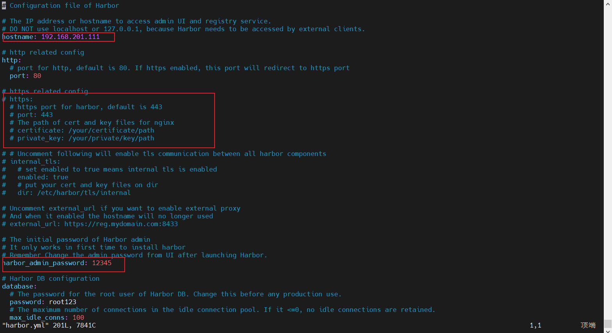

``` yaml
# 修改配置
[root@kubernetes-register /data/server/harbor]# vim harbor.yml.tmpl
    # 修改主机名
    hostname: kubernetes-register.sswang.com
    http:
      port: 80
    #https:  注释ssl相关的部分
      #  port: 443
      #  certificate: /your/certificate/path
      #  private_key: /your/private/key/path
    # 修改harbor的登录密码
    harbor_admin_password: 123456
    # 设定harbor的数据存储目录
    data_volume: /data/server/harbor/data

```

4. 配置harbor

``` bash
配置harbor
./prepare

启动harbor
./install.sh

检查效果
docker-compose ps

```

5. 定制启动文件(可以省略)

``` bash
# 定制服务启动文件 /etc/systemd/system/harbor.service
[Unit]
Description=Harbor
After=docker.service systemd-networkd.service systemd-resolved.service
Requires=docker.service
Documentation=http://github.com/vmware/harbor

[Service]
Type=simple
Restart=on-failure
RestartSec=5
#需要注意harbor的安装位置
ExecStart=/usr/bin/docker-compose --file /data/server/harbor/docker-compose.yml up
ExecStop=/usr/bin/docker-compose --file /data/server/harbor/docker-compose.yml down

[Install]
WantedBy=multi-user.target

```

加载配置文件

``` bash
加载服务配置文件
systemctl daemon-reload
启动服务
systemctl start harbor
检查状态
systemctl status harbor
设置开机自启动
systemctl enable harbor

```

6. harbor仓库定制

docker 添加配置

``` json
# 添加主机配置
vim /etc/hosts
# 添加下面配置
192.168.201.123 habor.com harbor
192.168.201.111 jenkins.com jenkins
192.168.201.112 gitlab.com gitlab

# docker配置
vim /etc/docker/daemon.json
{
  "exec-opts": ["native.cgroupdriver=systemd"],
  "registry-mirrors": [
    "https://docker.m.daocloud.io",
    "https://dockerhub.icu",
    "https://registry.aliyuncs.com",
    "https://docker.nju.edu.cn"
  ],
  # 添加harbor地址配置
 "insecure-registries": ["harbor.com"]
}

```


> 浏览器访问域名，用户名: admin, 密码：123456
> 创建repo用户专用的项目仓库，名称为 repo，权限为公开的

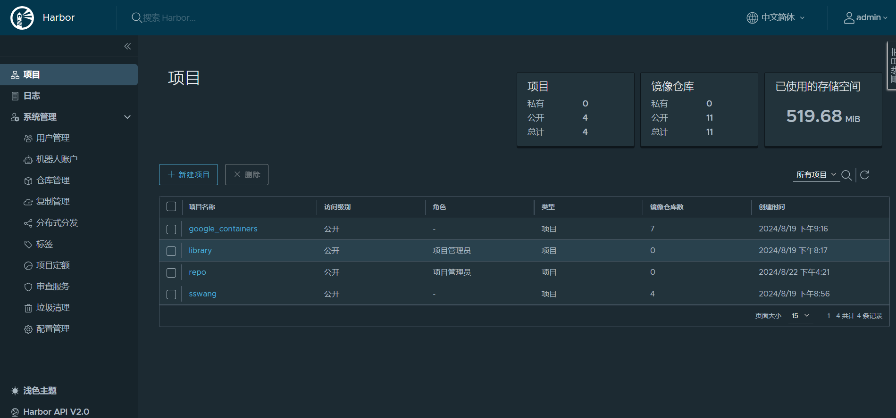

7. haibor仓库测试

``` bash
# docker login -u 用户名 -p 密码 Harbor地址
# 登录仓库 A123456a docker login kubernetes-register.sswang.com -u sswang
docker login harbor.com -u admin
Password:   # 输入登录密码 A12345678a

# 下载镜像
docker pull busybox

# 定制镜像标签 
# docker tag busybox kubernetes-register.sswang.com/sswang/busybox:v0.1 
docker tag test:v1.0.0 kubernetes-register.sswang.com/sswang/test:v1.0.0
# 推送镜像
# docker push kubernetes-register.sswang.com/sswang/busybox:v0.1
docker push kubernetes-register.sswang.com/sswang/test:v1.0.0

```

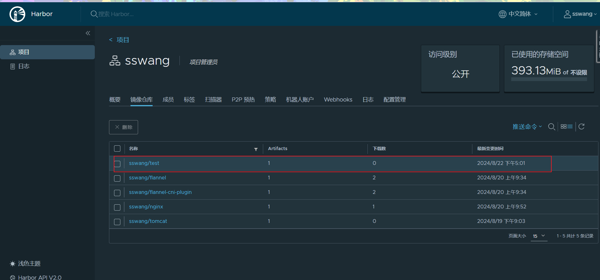

### 3. Jenkins容器使用宿主机Docker

构建镜像和发布镜像到harbor都需要使用到docker命令。而在Jenkins容器内部安装Docker官方推荐直

接采用宿主机带的Docker即可。

设置Jenkins容器使用宿主机Docker

1. 设置宿主机docker.sock权限

``` bash
cd /var/run/

sudo chown root:root /var/run/docker.sock
sudo chmod o+rw /var/run/docker.sock
```

2. 添加数据卷

修改Jenkins的docker-compse.yml，添加新的数据卷映射，然后重启jenkins

``` yaml
version: "3.1"
services:
  jenkins:
    image: jenkins/jenkins
    container_name: jenkins
    ports:
      - 8080:8080
      - 50000:50000
    volumes:
      - ./data/:/var/jenkins_home/
      - /usr/bin/docker:/usr/bin/docker
      - /var/run/docker.sock:/var/run/docker.sock
      - /etc/docker/daemon.json:/etc/docker/daemon.json
```

首先删除之前添加的推送的配置

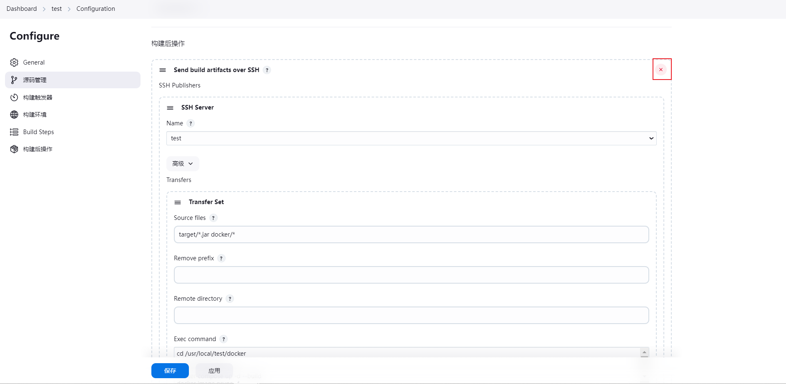

然后在添加一个构建后的操作，执行shell

``` shell
mv target/*.jar docker/
docker build -t mytest:$tag docker/
docker login -u sswang -p A123456a kubernetes-register.sswang.com
docker tag mytest:$tag kubernetes-register.sswang.com/sswang/mytest:$tag
docker push kubernetes-register.sswang.com/sswang/mytest:$tag
```

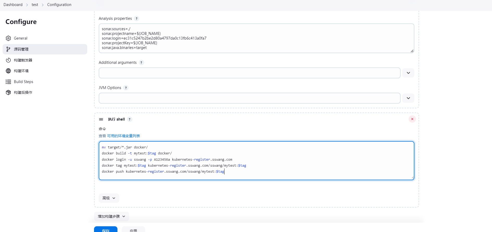

然后再次构建，然后再去harbor上查看镜像是否推送成功。这里看已经推送到harbor了

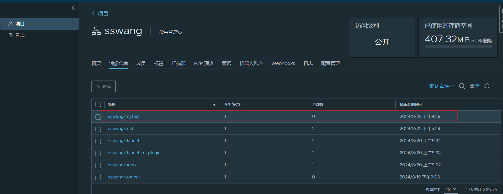

**如何在目标服务器运行容器？**

> 1. 告知目标服务器需要拉取哪个镜像
> 2. 判断当前服务器是否正在运行容器，需要删除
> 3. 如果目标服务器已经存在当前镜像，需要删除
> 4. 目标服务器拉取harbor上的镜像
> 5. 将拉去下来的镜像运行成为一个容器
>    1. 需要知道  harbor地址/harbor仓库/镜像名称:版本   端口号  kubernetes-register.sswang.com/sswang/mytest:v1.0.0

部署项目需要通过Publish Over SSH插件，让目标服务器执行命令。为了方便一次性实现拉取镜像和启动的命令，推荐采用脚本文件的方式。

添加脚本文件到目标服务器，再通过Publish Over SSH插件让目标服务器执行脚本即可。在根目录下。

``` bash
# 在根目录下
vim deploy.sh
# 放到环境变量中 echo $PATH
mv deploy.sh /usr/bin

chmod a+x deploy.sh
```

deploy.sh 文件

``` sh
harbor_addr=$1
harbor_repo=$2
project=$3
version=$4
container_port=$5
host_port=$6

imageName=$harbor_addr/$harbor_repo/$project:$version
echo $imageName

containerId=`docker ps -a | grep ${project} | awk '{print $1}'`
echo $containerId
if [ "$containerId" != "" ] ; then
	docker stop $containerId
	docker rm $containerId
	echo "Delete Container Success"
fi

tag=`docker images | grep ${project} | awk '{print $3}'`
echo $tag
if [ "$tag" != "" ] ; then
	docker rmi -f $tag
	echo "Delete Image Success"
fi

docker login -u sswang -p A123456a $harbor_addr
docker pull $imageName
docker run -d -p $host_port:$container_port --name $project $imageName
echo "Start Container Success"
echo $project
```

Jenkins任务添加配置1.添加构建后操作  `deploy.sh  kubernetes-register.sswang.com  sswang  ${JOB_NAME}  $tag  $port`

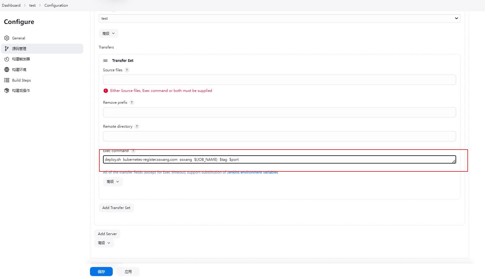

2.添加port参数git参数里面添加一个字符参数

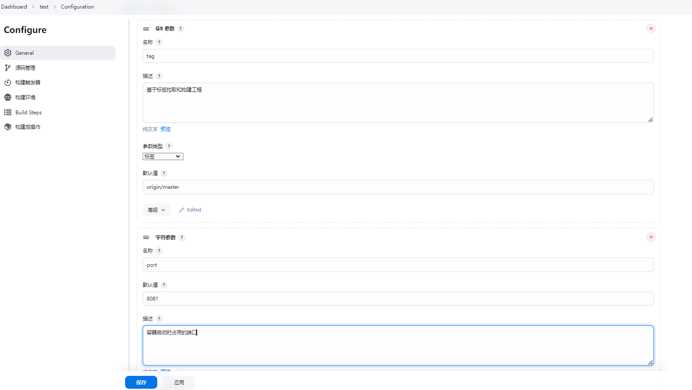

因为我的8080端口被占用了，所以映射端口改为了8081，但是项目启动的默认端口为8080，所以这里又加了一个容器端口


## 九、 Jenkins流水线pipeline

###  Jenkins流水线任务介绍

之前采用Jenkins的自由风格构建的项目，每个步骤流程都要通过不同的方式设置，并且构建过程中整体流程是不可见的，无法确认每个流程花费的间，并且问题不方便定位问题。Jenkins的Pipeline可以让项目的发布整体流程可视化，明确执行的阶段，可以快速的定位问题。并且整个项目的生命周期可以通过一个Jenkinsfile文件管理，而且Jenkinsfile文件是可以放在项目中维护。所以Pipeline相对自由风格或者其他的项目风格更容易操作。

###  Jenkins流水线任务

#### 构建Jenkins流水线任务

##### 1. 添加pipeline流水线任务

##### 2.  配置代码仓库

##### 3. 项目中添加Jenkinsfile文件

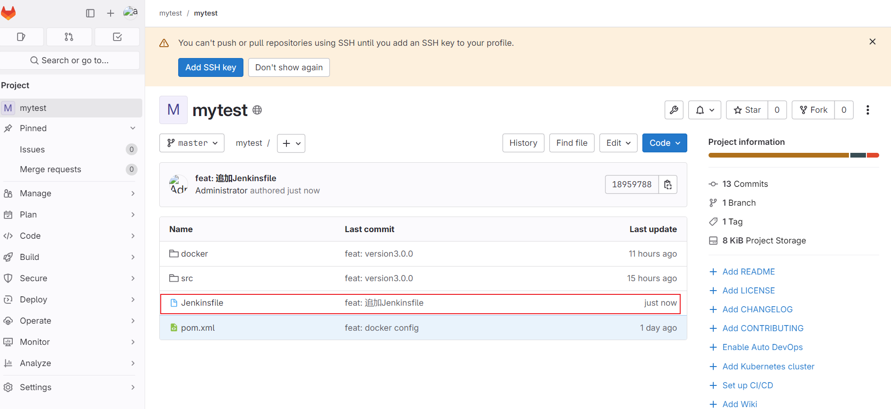

``` groovy
// 所有的脚本命令都放在pipeline中
pipeline{
	// 指定任务在哪个集群节点执行
	agent any
	// 声明全局变量，方便后面使用
	environment{
		key='value'
	}
	
	stages{
		stage('拉取git仓库代码') {
			steps {
				echo '拉取git仓库代码 -SUCCESS'
			}
		}
		stage('通过maven构建项目') {
			steps {
				echo '通过maven构建项目 -SUCCESS'
			}
		}
		stage('通过SonarQube做代码质量检测') {
			steps {
				echo '通过SonarQube做代码质量检测 -SUCCESS'
			}
		}
		stage('通过docker制作自定义镜像') {
			steps {
				echo '通过docker制作自定义镜像 -SUCCESS'
			}
		}
		stage('将自定义镜像推送到Harbor中') {
			steps {
				echo '将自定义镜像推送到Harbor中 -SUCCESS'
			}
		}
		stage('通过Publish Over SSH通知目标服务器') {
			steps {
				echo 'SSH通知目标服务器 -SUCCESS'
			}
		}
	}
}
```

##### 4. 修改jenkins配置

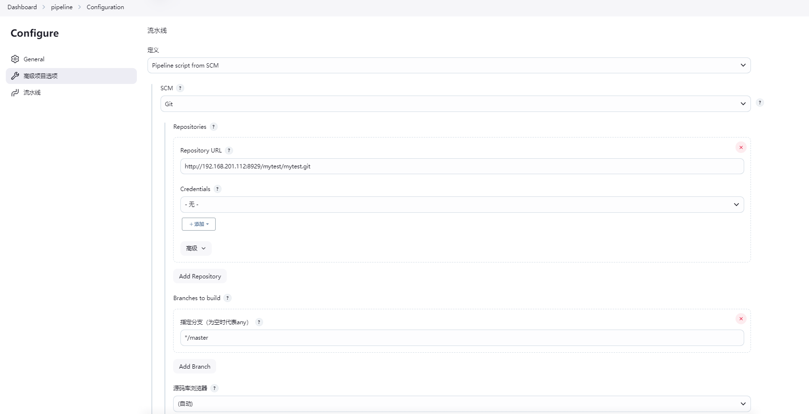

##### 5. 添加Jenkins配置，完善Jenkins脚本。**添加参数化构建的配置**

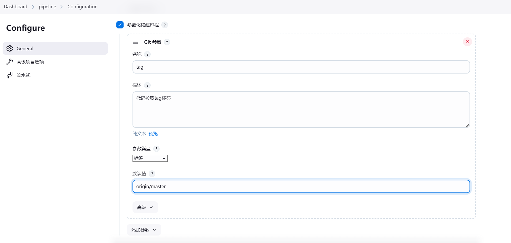

生成每一步的流水线语法，添加到Jenkinsfile对应的流程步骤中。在流水线语法中可以根据自己的需要生成对应的命令。

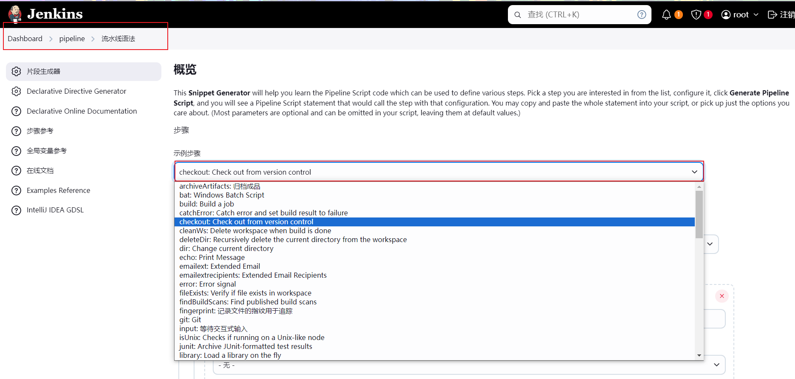

- 配置拉取代码的配置

``` groovy
stage('拉取git仓库代码') {
			steps {
				checkout scmGit(branches: [[name: '$tag']], extensions: [], userRemoteConfigs: [[url: 'http://192.168.201.112:8929/mytest/mytest.git']])
			}
		}

```

再次构建，进入jenkins容器发现已经有拉取下来的代码了,pipeline

``` bash

[root@clear bin]# docker exec -it jenkins bash
jenkins@e96108b4b77b:/$ cd ~/workspace/
jenkins@e96108b4b77b:~/workspace$ ls
mytest  pipeline  test
jenkins@e96108b4b77b:~/workspace$

```

- 配置通过maven构建步骤 shell

``` bash
/var/jenkins_home/maven/bin/mvn clean package -DskipTests

stage('通过maven构建项目') {
    steps {
        	sh '/var/jenkins_home/maven/bin/mvn clean package -DskipTests'
        }
    }
```

- 配置代码检测，重新构建，去sonarqube服务确认是否有代码检测记录 shell

``` bash
	/var/jenkins_home/sonar-scanner/bin/sonar-scanner -Dsonar.host.url=http://192.168.201.111:9000/ -Dsonar.sources=./ -Dsonar.projectname=${JOB_NAME} -Dsonar.projectKey=${JOB_NAME} -Dsonar.java.binaries=./target/ -Dsonar.login=65a1741c6f4191105f68096278fe77adaa1d15a1
	
		stage('通过SonarQube做代码质量检测') {
			steps {
				sh '/var/jenkins_home/sonar-scanner/bin/sonar-scanner -Dsonar.host.url=http://192.168.201.111:9000/ -Dsonar.sources=./ -Dsonar.projectname=${JOB_NAME} -Dsonar.projectKey=${JOB_NAME} -Dsonar.java.binaries=./target/ -Dsonar.login=65a1741c6f4191105f68096278fe77adaa1d15a1'
			}
		}
```

- 通过docker制作自定义镜像，重新构建，去服务器检查是否有pipeline的镜像 shell

``` bash
mv ./target/*.jar ./docker/
docker build -t ${JOB_NAME}:$tag ./docker/

stage('通过docker制作自定义镜像') {
			steps {
				sh '''mv ./target/*.jar ./docker/
docker build -t ${JOB_NAME}:$tag ./docker/'''
			}
		}

```

- 推送自定义镜像到Harbor中  shell

``` bash
# 在Jenkinsfile的文件中添加harbor相关配置
// 声明全局变量，方便后面使用
	environment{
		harborUser='sswang'
		harborPasswd='A123456a'
		harborAddr='kubernetes-register.sswang.com'
		harborRepo='sswang'
	}

# 配置镜像推送
docker login -u ${harborUser} -p ${harborPasswd} ${harborAddr}
docker tag ${JOB_NAME}:${tag} ${harborAddr}/${harborRepo}/${JOB_NAME}:${tag}
docker push ${harborAddr}/${harborRepo}/${JOB_NAME}:${tag}

stage('将自定义镜像推送到Harbor中') {
			steps {
				sh '''docker login -u ${harborUser} -p ${harborPasswd} ${harborAddr}
				docker tag ${JOB_NAME}:${tag} ${harborAddr}/${harborRepo}/${JOB_NAME}:${tag}
				docker push ${harborAddr}/${harborRepo}/${JOB_NAME}:${tag}'''
			}
		}

```

- 通过Publish Over SSH通知目标服务器 ssh publish，添加端口号配置，在任务配置中

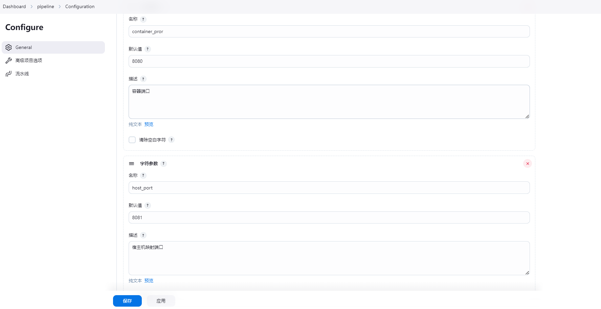

``` bash
deploy.sh $harborAddr $harborRepo $JOB_NAME  $tag $container_port $host_port

# deploy.sh要用英文双引号
stage('通过Publish Over SSH通知目标服务器') {
			steps {
				sshPublisher(publishers: [sshPublisherDesc(configName: 'test', transfers: [sshTransfer(cleanRemote: false, 	 excludes: '', execCommand: "deploy.sh $harborAddr $harborRepo $JOB_NAME  $tag $container_port $host_port", execTimeout: 120000, flatten: false, makeEmptyDirs: false, noDefaultExcludes: false, patternSeparator: '[, ]+', remoteDirectory: '', remoteDirectorySDF: false, removePrefix: '', sourceFiles: '')], usePromotionTimestamp: false, useWorkspaceInPromotion: false, verbose: false)])
			}
		}

```

完整的Jenkinsfile

``` bash
// 所有的脚本命令都放在pipeline中
pipeline{
	// 指定任务在哪个集群节点执行
	agent any
	// 声明全局变量，方便后面使用
	environment{
		harborUser='sswang'
		harborPasswd='A123456a'
		harborAddr='kubernetes-register.sswang.com'
		harborRepo='sswang'
	}
	
	stages{
		stage('拉取git仓库代码') {
			steps {
				checkout scmGit(branches: [[name: '$tag']], extensions: [], userRemoteConfigs: [[url: 'http://192.168.201.112:8929/mytest/mytest.git']])
			}
		}
		stage('通过maven构建项目') {
			steps {
				sh '/var/jenkins_home/maven/bin/mvn clean package -DskipTests'
			}
		}
		stage('通过SonarQube做代码质量检测') {
			steps {
			sh '/var/jenkins_home/sonar-scanner/bin/sonar-scanner -Dsonar.host.url=http://192.168.201.111:9000/ -Dsonar.sources=./ -Dsonar.projectname=${JOB_NAME} -Dsonar.projectKey=${JOB_NAME} -Dsonar.java.binaries=./target/ -Dsonar.login=65a1741c6f4191105f68096278fe77adaa1d15a1'
			}
		}
		stage('通过docker制作自定义镜像') {
			steps {
				sh '''mv ./target/*.jar ./docker/
				docker build -t ${JOB_NAME}:$tag ./docker/'''
			}
		}
		stage('将自定义镜像推送到Harbor中') {
			steps {
				sh '''docker login -u ${harborUser} -p ${harborPasswd} ${harborAddr}
				docker tag ${JOB_NAME}:${tag} ${harborAddr}/${harborRepo}/${JOB_NAME}:${tag}
				docker push ${harborAddr}/${harborRepo}/${JOB_NAME}:${tag}'''
			}
		}
		stage('通过Publish Over SSH通知目标服务器') {
			steps {
				sshPublisher(publishers: [sshPublisherDesc(configName: 'test', transfers: [sshTransfer(cleanRemote: false, 	 excludes: '', execCommand: "deploy.sh $harborAddr $harborRepo $JOB_NAME  $tag $container_port $host_port", execTimeout: 120000, flatten: false, makeEmptyDirs: false, noDefaultExcludes: false, patternSeparator: '[, ]+', remoteDirectory: '', remoteDirectorySDF: false, removePrefix: '', sourceFiles: '')], usePromotionTimestamp: false, useWorkspaceInPromotion: false, verbose: false)])
			}
		}
	}
}
```

- 到服务器docker ps查看运行容器，容器启动成功

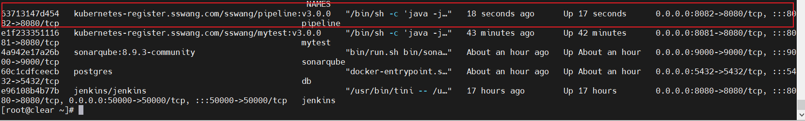

访问192.168.201.111:8082

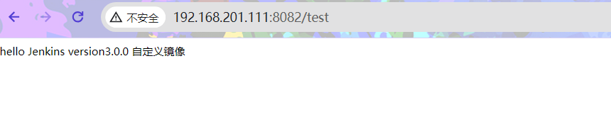

##### 6. 配置消息通知


## 十、 Jenkins集成k8s

#### 1. 准备部署的yml文件

pipeline.yml

```yaml
apiVersion: apps/v1
kind: Deployment
metadata:
  namespace: test
  name: pipeline
  labels:
    app: pipeline
spec:
  replicas: 2
  selector:
    matchLabels:
      app: pipeline
  template:
    metadata:
      labels:
        app: pipeline
    spec:
      containers:
      - name: pipeline
        image: harbor.com/sswang/pipeline:v4.0.0
        imagePullPolicy: Always
        ports:
        - containerPort: 8080

---
apiVersion: v1
kind: Service
metadata:
  namespace: test
  name: pipeline
  labels:
    app: pipeline
spec:
  selector:
    app: pipeline
  ports:
    - port: 8082
      targetPort: 8080
  type: NodePort

---
apiVersion: networking.k8s.io/v1
kind: Ingress
metadata:
  namespace: test
  name: pipeline
spec:
  ingressClassName: nginx
  rules:
  - host: pipeline.test.com
    http:
      paths:
      - path: /
        pathType: Prefix
        backend:
          service:
            name: pipeline
            port:
              number: 8082
```

#### 2. 配置Docker私服

在尝试用kubernetes的yml文件启动pipeline服务时，会出现Kubernetes无法拉取镜像的问题，这里需要在kubernetes所在的Linux中配置Harbor服务信息，并且保证Kubernetes可以拉取Harbor上的镜像。


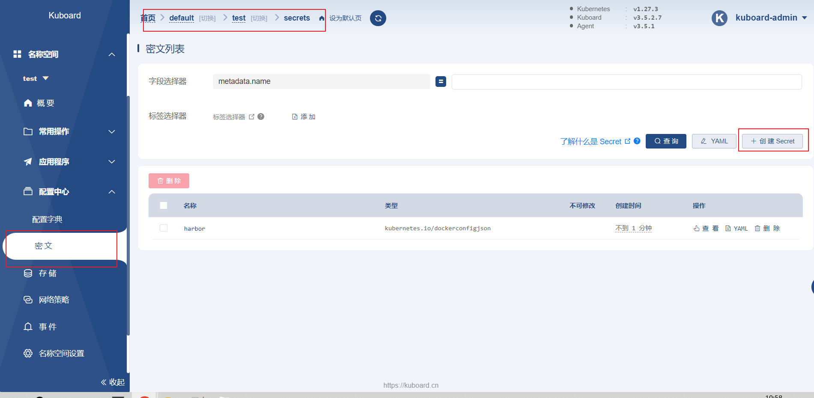

填写你的harbor地址信息，填写完成后下面会生成一行命令，复制命令到你的kube服务器运行，看是否可以登录成功，登陆成功就ok了

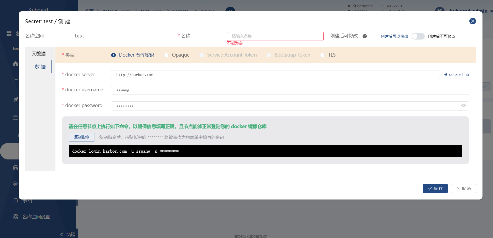

如果不成功，要检查一下你的daemon.json的配置


``` json
{
  "exec-opts": ["native.cgroupdriver=systemd"],
   # docker私服地址，把你的harbor地址加到这里
  "insecure-registries": ["kubernetes-register.sswang.com", "harbor.com"],
  "registry-mirrors": [
    "https://docker.m.daocloud.io",
    "https://dockerhub.icu",
    "https://registry.aliyuncs.com",
    "https://docker.nju.edu.cn"
  ]
}

```

配置完成后，再次启动你的pipeline.yml

``` bash
# 删除
kubectl delete -f pipeline.yml
# 启动
kubectl apply -f pipeline.yml
```

部署成功后，查看状态

``` bash
[root@master ~]# kubectl get all -n test
NAME                            READY   STATUS    RESTARTS   AGE
pod/pipeline-647d4585fb-qh292   1/1     Running   0          48m

NAME               TYPE       CLUSTER-IP      EXTERNAL-IP   PORT(S)          AGE
service/pipeline   NodePort   10.96.126.239   <none>        8082:32562/TCP   48m

NAME                       READY   UP-TO-DATE   AVAILABLE   AGE
deployment.apps/pipeline   1/1     1            1           48m

NAME                                  DESIRED   CURRENT   READY   AGE
replicaset.apps/pipeline-647d4585fb   1         1         1       48m

```

然后访问192.168.201.111:32562

#### 3. Jenkins配置k8s

- **在系统配置下面添加publish over ssh 配置，配置完成后，应用保存**

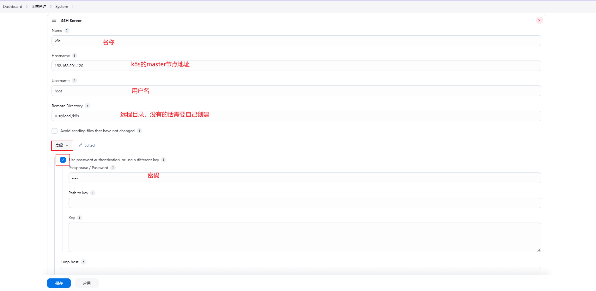

- **修改pipeline任务配置**

修改项目中Jenkinsfile中publish over ssh步骤的配置命令，到pipeline语法中生成

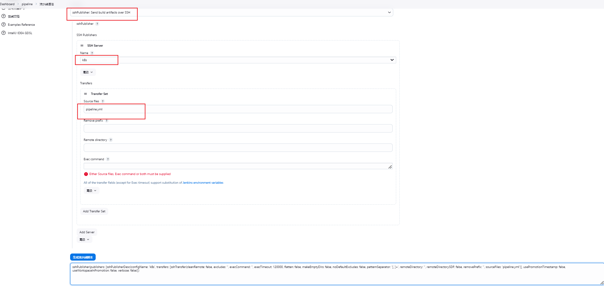


``` bash
sshPublisher(publishers: [sshPublisherDesc(configName: 'k8s', transfers: [sshTransfer(cleanRemote: false, excludes: '', execCommand: '', execTimeout: 120000, flatten: false, makeEmptyDirs: false, noDefaultExcludes: false, patternSeparator: '[, ]+', remoteDirectory: '', remoteDirectorySDF: false, removePrefix: '', sourceFiles: 'pipeline.yml')], usePromotionTimestamp: false, useWorkspaceInPromotion: false, verbose: false)])
```

然后修改项目中的Jenkinsfile的配置，用下面的配置，替换原来publish over ssh的配置

``` bash
		stage('将部署的yml文件传送到k8s-master节点') {
			steps {
				sshPublisher(publishers: [sshPublisherDesc(configName: 'k8s', transfers: [sshTransfer(cleanRemote: false, excludes: '', execCommand: '', execTimeout: 120000, flatten: false, makeEmptyDirs: false, noDefaultExcludes: false, patternSeparator: '[, ]+', remoteDirectory: '', remoteDirectorySDF: false, removePrefix: '', sourceFiles: 'pipeline.yml')], usePromotionTimestamp: false, useWorkspaceInPromotion: false, verbose: false)])
			}
		}

```

修改代码返回5.0.0，然后打标签v5.0.0,，然后构建看是否可以将pipeline文件传送到k8s服务器

``` bash
[root@master k8s]# ls /usr/local/k8s/
pipeline.yml
# 文件已经传到目标服务器了，然后执行文件
```

- 运行pipeline.yml

如何运行pipeline.yml，使用shell命令的方式会需要输入密码

``` bash
[root@master ~]# ssh root@192.168.201.120 kubectl ap -f /usr/local/k8s/pipeline.yml
root@192.168.201.120's password:

```

因此只能使用ssh的无密码登录方式，让Jenkins容器内部以无密码的方式连接到k8s的master节点，绝体步骤如下

1. 进入Jenkins容器内部

``` bash
[root@clear jenkins_docker]# docker exec -it jenkins bash
jenkins@e96108b4b77b:/$ cd ~
# 找到隐藏的文件.ssh
jenkins@e96108b4b77b:~$ ls -a
.ssh

jenkins@e96108b4b77b:~$ cat ~/.ssh/id_rsa.pub
ssh-rsa AAAAB3NzaC1yc2EAAAADAQABAAACAQC86IaWBtwJkhlAEH4WYoMUAg8acBZGiM13BZPTsHeqM541lKp02qcgvk8RBd9Zg2ykmeCH6qkPNLTVPzqfR75bnOFD7ZZ3q/A0Yl6h06NzoxFAIAepuXdy+hF+IK3ORScl1pOsFq8TQAWtQWN2UTPYJ7xORW8w/2hgwXKffwzTj1uuA2PZDpoQanSyx1N0qV+/t2omFRFscV1BkhiZvNKa7Pifesd3m24y/uFykZTE8/YCn8Bjbvlj1AH77vdgkkrCXjFJZeqWVLYcpLEGVqUt9tklDI9XkEf6gE/ut+QWtB5HHN+pfW95MFkFY/78i4KXNDUT7+Ogix0AqvUKyhriMOUx8KaAfLCUAWNtrmC+mLQwPFyyJN1EEiCNYWb6OJ5G9geH1YvrzoRfcpLk/k6pmsbkrpJdxh2ZSQqwdvTnxWNDMjnJLRw4OE6rRMp57qWecFnqJuaJN1z43Cdk2wo9J/Ve6f02vXAN0iTFK6t6xAF9E5+lBbKps9FRoLz/3njqWcrMlFQ3jKO2IvL/JJKe+fNbc6VHGT0BPc2TQ4nay24I7KAqfLhLqkrpuhOHbPoj7dO3yr5zzu0I9Z78gPsRpM2BOmaEE+Q2WXKyGUZmsr3IWdy9V/l4IwxYRlNUxjvUxbetkbvRRP8rT48JhsJYeZfHAekgpsVnHKJMsTYnAQ== your_email@example.com

# 如果没有则自己生成，生成方式如下
```

> 在设置SSH服务时，生成SSH密钥（公钥和私钥）是一个常见的任务。这些密钥用于安全地进行身份验证，无需输入密码。以下是如何生成SSH密钥的步骤：
>
> 1. **生成SSH密钥对**
> 首先，您需要在客户端机器上生成一个SSH密钥对。使用ssh-keygen命令来生成密钥对。
>
> ssh-keygen -t rsa -b 4096 -C "your_email@example.com"
> -t rsa：指定密钥类型为RSA。
> -b 4096：指定密钥长度为4096位。
> -C “your_email@example.com”：添加注释（通常是您的电子邮件地址），这有助于识别密钥。
> 执行上述命令后，系统会提示您输入文件名以保存密钥（默认情况下保存在~/.ssh/id_rsa中），以及是否设置密码短语。设置密码短语可以增加额外的安全层，但也可以留空以便免密码连接。
>
> 2. **查看生成的密钥文件**
> 生成密钥对后，您的SSH目录（通常是~/.ssh）中将包含以下两个文件：
>
> id_rsa：私钥文件。
> id_rsa.pub：公钥文件。
>
> 3. **将公钥复制到远程服务器**
> 要使用SSH密钥登录到远程服务器，需要将生成的公钥添加到远程服务器上的~/.ssh/authorized_keys文件中。可以使用ssh-copy-id命令来完成此操作：
>
> ``` bash
> ssh-copy-id user@remote_host
> ```
>
> user：远程服务器上的用户名。
> remote_host：远程服务器的IP地址或域名。
> 此命令会提示您输入远程服务器用户的密码，并将公钥自动复制到远程服务器的~/.ssh/authorized_keys文件中。
>
> 4. **手动复制公钥 （可选**）
> 如果无法使用ssh-copy-id，也可以手动复制公钥。首先查看公钥内容：
>
> ``` bash
> cat ~/.ssh/id_rsa.pub
> ```
>
> 然后，将输出的内容复制并粘贴到远程服务器上的~/.ssh/authorized_keys文件中。确保文件权限正确：
>
> 在远程服务器上执行
>
> ```bash
> mkdir -p ~/.ssh
> chmod 700 ~/.ssh
> echo "your_public_key" >> ~/.ssh/authorized_keys
> chmod 600 ~/.ssh/authorized_keys
> ```
>
> 5. 测试SSH连接
> 完成上述步骤后，您应该能够使用SSH密钥进行无密码登录：
>
> ``` bash
> ssh user@remote_host
> ```
>
> 
>
> 如果一切正常，您将直接登录到远程服务器，而不需要输入密码。
>
> 6. **配置SSH客户端（可选）**
> 为了更方便地管理多个SSH连接，可以在本地机器的~/.ssh/config文件中配置SSH客户端：
>
> ```
> Host remote_host_alias
> HostName remote_host
> User user
> IdentityFile ~/.ssh/id_rsa
> ```
>
> 这样，您可以通过别名进行连接：
>
> ``` bash
> ssh remote_host_alias
> ```
>
> 通过以上步骤，您可以生成SSH密钥并配置SSH服务，以便实现更加安全和便捷的无密码登录
>

- 来到k8s的master节点用户目录下.ssh文件夹，把jenkins的公钥放到.ssh文件夹下的authorized_keys文件中

``` bash
[root@master ~]# cd ~
[root@master ~]# ls -a
.   anaconda-ks.cfg  .bash_logout   .bashrc  .config  deploy-nginx.yml  ingress  kuboard-v3.yaml   pipeline.yml  .ssh     .viminfo
..  .bash_history    .bash_profile  .cache   .cshrc   .docker           .kube    nginx-tomcat.yml  .pki          .tcshrc
[root@master ~]# cd .ssh
[root@master .ssh]# ls
known_hosts
[root@master .ssh]#  touch authorized_keys
[root@master .ssh]# vim authorized_keys
# 复制密钥到文件中保存即可


jenkins@e96108b4b77b:~$ ssh root@192.168.201.120 sfs
bash: sfs: command not found
jenkins@e96108b4b77b:~$

```

下面就可以在Jenkins中执行k8s的命令了，来到jenkins中添加配置，生成pipeline命令

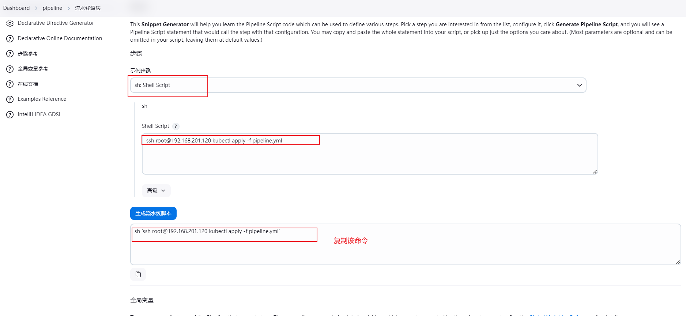

修改项目中Jenkinsfile文件，在执行步骤中添加一个步骤，然后去Jenkins构建

``` bash
stage('远程执行k8s-master节点的kubectl命令') {
			steps {
				sh 'ssh root@192.168.201.120 kubectl apply -f /usr/local/k8s/pipeline.yml'
			}
		}

```

最后成功部署了


#### 自动化CI操作

- 安装gitlab plugin 工具

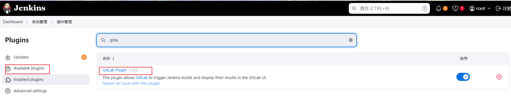

- 配置流水线任务的构建触发器，复制URL：http://192.168.201.111:8080/project/pipeline


- Gitlab配置Webhooks，将上面的url：http://192.168.201.111:8080/project/pipeline粘贴到下面位置，下面勾选push events

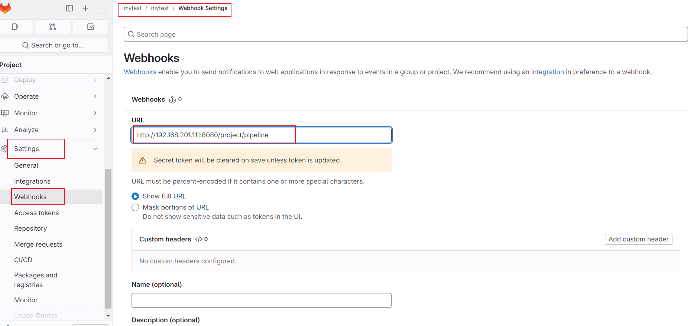

但是在保存的时候报了zURL阻塞这个问题，解决方案如下，点击admin下面的network找到Outbound requests都选下面选项，然后点击保存

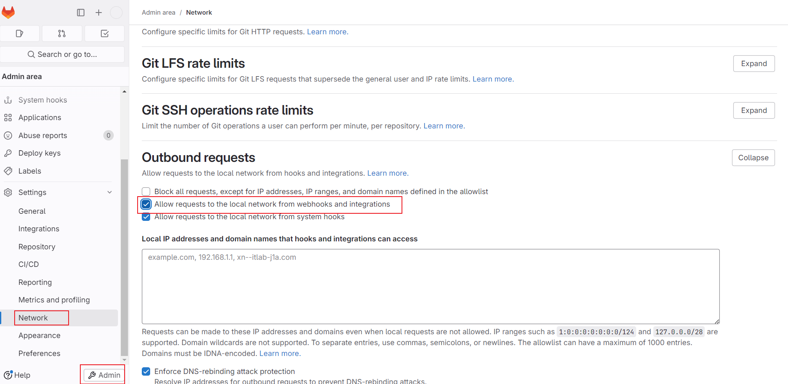

完成上面步骤，然后再次，到webhooks页面复制url然后点击保存。

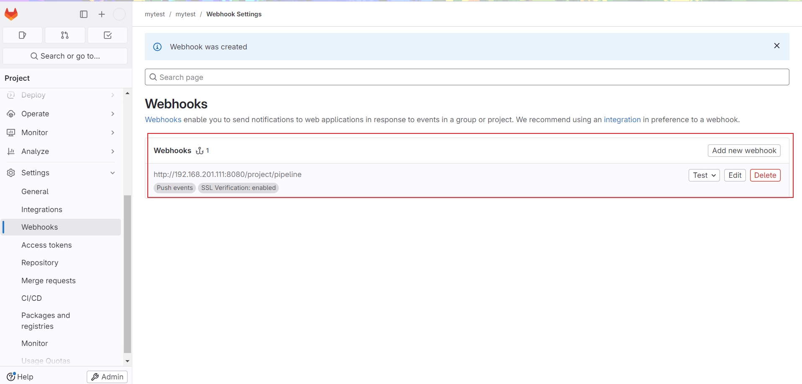

然后测试，报了403，应为Jenkins默认是不接收webhooks的请求的，这是Jenkins的安全机制导致的，需要修改Jenkins的系统配置

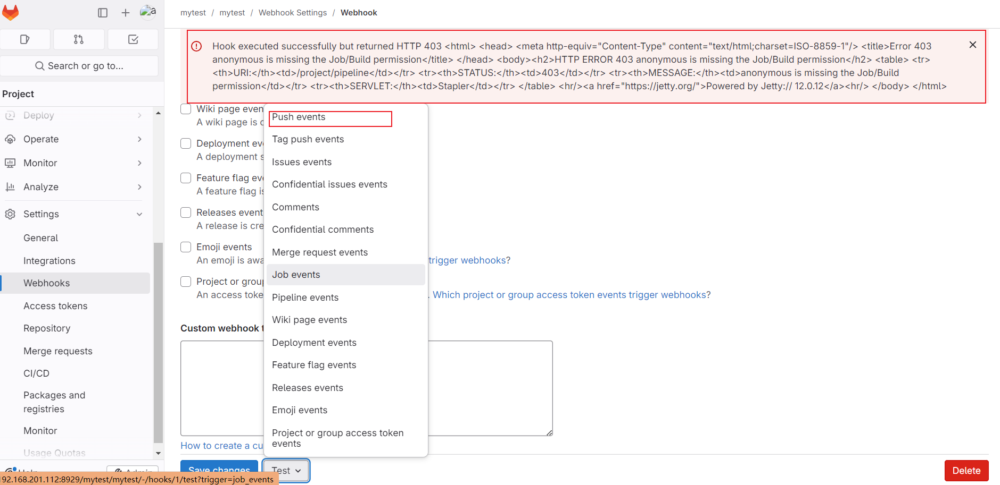

- 修改Jenkins的Gitlab配置，需要先安装我们上面说的**Gitlab plugin插件**

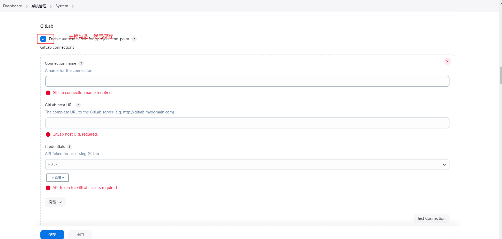

再次去webhooks页面进行测试，然后成功了，然后Jenkins也触发了构建

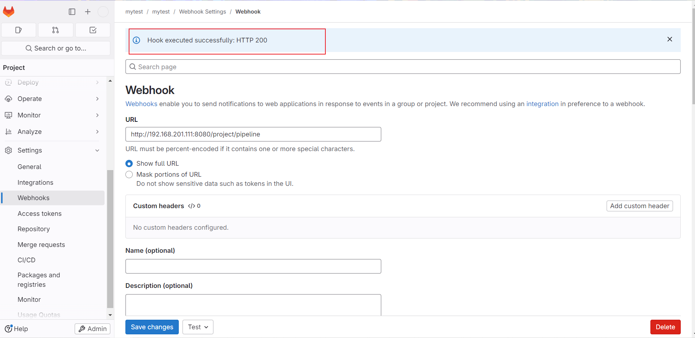

Jenkins自动构建

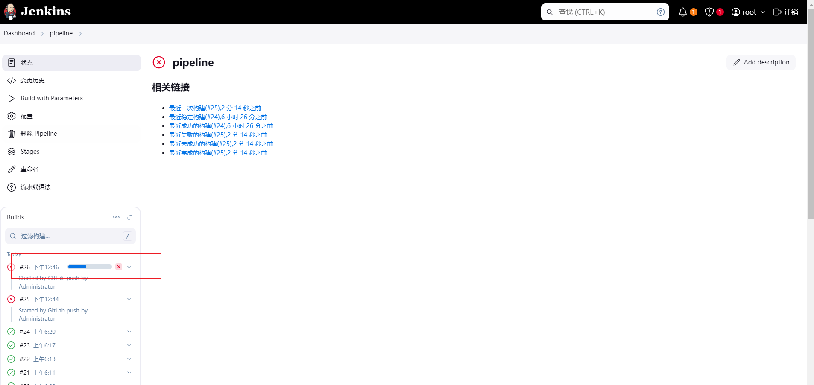

但是构建失败了，原因就是我们构建打包的时候，配置了tag提交点，现在我们是需要按代码的最新的提交点打包部署，要去掉git的参数配置，修改Jenkinsfile文件里用到的$tag的地方。

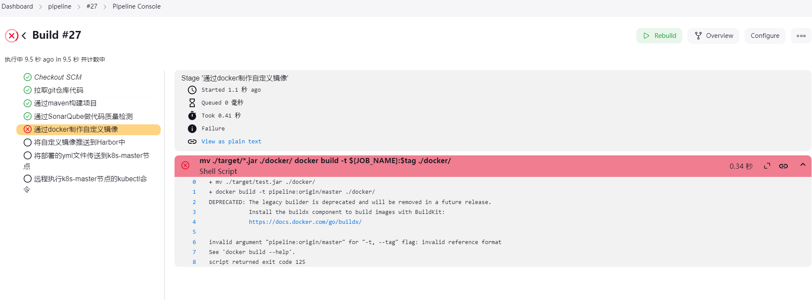

- 删除流水线的参数构建化过程

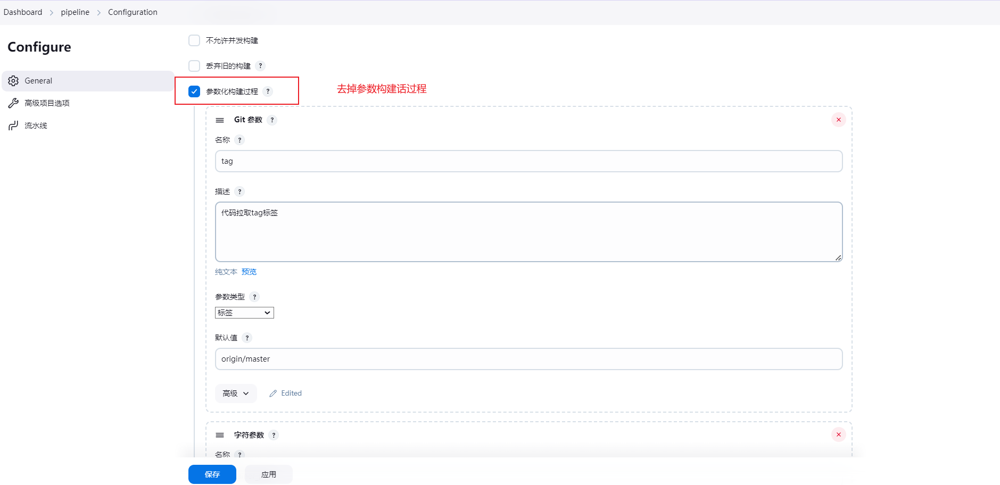

- 修改项目的Jenkinsfile文件,$tag替换

``` groovy
// 所有的脚本命令都放在pipeline中
pipeline{
	// 指定任务在哪个集群节点执行
	agent any
	// 声明全局变量，方便后面使用
	environment{
		harborUser='sswang'
		harborPasswd='A123456a'
		harborAddr='harbor.com'
		harborRepo='sswang'
	}
	
	stages{
		stage('拉取git仓库代码') {
			steps {
				checkout scmGit(branches: [[name: '*/master']], extensions: [], userRemoteConfigs: [[url: 'http://192.168.201.112:8929/mytest/mytest.git']])
			}
		}
		stage('通过maven构建项目') {
			steps {
				sh '/var/jenkins_home/maven/bin/mvn clean package -DskipTests'
			}
		}
		stage('通过SonarQube做代码质量检测') {
			steps {
			sh '/var/jenkins_home/sonar-scanner/bin/sonar-scanner -Dsonar.host.url=http://192.168.201.111:9000/ -Dsonar.sources=./ -Dsonar.projectname=${JOB_NAME} -Dsonar.projectKey=${JOB_NAME} -Dsonar.java.binaries=./target/ -Dsonar.login=65a1741c6f4191105f68096278fe77adaa1d15a1'
			}
		}
		stage('通过docker制作自定义镜像') {
			steps {
				sh '''mv ./target/*.jar ./docker/
				docker build -t ${JOB_NAME}:latest ./docker/'''
			}
		}
		stage('将自定义镜像推送到Harbor中') {
			steps {
				sh '''docker login -u ${harborUser} -p ${harborPasswd} ${harborAddr}
				docker tag ${JOB_NAME}:latest ${harborAddr}/${harborRepo}/${JOB_NAME}:latest
				docker push ${harborAddr}/${harborRepo}/${JOB_NAME}:latest'''
			}
		}
		stage('将部署的yml文件传送到k8s-master节点') {
			steps {
				sshPublisher(publishers: [sshPublisherDesc(configName: 'k8s', transfers: [sshTransfer(cleanRemote: false, excludes: '', execCommand: '', execTimeout: 120000, flatten: false, makeEmptyDirs: false, noDefaultExcludes: false, patternSeparator: '[, ]+', remoteDirectory: '', remoteDirectorySDF: false, removePrefix: '', sourceFiles: 'pipeline.yml')], usePromotionTimestamp: false, useWorkspaceInPromotion: false, verbose: false)])
			}
		}
		stage('远程执行k8s-master节点的kubectl命令') {
			steps {
				sh 'ssh root@192.168.201.120 kubectl apply -f /usr/local/k8s/pipeline.yml'
			}
		}
	}
}

```

然后修改controller文件，触发了构建，虽然构建成功了，但是发现了一个问题，k8s的pod并没有更新。

针对这个问题，k8s提供了一种解决的方法，`kubectl rollout restart deployment pipeline -n test`执行完命令后发现容器在滚动重启了

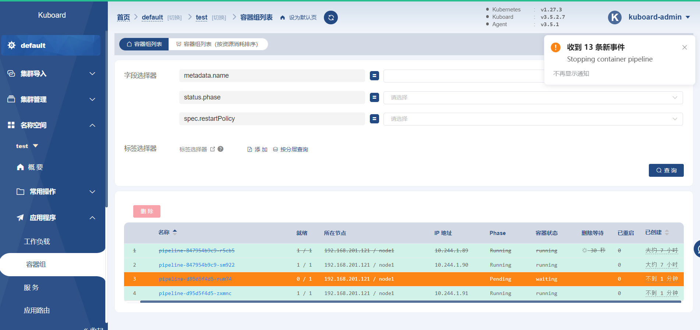

还有修改项目中pipeline.yml的镜像的版本号为latest

``` yaml
apiVersion: apps/v1
kind: Deployment
metadata:
  namespace: test
  name: pipeline
  labels:
    app: pipeline
spec:
  replicas: 2
  selector:
    matchLabels:
      app: pipeline
  template:
    metadata:
      labels:
        app: pipeline
    spec:
      containers:
      - name: pipeline
        image: harbor.com/sswang/pipeline:latest
        imagePullPolicy: Always
        ports:
        - containerPort: 8080

---
apiVersion: v1
kind: Service
metadata:
  namespace: test
  name: pipeline
  labels:
    app: pipeline
spec:
  selector:
    app: pipeline
  ports:
    - port: 8082
      targetPort: 8080
  type: NodePort

---
apiVersion: networking.k8s.io/v1
kind: Ingress
metadata:
  namespace: test
  name: pipeline
spec:
  ingressClassName: nginx
  rules:
  - host: pipeline.test.com
    http:
      paths:
      - path: /
        pathType: Prefix
        backend:
          service:
            name: pipeline
            port:
              number: 8082

```

重新触发部署后发现成功了


但是还有一个问题，因为我们是修改的pipeline.yml，所以生效了，但是我要是修改controller之后，还是没有变化，不信的话可以自己试一下，我试过了。哈哈哈，要解决这个问题，就要修改kubectl的命令

- 最终修改Jenkinsfile文件，添加k8s部署命令

``` bash
sh '''ssh root@192.168.201.120 kubectl apply -f /usr/local/k8s/pipeline.yml
ssh root@192.168.201.120 kubectl rollout restart deployment pipeline -n test'''
```

最终Jenkinsfile文件

``` groovy
// 所有的脚本命令都放在pipeline中
pipeline{
	// 指定任务在哪个集群节点执行
	agent any
	// 声明全局变量，方便后面使用
	environment{
		harborUser='sswang'
		harborPasswd='A123456a'
		harborAddr='harbor.com'
		harborRepo='sswang'
	}
	
	stages{
		stage('拉取git仓库代码') {
			steps {
				checkout scmGit(branches: [[name: '*/master']], extensions: [], userRemoteConfigs: [[url: 'http://192.168.201.112:8929/mytest/mytest.git']])
			}
		}
		stage('通过maven构建项目') {
			steps {
				sh '/var/jenkins_home/maven/bin/mvn clean package -DskipTests'
			}
		}
		stage('通过SonarQube做代码质量检测') {
			steps {
			sh '/var/jenkins_home/sonar-scanner/bin/sonar-scanner -Dsonar.host.url=http://192.168.201.111:9000/ -Dsonar.sources=./ -Dsonar.projectname=${JOB_NAME} -Dsonar.projectKey=${JOB_NAME} -Dsonar.java.binaries=./target/ -Dsonar.login=65a1741c6f4191105f68096278fe77adaa1d15a1'
			}
		}
		stage('通过docker制作自定义镜像') {
			steps {
				sh '''mv ./target/*.jar ./docker/
				docker build -t ${JOB_NAME}:latest ./docker/'''
			}
		}
		stage('将自定义镜像推送到Harbor中') {
			steps {
				sh '''docker login -u ${harborUser} -p ${harborPasswd} ${harborAddr}
				docker tag ${JOB_NAME}:latest ${harborAddr}/${harborRepo}/${JOB_NAME}:latest
				docker push ${harborAddr}/${harborRepo}/${JOB_NAME}:latest'''
			}
		}
		stage('将部署的yml文件传送到k8s-master节点') {
			steps {
				sshPublisher(publishers: [sshPublisherDesc(configName: 'k8s', transfers: [sshTransfer(cleanRemote: false, excludes: '', execCommand: '', execTimeout: 120000, flatten: false, makeEmptyDirs: false, noDefaultExcludes: false, patternSeparator: '[, ]+', remoteDirectory: '', remoteDirectorySDF: false, removePrefix: '', sourceFiles: 'pipeline.yml')], usePromotionTimestamp: false, useWorkspaceInPromotion: false, verbose: false)])
			}
		}
		stage('远程执行k8s-master节点的kubectl命令') {
			steps {
				sh '''ssh root@192.168.201.120 kubectl apply -f /usr/local/k8s/pipeline.yml
                ssh root@192.168.201.120 kubectl rollout restart deployment pipeline -n test'''
			}
		}
	}
}

```

修改controller文件验证

``` java
/**
 * @author analytics
 * @date 2024/8/20 22:10
 * @description
 */
@RestController
public class TestController {

    @GetMapping("/test")
    public String test() {
        return "Hello Jenkins the final Pipeline:latest!!!!!!!!!!";
    }
}

```

最后终于成功了，xdm，到此，累坏了。

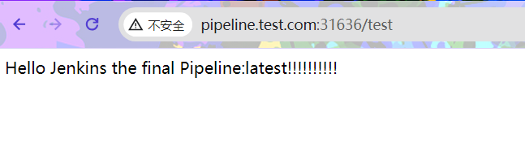

我爱学习


## 十一、 k8s集群部署

这里会单独出一个文档，记录k8s集群部署，可以参考

- https://cloud.fynote.com/share/d/IcInOR5h#7-2-Ingress%E9%83%A8%E7%BD%B2_145
- https://www.kuboard.cn/install/install-k8s.html#%E9%85%8D%E7%BD%AE%E8%A6%81%E6%B1%82


## 机器环境准备

环境基于自己的电脑，我的电脑时16G的，搭建了4太2C4G的虚拟机，CentOS 7.5+，如果资源充足可以多准备几台机器。

1. 准备一台干净的虚拟机，然后克隆完整的虚拟机2c4g
2. 修改IPADDR的值，也就是ip，避免ip冲突

``` bash
vim /etc/sysconfig/network-scripts/ifcfg-ens33
# 修改ip信息
TYPE=Ethernet
PROXY_METHOD=none
BROWSER_ONLY=no
BOOTPROTO=none
DEFROUTE=yes
IPV4_FAILURE_FATAL=no
IPV6INIT=yes
IPV6_AUTOCONF=yes
IPV6_DEFROUTE=yes
IPV6_FAILURE_FATAL=no
IPV6_ADDR_GEN_MODE=stable-privacy
NAME=ens33
UUID=2223198d-9d58-4db9-9206-bf3c0a9c10c9
DEVICE=ens33
ONBOOT=yes
IPADDR=192.168.201.111
PREFIX=24
GATEWAY=192.168.201.2
DNS1=223.5.5.5
IPV6_PRIVACY=no

```

3.  重启网络  systemctl restart network 

### 将CentOS的yum源更换为国内镜像源

1. **备份**

``` bash'
mv /etc/yum.repos.d/CentOS-Base.repo /etc/yum.repos.d/CentOS-Base.repo.bak
```

2. **下载新的 CentOS-Base.repo 到 /etc/yum.repos.d/**

``` bash
# centos6
wget -O /etc/yum.repos.d/CentOS-Base.repo http://mirrors.aliyun.com/repo/Centos-6.repo

# centos7
wget -O /etc/yum.repos.d/CentOS-Base.repo http://mirrors.aliyun.com/repo/Centos-7.repo
```

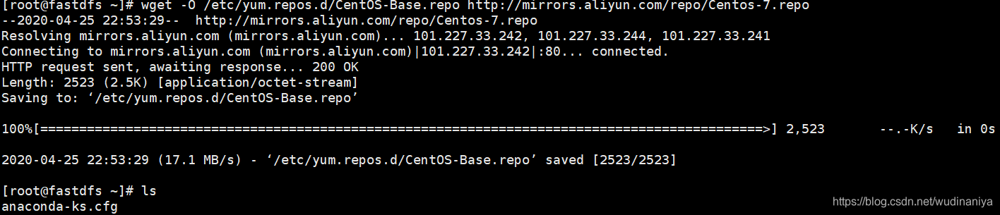

**3.之后运行yum makecache生成缓存**

``` bash
yum makecache
```


## 