# Kubernetes(K8s 1.27.x) 快速上手+实践

## 1. 基础知识

### 1.1 K8s 有用么？

K8s有没有用

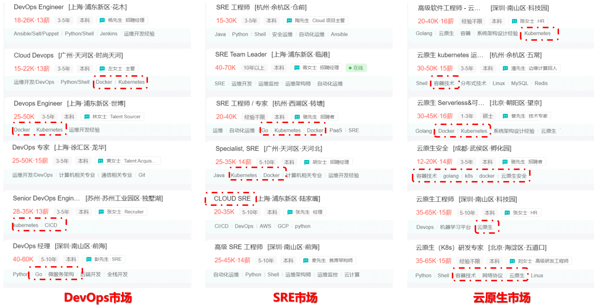

K8s要不要学？

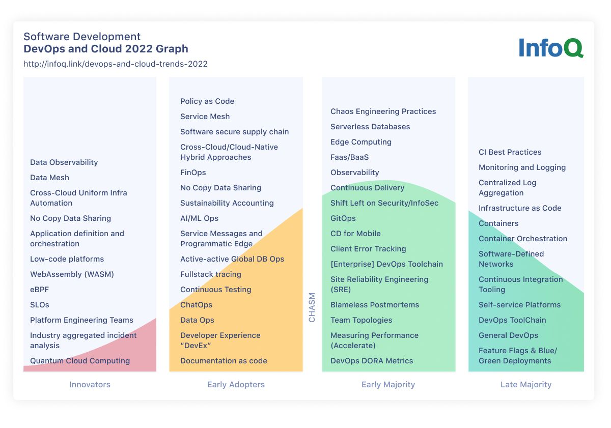

```pow
参考资料:
https://www.infoq.com/articles/devops-and-cloud-trends-2022/?itm_source=articles_about_InfoQ-trends-report&itm_medium=link&itm_campaign=InfoQ-trends-report
```

### 1.2 K8s 是什么？


### 1.3 k8s 部署方式

目前Kubernetes的两类部署样式

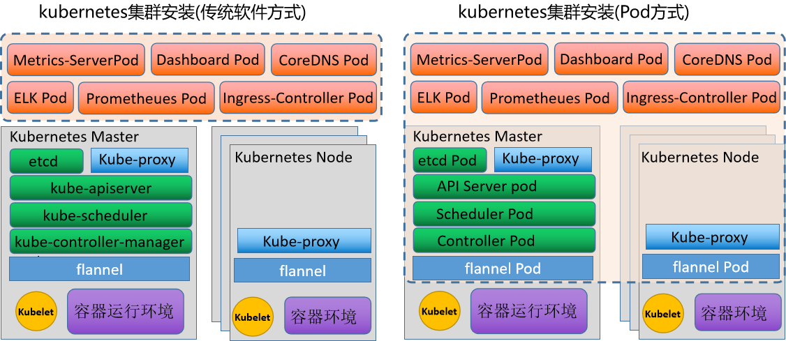

### 1.4 k8s 环境解析

网络环境解析

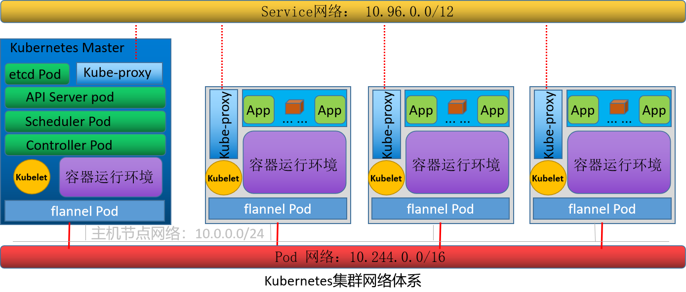

部署结构解析


## 2 环境部署

### 2.1 基础环境配置

主机名规划

| 序号 | 主机ip    | 主机名规划                                         |
| ---- | --------- | -------------------------------------------------- |
| 1    | 10.0.0.12 | kubernetes-master.sswang.com kubernetes-master     |
| 2    | 10.0.0.15 | kubernetes-node1.sswang.com kubernetes-node1       |
| 3    | 10.0.0.16 | kubernetes-node2.sswang.com kubernetes-node2       |
| 4    | 10.0.0.17 | kubernetes-node3.sswang.com kubernetes-node3       |
| 5    | 10.0.0.20 | kubernetes-register.sswang.com kubernetes-register |

跨主机免密码认证

```powershell
生成秘钥对
ssh-keygen -t rsa 

跨主机免密码认证
ssh-copy-id root@远程主机ip地址
```

Swap环境配置(所有主机操作)

```powershell
临时禁用
swapoff -a

永久禁用
sed -i 's/.*swap.*/#&/' /etc/fstab 

内核参数调整
cat >> /etc/sysctl.d/k8s.conf << EOF
vm.swappiness=0
EOF
sysctl -p /etc/sysctl.d/k8s.conf
```

网络参数调整(所有主机操作)

```powershell
配置iptables参数，使得流经网桥的流量也经过iptables/netfilter防火墙
cat >> /etc/sysctl.d/k8s.conf << EOF
net.bridge.bridge-nf-call-ip6tables = 1
net.bridge.bridge-nf-call-iptables = 1
net.ipv4.ip_forward = 1
EOF

配置生效
modprobe br_netfilter
modprobe overlay
sysctl -p /etc/sysctl.d/k8s.conf
```

### 2.2 容器环境操作

注意：所有主机操作

部署docker软件源

```powershell
定制软件源
yum install -y yum-utils device-mapper-persistent-data lvm2
yum-config-manager --add-repo http://mirrors.aliyun.com/docker-ce/linux/centos/docker-ce.repo
安装最新版docker
yum list docker-ce --showduplicates | sort -r
yum install -y docker-ce
systemctl enable docker
systemctl start docker
```

docker加速器配置

```powershell
配置加速器文件
]# cat >> /etc/docker/daemon.json <<-EOF
{
  "registry-mirrors": [
    "http://74f21445.m.daocloud.io",
    "https://registry.docker-cn.com",
    "http://hub-mirror.c.163.com",
    "https://docker.mirrors.ustc.edu.cn"
  ], 
  "insecure-registries": ["kubernetes-register.sswang.com"], 
  "exec-opts": ["native.cgroupdriver=systemd"]
}
EOF

重启docker服务
systemctl restart docker
```

### 2.3 cri环境操作

注意：所有主机操作

获取软件

```powershell
下载软件
mkdir /data/softs && cd /data/softs
wget https://github.com/Mirantis/cri-dockerd/releases/download/v0.3.2/cri-dockerd-0.3.2.amd64.tgz

解压软件
tar xf cri-dockerd-0.3.2.amd64.tgz
mv cri-dockerd/cri-dockerd /usr/local/bin/

检查效果
cri-dockerd --version
```

定制配置

```powershell
定制配置文件
cat > /etc/systemd/system/cri-dockerd.service<<-EOF
[Unit]
Description=CRI Interface for Docker Application Container Engine
Documentation=https://docs.mirantis.com
After=network-online.target firewalld.service docker.service
Wants=network-online.target
[Service]
Type=notify
ExecStart=/usr/local/bin/cri-dockerd --pod-infra-container-image=registry.cn-hangzhou.aliyuncs.com/google_containers/pause:3.9
 --network-plugin=cni --cni-conf-dir=/etc/cni/net.d --cni-bin-dir=/opt/cni/bin --container-runtime-endpoint=unix:///var/run/cri-dockerd.sock --cri-dockerd-root-directory=/var/lib/dockershim --docker-endpoint=unix:///var/run/docker.sock --cri-dockerd-root-directory=/var/lib/docker
ExecReload=/bin/kill -s HUP $MAINPID
TimeoutSec=0
RestartSec=2
Restart=always
StartLimitBurst=3
StartLimitInterval=60s
LimitNOFILE=infinity
LimitNPROC=infinity
LimitCORE=infinity
TasksMax=infinity
Delegate=yes
KillMode=process
[Install]
WantedBy=multi-user.target
EOF
定制配置
cat > /etc/systemd/system/cri-dockerd.socket <<-EOF
[Unit]
Description=CRI Docker Socket for the API
PartOf=cri-docker.service

[Socket]
ListenStream=/var/run/cri-dockerd.sock
SocketMode=0660
SocketUser=root
SocketGroup=docker

[Install]
WantedBy=sockets.target
EOF
设置服务开机自启动
systemctl daemon-reload
systemctl enable cri-dockerd.service
systemctl restart cri-dockerd.service
```

### 2.4 harbor仓库操作

准备工作

```powershell
安装docker环境
参考 上一节docker环境部署
安装docker-compose
yum install -y docker-compose
```

获取软件

```powershell
下载软件
mkdir /data/{softs,server} -p && cd /data/softs
wget https://github.com/goharbor/harbor/releases/download/v2.5.0/harbor-offline-installer-v2.5.0.tgz

解压软件
tar -zxvf harbor-offline-installer-v2.5.0.tgz -C  /data/server/
cd /data/server/harbor/

加载镜像
docker load < harbor.v2.5.0.tar.gz
docker images

备份配置
cp harbor.yml.tmpl harbor.yml
```

修改配置

```powershell
修改配置
[root@kubernetes-register /data/server/harbor]# vim harbor.yml.tmpl
    # 修改主机名
    hostname: kubernetes-register.sswang.com
    http:
      port: 80
    #https:  注释ssl相关的部分
      #  port: 443
      #  certificate: /your/certificate/path
      #  private_key: /your/private/key/path
    # 修改harbor的登录密码
    harbor_admin_password: 123456
    # 设定harbor的数据存储目录
    data_volume: /data/server/harbor/data
配置harbor
./prepare

启动harbor
./install.sh

检查效果
docker-compose ps
```

定制服务启动文件

```powershell
定制服务启动文件 /etc/systemd/system/harbor.service
[Unit]
Description=Harbor
After=docker.service systemd-networkd.service systemd-resolved.service
Requires=docker.service
Documentation=http://github.com/vmware/harbor

[Service]
Type=simple
Restart=on-failure
RestartSec=5
#需要注意harbor的安装位置
ExecStart=/usr/bin/docker-compose --file /data/server/harbor/docker-compose.yml up
ExecStop=/usr/bin/docker-compose --file /data/server/harbor/docker-compose.yml down

[Install]
WantedBy=multi-user.target
加载服务配置文件
systemctl daemon-reload
启动服务
systemctl start harbor
检查状态
systemctl status harbor
设置开机自启动
systemctl enable harbor
```

harbor仓库定制

```powershell
浏览器访问域名，用户名: admin, 密码：123456
创建sswang用户专用的项目仓库，名称为 sswang，权限为公开的
```

harbor仓库测试

```powershell
登录仓库
# docker login kubernetes-register.sswang.com -u sswang
Password:   # 输入登录密码 A12345678a

下载镜像
docker pull busybox

定制镜像标签
docker tag busybox kubernetes-register.sswang.com/sswang/busybox:v0.1

推送镜像
docker push kubernetes-register.sswang.com/sswang/busybox:v0.1
```

### 2.5 k8s集群初始化

软件部署

```powershell
定制阿里云的关于kubernetes的软件源
]# cat > /etc/yum.repos.d/kubernetes.repo << EOF
[kubernetes]
name=Kubernetes
baseurl=https://mirrors.aliyun.com/kubernetes/yum/repos/kubernetes-el7-x86_64
enabled=1
gpgcheck=0
repo_gpgcheck=0
gpgkey=https://mirrors.aliyun.com/kubernetes/yum/doc/yum-key.gpg https://mirrors.aliyun.com/kubernetes/yum/doc/rpm-package-key.gpg
EOF

更新软件源
yum makecache fast
master环境软件部署
yum install kubeadm kubectl kubelet -y

node环境软件部署
yum install kubeadm kubectl kubelet -y
```

确认基本配置

```powershell
检查镜像文件列表
kubeadm config images list

获取镜像文件
images=$(kubeadm config images list --kubernetes-version=1.27.3 | awk -F "/" '{print $NF}')
for i in ${images}
do
  docker pull registry.aliyuncs.com/google_containers/$i
  docker tag registry.aliyuncs.com/google_containers/$i kubernetes-register.sswang.com/google_containers/$i
  docker push kubernetes-register.sswang.com/google_containers/$i
  docker rmi registry.aliyuncs.com/google_containers/$i
done
```

master节点初始化

```powershell
环境初始化命令
kubeadm init --kubernetes-version=1.27.3 \
--apiserver-advertise-address=10.0.0.12 \
--image-repository kubernetes-register.superopsmsb.com/google_containers \
--service-cidr=10.96.0.0/12 \
--pod-network-cidr=10.244.0.0/16 \
--ignore-preflight-errors=Swap \
--cri-socket=unix:///var/run/cri-dockerd.sock
```

node节点加入集群

```powershell
复制join命令，加入到master集群
kubeadm join 10.0.0.12:6443 --token vudfvt.fwpohpbb7yw2qy49 \
        --discovery-token-ca-cert-hash sha256:1... ...48545 --cri-socket=unix:///var/run/cri-dockerd.sock
```

### 2.6 k8s环境收尾操作

权限操作

```powershell
定制kubernetes的登录权限
mkdir -p $HOME/.kube
cp -i /etc/kubernetes/admin.conf $HOME/.kube/config
chown $(id -u):$(id -g) $HOME/.kube/config
```

命令补全

```powershell
放到master主机的环境文件中
echo "source <(kubectl completion bash)" >> ~/.bashrc
echo "source <(kubeadm completion bash)" >> ~/.bashrc
source ~/.bashrc
```

网络环境

```powershell
网络定制
mkdir /data/kubernetes/flannel -p
cd /data/kubernetes/flannel

获取配置文件
wget https://raw.githubusercontent.com/flannel-io/flannel/master/Documentation/kube-flannel.yml

定制镜像标签
for i in $(grep image kube-flannel.yml | grep -v '#' | awk -F '/' '{print $NF}')
do
    docker pull flannel/$i
    docker tag flannel/$i kubernetes-register.superopsmsb.com/google_containers/$i
    docker push kubernetes-register.superopsmsb.com/google_containers/$i
    docker rmi flannel/$i
done

备份配置文件
cp kube-flannel.yml{,.bak}
修改配置文件
sed -i '/ image:/s/docker.io\/flannel/kubernetes-register.sswang.com\/google_containers/' kube-flannel.yml

应用配置文件
kubectl apply -f kube-flannel.yml

检查效果
kubectl get node
```

## 3 应用部署

### 3.1 应用管理解读

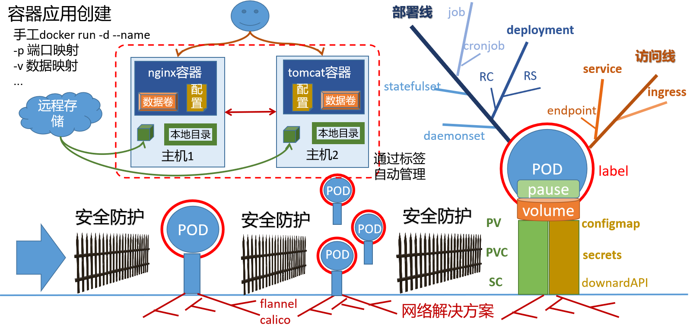

### 3.2 应用部署实践

资源对象管理关系

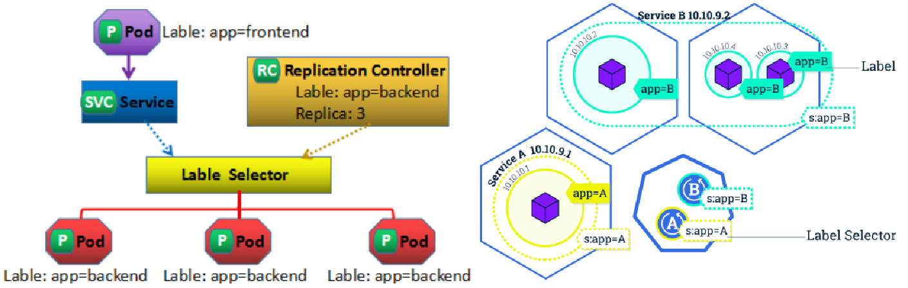

资源对象管理实践

```powershell
手工方式：
kubectl run pod名称 --image=image地址
资源清单方式:
apiVersion: v1
kind: Pod
metadata:
  labels:
    run: my-pod
  name: my-pod
spec:
  containers:
  - image: kubernetes-register.sswang.com/sswang/nginx
    name: my-pod
```

deployment资源实践

```powershell
nginx-proxy应用的配置清单文件
apiVersion: apps/v1
kind: Deployment
metadata:
  name: sswang-nginx-proxy
  labels:
    app: nginx
spec:
  replicas: 1
  selector:
    matchLabels:
      app: nginx
  template:
    metadata:
      labels:
        app: nginx
    spec:
      containers:
      - name: nginx
        image: kubernetes-register.sswang.com/sswang/nginx
        ports:
        - containerPort: 80
nginx-web 的资源清单文件
apiVersion: apps/v1
kind: Deployment
metadata:
  name: sswang-nginx-web
  labels:
    app: nginx-web
spec:
  replicas: 1
  selector:
    matchLabels:
      app: nginx-web
  template:
    metadata:
      labels:
        app: nginx-web
    spec:
      containers:
      - name: nginx
        image: kubernetes-register.sswang.com/sswang/nginx_web:v0.1
        ports:
        - containerPort: 80
tomcat-web 的资源清单文件
apiVersion: apps/v1
kind: Deployment
metadata:
  name: sswang-tomcat-web
  labels:
    app: tomcat-web
spec:
  replicas: 1
  selector:
    matchLabels:
      app: tomcat-web
  template:
    metadata:
      labels:
        app: tomcat-web
    spec:
      containers:
      - name: tomcat
        image: kubernetes-register.sswang.com/sswang/tomcat_web:v0.1
        ports:
        - containerPort: 8080
```

### 3.3 应用管理实践

资源对象隔离

```powershell
namespace资源对象实践
apiVersion: v1
kind: Namespace
metadata:
  name: my-ns
---
apiVersion: apps/v1
kind: Deployment
metadata:
  name: sswang-tomcat-web
  namespace: my-ns
  labels:
    app: tomcat-web
spec:
  replicas: 1
  selector:
    matchLabels:
      app: tomcat-web
  template:
    metadata:
      labels:
        app: tomcat-web
    spec:
      containers:
      - name: tomcat
        image: kubernetes-register.sswang.com/sswang/tomcat_web:v0.1
        ports:
        - containerPort: 8080
```

资源对象的扩缩容

```powershell
资源对象扩缩容
kubectl scale deployment 资源对象名称 --replicas=目标数量 deployment/mysql

修改应用镜像版本
kubectl set image deployment 资源对象名称 容器名称=镜像名称
```

## 4 应用访问

### 4.1 service对象定位

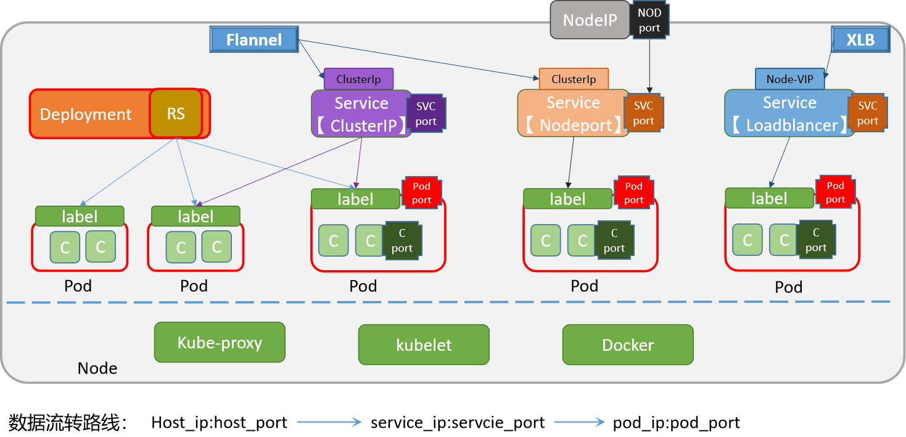

### 4.2 Service 实践

手工创建Service

```powershell
根据应用部署资源对象，创建SVC对象
kubectl expose deployment nginx --port=80 --type=NodePort
```

yaml方式创建Service

```powershell
nginx-web的service资源清单文件
apiVersion: v1
kind: Service
metadata:
  name: sswang-nginx-web
  labels:
    app: nginx-web
spec:
  type: NodePort
  selector:
    app: nginx-web
  ports:
    - protocol: TCP
      name: http
      port: 80
      targetPort: 80
      nodePort: 31080
tomcat-web的service资源清单文件
apiVersion: v1
kind: Service
metadata:
  name: sswang-tomcat-web
  labels:
    app: tomcat-web
spec:
  type: NodePort
  selector:
    app: tomcat
  ports:
    - protocol: TCP
      name: http
      port: 8080
      targetPort: 8080
      nodePort: 31880
```

### 4.3 外部Service

部署外部mysql环境

```powershell
准备软件源
]# cat /etc/yum.repos.d/MariaDB.repo
[mariadb]
name = MariaDB
baseurl = http://yum.mariadb.org/10.3/centos7-amd64
gpgcheck=0

更新系统软件包：
yum makecache fast

安装 MySQL 服务器
yum install mariadb-server mariadb -y 

设置 MySQL 服务在启动时自动启动
systemctl start mariadb.service
systemctl enable mariadb.service
开启 MySQL 服务器远程访问能力
]# vim /etc/my.cnf.d/server.cnf
[mysqld]
bind-address = 0.0.0.0

重启 MySQL 服务使配置生效
systemctl restart mariadb.service

配置远程主机登录权限
mysql -uroot -p123456 -e "GRANT ALL PRIVILEGES ON *.* TO 'root'@'%' IDENTIFIED BY '123456' WITH GRANT OPTION;"
mysql -uroot -p123456 -e "FLUSH PRIVILEGES;"
主库上创建数据库
]# mysql -uroot -p123456 -e "
CREATE DATABASE bookinfo default charset utf8 collate utf8_general_ci;
USE bookinfo;
CREATE TABLE book_info (
  id INT AUTO_INCREMENT PRIMARY KEY,
  book_name VARCHAR(100),
  author VARCHAR(100),
  date_of_issue DATE,
  isDelete BOOLEAN
);
INSERT INTO book_info (book_name, author, date_of_issue, isDelete) VALUES
  ('Book 1', 'Author 1', '2022-01-01', FALSE),
  ('Book 2', 'Author 2', '2022-02-01', FALSE),
  ('Book 3', 'Author 3', '2022-03-01', TRUE);
"
```

定制资源清单文件

```powershell
apiVersion: v1
kind: Namespace
metadata:
  name: external-ns
---
apiVersion: v1
kind: Endpoints
metadata:
  name: ex-mysql
  namespace: external-ns
subsets:
  - addresses:
      - ip: 10.0.0.18
    ports:
      - port: 3306
---
apiVersion: v1
kind: Service
metadata:
  name: ex-mysql
  namespace: external-ns
spec:
  type: ClusterIP
  ports:
  - port: 3306
    targetPort: 3306
---
apiVersion: apps/v1
kind: Deployment
metadata:
  name: bookinfo
  namespace: external-ns
spec:
  replicas: 1
  selector:
    matchLabels:
      app: flask-bookinfo
  template:
    metadata:
      labels:
        app: flask-bookinfo
    spec:
      containers:
        - name: flask-bookinfo
          image: kubernetes-register.sswang.com/sswang/flask_bookinfo:2.3.2
          imagePullPolicy: Always
          ports:
            - containerPort: 5000
          env:
            - name: DB_HOST
              value: "ex-mysql"
            - name: DB_USER
              value: "root"
            - name: DB_PASSWORD
              value: "123456"
            - name: DB_DATABASE
              value: "bookinfo"
```

## 5 应用数据

### 5.1 应用数据解析

k8s应用数据类型和步骤解析

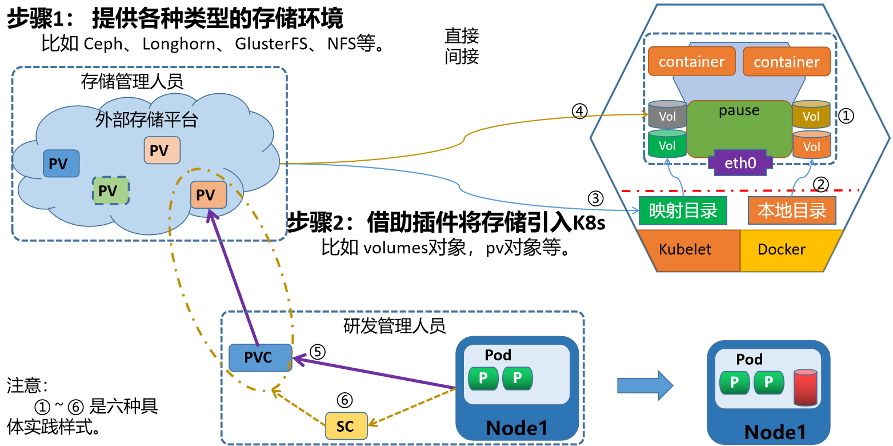

k8s如何使用数据功能

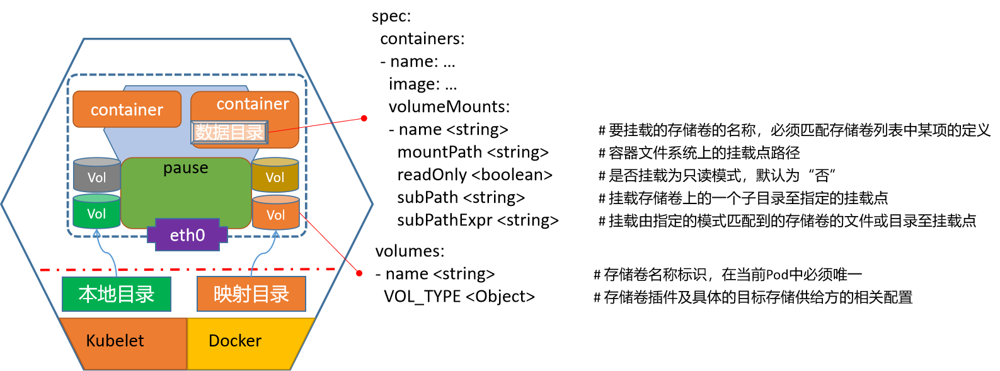

k8s使用各种数据类型的配置

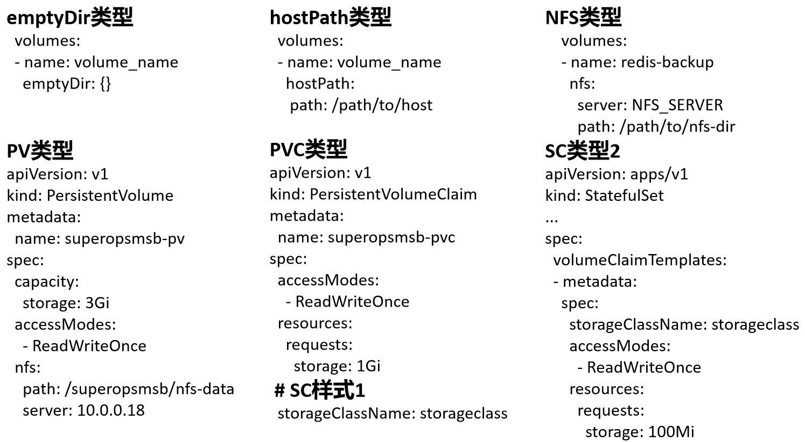

### 5.2 应用数据实践

emptyDir实践

```powershell
资源对象文件内容
apiVersion: v1
kind: Pod
metadata:
  name: sswang-emptydir
spec:
  containers:
  - name: nginx-web
    image: kubernetes-register.sswang.com/sswang/nginx_web:v0.1
    volumeMounts:
    - name: nginx-index
      mountPath: /usr/share/nginx/html
  - name: change-index
    image: kubernetes-register.sswang.com/sswang/busybox:1.28
    # 每过2秒更改一下文件内容
    command: ['sh', '-c', 'for i in $(seq 100); do echo index-$i > /testdir/index.html;sleep 2;done']
    volumeMounts:
    - name: nginx-index
      mountPath: /testdir
  volumes:
  - name: nginx-index
    emptyDir: {}
```

hostPath实践

```powershell
资源对象文件内容
apiVersion: v1
kind: Pod
metadata:
  name: sswang-hostpath
spec:
  volumes:
  - name: redis-backup
    hostPath:
     path: /data/backup/redis
  containers:
    - name: hostpath-redis
      image: kubernetes-register.sswang.com/sswang/redis:7.0.4
      volumeMounts:
       - name: redis-backup
         mountPath: /data
```

## 6 应用配置

### 6.1 应用配置解析

k8s如何使用配置数据功能


### 6.2 配置文件实践

定制配置文件实践

```powershell
定制资源清单文件
apiVersion: v1
kind: ConfigMap
metadata:
  name: sswang-nginxconf
data:
  default.conf: |
    server {
        listen 80;
        server_name www.sswang.com;
        location /nginx {
          proxy_pass http://sswang-nginx-web/;
        }
        location /tomcat {
          proxy_pass http://sswang-tomcat-web:8080/;
        }
        location / {
            root /usr/share/nginx/html;
        }
    }
---
apiVersion: v1
kind: ConfigMap
metadata:
  name: sswang-nginx-index
data:
  index.html: "Hello Nginx, This is Nginx Web Page by sswang!!!\n"
定制nginx-proxy代理
apiVersion: apps/v1
kind: Deployment
metadata:
  name: sswang-nginx-proxy
  labels:
    app: nginx
spec:
  replicas: 1
  selector:
    matchLabels:
      app: nginx
  template:
    metadata:
      labels:
        app: nginx
    spec:
      containers:
      - name: nginx
        image: kubernetes-register.sswang.com/sswang/nginx_proxy:v0.1
        volumeMounts:
        - name: nginxconf
          mountPath: /etc/nginx/conf.d/
          readOnly: true
        - name: nginxindex
          mountPath: /usr/share/nginx/html/
          readOnly: true
      volumes:
      - name: nginxconf
        configMap:
          name: sswang-nginxconf
      - name: nginxindex
        configMap:
          name: sswang-nginx-index
---
apiVersion: v1
kind: Service
metadata:
  name: superopsmsb-nginx-proxy
  labels:
    app: superopsmsb-nginx-proxy
spec:
  selector:
    app: nginx
  ports:
    - protocol: TCP
      name: http
      port: 80
      targetPort: 80
```

### 6.3 敏感文件实践

定制配置文件

```powershell
准备nginx容器的配置目录
mkdir tls-key

做证书
openssl  genrsa -out tls-key/tls.key 2048

做成自签证书
openssl req  -new -x509 -key tls-key/tls.key  -out tls-key/tls.crt -subj "/CN=www.sswang.com"
定制专属nginx配置文件  nginx-conf-tls/default.conf
server {
    listen 443 ssl;
    server_name www.sswang.com;
    ssl_certificate /etc/nginx/certs/tls.crt; 
    ssl_certificate_key /etc/nginx/certs/tls.key;
    location / {
        root /usr/share/nginx/html;
    }
}

server {
    listen 80;
    server_name www.sswang.com; 
    return 301 https://$host$request_uri; 
}
```

手工创建资源对象文件

```powershell
创建cm资源对象
kubectl create configmap nginx-ssl-conf --from-file=nginx-conf-tls/

创建secret资源对象
kubectl create secret tls nginx-ssl-secret --cert=tls-key/tls.crt --key=tls-key/tls.key
定制资源清单文件
apiVersion: v1
kind: Pod
metadata:
  name: sswang-nginx-ssl
spec:
  containers:
  - image: kubernetes-register.sswang.com/sswang/nginx_web:v0.1
    name: nginx-web
    volumeMounts:
    - name: nginxcerts
      mountPath: /etc/nginx/certs/
      readOnly: true
    - name: nginxconfs
      mountPath: /etc/nginx/conf.d/
      readOnly: true
  volumes:
  - name: nginxcerts
    secret:
      secretName: nginx-ssl-secret
  - name: nginxconfs
    configMap:
      name: nginx-ssl-conf
```

## 7 服务访问

### 7.1 Ingress简介

原理解析

```powershell
Ingress是授权入站连接到达集群服务的规则集合。
    从外部流量调度到nodeport上的service
    从service调度到ingress-controller
    ingress-controller根据ingress[Pod]中的定义（虚拟主机或者后端的url）
    根据虚拟主机名直接调度到后端的一组应用pod中
```

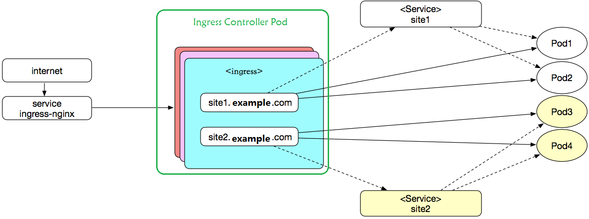

### 7.2 Ingress部署

环境部署

```powershell
获取配置文件
cd /data/kubernetes/app_secure
mkdir ingress ; cd ingress
wget https://raw.githubusercontent.com/kubernetes/ingress-nginx/controller-v1.3.1/deploy/static/provider/baremetal/deploy.yaml
mv deploy.yaml ingress-deploy.yaml
cp ingress-deploy.yaml{,.bak}
默认镜像
]# grep image: ingress-deploy.yaml | awk -F '/|@' '{print $(NF-1)}' | uniq
controller:v1.3.1
kube-webhook-certgen:v1.3.0

获取镜像
for i in nginx-ingress-controller:v1.3.1 kube-webhook-certgen:v1.3.0
do
  docker pull registry.cn-hangzhou.aliyuncs.com/google_containers/$i
  docker tag registry.cn-hangzhou.aliyuncs.com/google_containers/$i kubernetes-register.sswang.com/google_containers/$i
  docker push kubernetes-register.sswang.com/google_containers/$i
  docker rmi registry.cn-hangzhou.aliyuncs.com/google_containers/$i
done
注意：
	controller的名称是需要更改一下，阿里云的镜像名称多了一个标识
修改基础镜像
]# grep image: ingress-deploy.yaml
          image: kubernetes-register.sswang.com/google_containers/nginx-ingress-controller:v1.3.1
          image: kubernetes-register.sswang.com/google_containers/kube-webhook-certgen:v1.3.0
          image: kubernetes-register.sswang.com/google_containers/kube-webhook-certgen:v1.3.0
        
开放访问入口地址  
]# vim ingress-deploy.yaml
...
334 apiVersion: v1
335 kind: Service
...
344   namespace: ingress-nginx
345 spec:
      ...
348   ipFamilyPolicy: SingleStack
349   externalIPs: ['10.0.0.12']			# 限制集群外部访问的入口ip
350   ports:
351   - appProtocol: http
352     name: http
353     port: 80
...
628   failurePolicy: Ignore				    # 为了避免默认的准入控制限制，改为Ignore
...
应用资源配置文件
]# kubectl apply -f ingress-deploy.yaml

确认效果
]# kubectl get all -n ingress-nginx
NAME                                            READY   STATUS      RESTARTS   AGE
pod/ingress-nginx-admission-create-s5p7h        0/1     Completed   0          105s
pod/ingress-nginx-admission-patch-qnjmv         0/1     Completed   0          105s
pod/ingress-nginx-controller-6cc467dfd9-c2dfg   1/1     Running     0          105s

NAME                                         TYPE        CLUSTER-IP       EXTERNAL-IP   PORT(S)                      AGE
service/ingress-nginx-controller             NodePort    10.109.163.145   10.0.0.12     80:30439/TCP,443:31912/TCP   105s
service/ingress-nginx-controller-admission   ClusterIP   10.96.223.121    <none>        443/TCP                      105s

NAME                                       READY   UP-TO-DATE   AVAILABLE   AGE
deployment.apps/ingress-nginx-controller   1/1     1            1           105s

NAME                                                  DESIRED   CURRENT   READY   AGE
replicaset.apps/ingress-nginx-controller-6cc467dfd9   1         1         1       105s

NAME                                       COMPLETIONS   DURATION   AGE
job.batch/ingress-nginx-admission-create   1/1           8s         105s
job.batch/ingress-nginx-admission-patch    1/1           7s         105s
测试访问页面
]# curl 10.0.0.12:30439
<html>
<head><title>404 Not Found</title></head>
<body>
<center><h1>404 Not Found</h1></center>
<hr><center>nginx</center>
</body>
</html>
```

### 7.3 Ingress实践

定制资源清单文件

```powershell
定制资源清单文件
apiVersion: networking.k8s.io/v1
kind: Ingress
metadata:
  name: superopsmsb-ingress-mulhost
  annotations:
    kubernetes.io/ingress.class: "nginx"
spec:
  rules:
  - host: nginx.sswang.com
    http:
      paths:
      - path: /
        pathType: Prefix
        backend:
          service:
            name: sswang-nginx-web
            port:
              number: 80
  - host: tomcat.sswang.com
    http:
      paths:
      - path: /
        pathType: Prefix
        backend:
          service:
            name: sswang-tomcat-web
            port:
              number: 8080
```

## 8 helm管理

### 8.1 helm简介

需求

```powershell
在kubernetes平台上，我们在部署各种各样的应用服务的时候，可以基于手工或者自动的方式对各种资源对象实现伸缩操作，尤其是对于有状态的应用，我们可以结合持久性存储机制实现更大场景的伸缩动作。但是，无论我们怎么操作各种资源对象，问题最多的就是各种基础配置、镜像等之类的依赖管理操作。在linux平台下，常见的包依赖的就是yum、apt等工具，在kubernetes平台下，同样有类似的解决依赖关系的工具 -- helm。
官方网址：https://v3.helm.sh/
官方地址：https://github.com/helm/helm
```

简介

```powershell
helm的功能类似于yum 或 apt，提供应用部署时候所需要的各种配置、资源清单文件，他与yum之类工具不同的是，在k8s中helm是不提供镜像的，这些镜像文件需要由专门的镜像仓库来提供。

	例如：k8s平台上的nginx应用部署，对于该应用部署来说，主要需要三类内容：
        镜像：nginx镜像
        资源定义文件：Deployment、service、hpa等
        专用文件：配置文件、证书等
        helm管理的主要是：资源定义文件和专用文件。
```

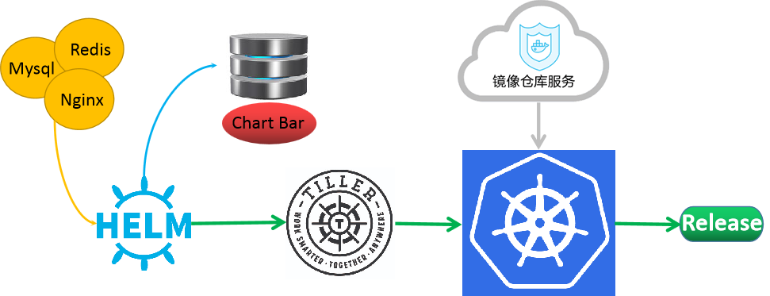

```powershell
基于helm来成功的部署一个应用服务，完整的工作流程如下：
1 部署一个稳定运行的k8s集群，在能管理k8s的主机上部署helm。
2 用户在客户端主机上，定制各种Chart资源和config资源，上传到专用的仓库(本地或者远程)
3 helm客户端向Tiller发出部署请求，如果本地有chart用本地的，否则从仓库获取
4 Tiller与k8s集群的api-server发送请求
5 api-server通过集群内部机制部署应用，需要依赖镜像的时候，从专门的镜像仓库获取。
6 基于helm部署好的应用实例，在k8s集群中，我们称之为release。
```

v3介绍

```powershell
根据我们对 helm v2 版本的流程解析，我们发现，在客户端上部署tiller来维护 release相关的信息，有些太重量级了，所以在 helm v3 版本的时候，就剔除了专门的Tiller。在 Helm v3 中移除了 Tiller, 版本相关的数据直接存储在了 Kubernetes 中.
```

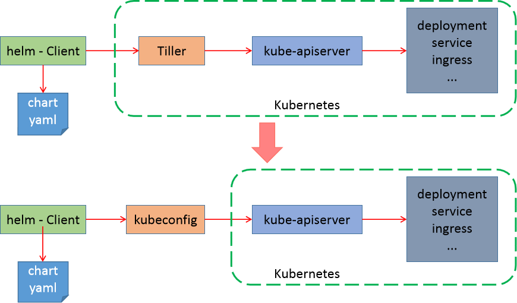

### 8.2 helm部署

软件部署

```powershell
下载软件
cd /data/softs
wget https://get.helm.sh/helm-v3.13.0-linux-amd64.tar.gz

配置环境
mkdir /data/server/helm/bin -p
tar xf helm-v3.13.0-linux-amd64.tar.gz
mv linux-amd64/helm /data/server/helm/bin/

环境变量
# cat /etc/profile.d/helm.sh
#!/bin/bash
# set helm env
export PATH=$PATH:/data/server/helm/bin

chmod +x /etc/profile.d/helm.sh
source /etc/profile.d/helm.sh

确认效果
# helm  version
version.BuildInfo{Version:"v3.13.0", GitCommit:"1d11fcb5d3f3bf00dbe6fe31b8412839a96b3dc4", GitTreeState:"clean", GoVersion:"go1.16.9"}
```

命令帮助

```powershell
# helm --help
The Kubernetes package manager

Common actions for Helm:

- helm search:    search for charts
- helm pull:      download a chart to your local directory to view
- helm install:   upload the chart to Kubernetes
- helm list:      list releases of charts
```

### 8.3 helm实践

仓库管理

```powershell
添加仓库 
helm repo add az-stable http://mirror.azure.cn/kubernetes/charts/
helm repo add bitnami https://charts.bitnami.com/bitnami

查看仓库
# helm repo list
NAME            URL
az-stable       http://mirror.azure.cn/kubernetes/charts/
bitnami         https://charts.bitnami.com/bitnami

更新仓库属性信息
helm repo update
搜索chart信息
# helm search --help
...
Available Commands:
  hub         search for charts in the Artifact Hub or your own hub instance
  repo        search repositories for a keyword in charts
  结果显示：
  	helm 有两种搜索的源地址，官方的在 Artifact，幸运的是，无法访问。

从自定义仓库中获取源信息
helm search repo redis
查看chart的所有信息
helm show all bitnami/redis
```

redis实践

```powershell
安装chart
helm install my_helm bitnami/redis

删除应用
helm uninstall my-helm

更新应用
helm install my-helm bitnami/redis --set master.persistence.enabled=false --set replica.persistence.enabled=false

查看效果
helm list
kubectl get pod
```

简单实践

```powershell
查看基本操作的信息
helm status my-helm

获取具备读写权限的主机域名
 	redis主角色主机： my-helm-redis-master.default.svc.cluster.local
 	redis从角色主机： my-helm-redis-replicas.default.svc.cluster.local
 
获取连接密码
# export REDIS_PASSWORD=$(kubectl get secret --namespace default my-helm-redis -o jsonpath="{.data.redis-password}" | base64 --decode)
# echo $REDIS_PASSWORD
ID6KzPAZc1

创建客户端
# kubectl run --namespace default redis-client --restart='Never'  --env REDIS_PASSWORD=$REDIS_PASSWORD  --image docker.io/bitnami/redis:6.2.6-debian-10-r0 --command -- sleep infinity

连接redis主角色
$ redis-cli -h my-helm-redis-master.default.svc.cluster.local -a ID6KzPAZc1

redis操作
my-helm-redis-master.default.svc.cluster.local:6379> set a 1
OK
my-helm-redis-master.default.svc.cluster.local:6379> set b 2
OK
my-helm-redis-master.default.svc.cluster.local:6379> keys *
1) "a"
2) "b"
my-helm-redis-master.default.svc.cluster.local:6379> get a
"1"
```