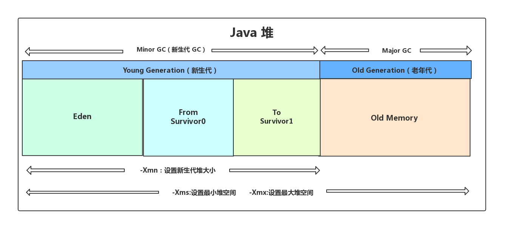

# JVM垃圾回收机制详解

## 1. 为什么垃圾回收

如果不进行垃圾回收，内存迟早都会被消耗空，因为我们在不断的分配内存空间而不进行回收。除非内存无限大，我们可以任性的分配而不回收，但是事实并非如此。所以，垃圾回收是必须的。

## 2. 如何判断对象已经死亡

### 2.1 引用计数法

**引用计数法**：给每个对象维护一个引用计数器，每当该对象被应用一次，计数器就加1；当引用失效，计数器就减1；当计数器为0时，对象可以被回收。

> 引用计数法，可能会出现A 引用了 B，B 又引用了 A，这时候就算他们都不再使用了，但因为相互引用 计数器=1 永远无法被回收。

### 2.2 可达性算法

**可达性算法**：从GC Roots的节点向下搜索，搜所走过的路径称为引用链。当一个对象到GC Roots没有任何引用链时，则证明该对象是不可用的，可以被回收。

什么样的对象可以作为GC Roots？

1. Java虚拟机栈引用的对象
2. 方法区静态属性应用的对象
3. 方法区常量引用的对象
4. 本地方法栈（Native方法）引用的对象

**对象不可达并不会被立即回收**
可达性算法中的不可达对象并不是立即死亡的，对象拥有一次自我拯救的机会。对象被系统宣告死亡至少要经历两次标记过程：第一次是经过可达性分析发现没有与GC Roots相连接的引用链，第二次是在由虚拟机自动建立的Finalizer队列中判断是否需要执行finalize()方法。

当对象变成(GC Roots)不可达时，GC会判断该对象是否覆盖了finalize方法，若未覆盖，则直接将其回收。否则，若对象未执行过finalize方法，将其放入F-Queue队列，由一低优先级线程执行该队列中对象的finalize方法。执行finalize方法完毕后，GC会再次判断该对象是否可达，若不可达，则进行回收，否则，对象“复活”每个对象只能触发一次finalize()方法由于finalize()方法运行代价高昂，不确定性大，无法保证各个对象的调用顺序，不推荐大家使用，建议遗忘它。

https://blog.csdn.net/Y_eatMeat/article/details/122851814?spm=1001.2014.3001.5501

### 2.3 引用类型

**1．强引用（StrongReference）**

以前我们使用的大部分引用实际上都是强引用，这是使用最普遍的引用。如果一个对象具有强引用，那就类似于**必不可少的生活用品**，垃圾回收器绝不会回收它。当内存空间不足，Java 虚拟机宁愿抛出 OutOfMemoryError 错误，使程序异常终止，也不会靠随意回收具有强引用的对象来解决内存不足问题。

**2．软引用（SoftReference）**

如果一个对象只具有软引用，那就类似于**可有可无的生活用品**。如果内存空间足够，垃圾回收器就不会回收它，如果内存空间不足了，就会回收这些对象的内存。只要垃圾回收器没有回收它，该对象就可以被程序使用。软引用可用来实现内存敏感的高速缓存。

软引用可以和一个引用队列（ReferenceQueue）联合使用，如果软引用所引用的对象被垃圾回收，JAVA 虚拟机就会把这个软引用加入到与之关联的引用队列中。

**3．弱引用（WeakReference）**

如果一个对象只具有弱引用，那就类似于**可有可无的生活用品**。弱引用与软引用的区别在于：只具有弱引用的对象拥有更短暂的生命周期。在垃圾回收器线程扫描它所管辖的内存区域的过程中，一旦发现了只具有弱引用的对象，不管当前内存空间足够与否，都会回收它的内存。不过，由于垃圾回收器是一个优先级很低的线程， 因此不一定会很快发现那些只具有弱引用的对象。

弱引用可以和一个引用队列（ReferenceQueue）联合使用，如果弱引用所引用的对象被垃圾回收，Java 虚拟机就会把这个弱引用加入到与之关联的引用队列中。

**4．虚引用（PhantomReference）**

"虚引用"顾名思义，就是形同虚设，与其他几种引用都不同，虚引用并不会决定对象的生命周期。如果一个对象仅持有虚引用，那么它就和没有任何引用一样，在任何时候都可能被垃圾回收。

**虚引用主要用来跟踪对象被垃圾回收的活动**。

**虚引用与软引用和弱引用的一个区别在于：** 虚引用必须和引用队列（ReferenceQueue）联合使用。当垃圾回收器准备回收一个对象时，如果发现它还有虚引用，就会在回收对象的内存之前，把这个虚引用加入到与之关联的引用队列中。程序可以通过判断引用队列中是否已经加入了虚引用，来了解被引用的对象是否将要被垃圾回收。程序如果发现某个虚引用已经被加入到引用队列，那么就可以在所引用的对象的内存被回收之前采取必要的行动。

特别注意，在程序设计中一般很少使用弱引用与虚引用，使用软引用的情况较多，这是因为**软引用可以加速 JVM 对垃圾内存的回收速度，可以维护系统的运行安全，防止内存溢出（OutOfMemory）等问题的产生**。

### 2.4 如何判断一个常量是废弃常量

假如在字符串常量池中存在字符串 "abc"，如果当前没有任何 String 对象引用该字符串常量的话，就说明常量 "abc" 就是废弃常量，如果这时发生内存回收的话而且有必要的话，"abc" 就会被系统清理出常量池了。

### 2.5 如何判断一个类是无用类

判断一个类是无用的类要同时满足下面三个条件：

1. 该类的所有实例已经被回收，Java堆中不存在该类的任何实例。
2. 加载该类的`ClassLoader`已经被回收。
3. 该类对应的`java.lang.Class`对象没有在任何地方被引用，无法在任何地方通过反射访问该类的任何方法。

## 3. 垃圾回收算法

### 3.1 标记-清除算法

标记-清除算法分为两个阶段：”标记“和”清除“。首相标记出所有不需要回收的对象，在标记完成之后统一回收掉所有没有被标记的对象。标记-清除算法是最基本的收集算法，后续的算法都是对其不足进行改进得到的。该算法会带来两个问题：

1. 效率不高。先标记，再清除，会比较耗时。
2. 会产生大量的不连续的内存碎片。

### 3.2 标记-复制算法

为了解决效率问题，“标记-复制”收集算法出现了。它可以将内存分为大小相同的两块，每次使用其中的一块。当这一块的内存使用完后，就将还存活的对象复制到另一块去，然后再把使用的空间一次清理掉。这样就使每次的内存回收都是对内存区间的一半进行回收。

### 3.3 标记-整理算法

根据老年代的特点提出的一种标记算法，标记过程仍然与“标记-清除”算法一样，但后续步骤不是直接对可回收对象回收，而是让所有存活的对象向一端移动，然后直接清理掉端边界以外的内存。

### 3.4 分代收集算法

当前虚拟机的垃圾收集都采用分代收集算法，这种算法没有什么新的思想，只是根据对象存活周期的不同将内存分为几块。一般将 java 堆分为新生代和老年代，这样我们就可以根据各个年代的特点选择合适的垃圾收集算法。

**比如在新生代中，每次收集都会有大量对象死去，所以可以选择”标记-复制“算法，只需要付出少量对象的复制成本就可以完成每次垃圾收集。而老年代的对象存活几率是比较高的，而且没有额外的空间对它进行分配担保，所以我们必须选择“标记-清除”或“标记-整理”算法进行垃圾收集。**

## 4. JVM内存分配与回收过程

Java堆是垃圾收集器管理的主要区域，因此也被称作**GC堆**。从垃圾回收的角度，由于现在的垃圾收集器基本都采用分代垃圾收集算法，所以Java堆还可以细分为：新生代和老年代。再细致一点新生代又可以分为：一个Eden区和两个Survivor区。Eden区、From Survivor区，To Survivor区。进一步划分的目的就是为了更好的进行内存回收和更快的分配内存。

上图所示的 Eden 区、From Survivor0("From") 区、To Survivor1("To") 区都属于新生代，Old Memory 区属于老年代。

大部分情况，对象都会首先在 Eden 区域分配，在一次新生代垃圾回收后，如果对象还存活，则会进入 s0 或者 s1，并且对象的年龄还会加 1(Eden 区->Survivor 区后对象的初始年龄变为 1)，当它的年龄增加到一定程度（默认为大于 15 岁），就会被晋升到老年代中。对象晋升到老年代的年龄阈值，可以通过参数 `-XX:MaxTenuringThreshold` 来设置默认值，这个值会在虚拟机运行过程中进行调整，可以通过`-XX:+PrintTenuringDistribution`来打印出当次 GC 后的 Threshold。

经过一次 GC 后，Eden 区和"From"区已经被清空。这个时候，"From"和"To"会交换他们的角色，也就是新的"To"就是上次 GC 前的“From”，新的"From"就是上次 GC 前的"To"。不管怎样，都会保证名为 To 的 Survivor 区域是空的。Minor GC 会一直重复这样的过程，在这个过程中，有可能当次 Minor GC 后，Survivor 的"From"区域空间不够用，有一些还达不到进入老年代条件的实例放不下，则放不下的部分会提前进入老年代。

### 4.1 对象首先在Eden区分配

目前主流的垃圾收集器都会采用分代回收算法，因此需要将堆内存分为新生代和老年代，这样我们就可以根据各个年代的特点选择合适的垃圾收集算法。

大多数情况下，对象在新生代中 eden 区分配。当 eden 区没有足够空间进行分配时，虚拟机将发起一次 Minor GC.

### 4.2 大对象直接进入老年代

大对象就是需要大量连续存储空间的对象（比如：字符串，数组）。

为什么大对象要直接进入老年代呢？

为了避免为大对象分配内存时由于分配担保机制带来的复制而降低效率。

### 4.3 长期存活的对象直接进入老年代

既然虚拟机采用分代收集的思想来管理内存，那么进行内存回收时就必须识别哪些对象应该放在新生代，哪些对象应该放在老年代。因此，虚拟机给每个对象一个对象年龄计数器。

如果对象在Eden区出生并经过一次Minor GC后仍然存活，并且能够被Survivor容纳的话，对象将被移动到Survivor区，并将对象的年龄设为1.对象在Survivor区每经过一次Minor GC年龄就增加一岁。当对象的年龄增加到一定程度（默认为15岁），就会被晋升到老年代中。对象晋升到老年代的年龄阈值可以通过参数`-XX:MaxTenuringThreshold` 来设置。

### 4.4 动态对象年龄判定

大部分情况，对象都会首先在 Eden 区域分配，在一次新生代垃圾回收后，如果对象还存活，则会进入 s0 或者 s1，并且对象的年龄还会加 1(Eden 区->Survivor 区后对象的初始年龄变为 1)，当它的年龄增加到一定程度（默认为 15 岁），就会被晋升到老年代中。对象晋升到老年代的年龄阈值，可以通过参数 `-XX:MaxTenuringThreshold` 来设置。

> “Hotspot 遍历所有对象时，按照年龄从小到大对其所占用的大小进行累积，当累积的某个年龄大小超过了 survivor 区的 50% 时（默认值是 50%），可以通过 `-XX:TargetSurvivorRatio=percent` 来设置，取这个年龄和 MaxTenuringThreshold 中更小的一个值，作为新的晋升年龄阈值”。
>
> 

>
>jdk8 官方文档引用 ：https://docs.oracle.com/javase/8/docs/technotes/tools/unix/java.html 。

意思就是说，当Survivor中大于或等于某个年龄的对象的大小超过了 survivor 区的 50% 时（默认值是 50%），对象就会被晋升到老年代。

### 4.5 空间分配担保机制

**什么是空间分配担保**

在发生**Minor GC**之前，虚拟机会检查**老年代最大可用的连续空间**是否**大于新生代所有对象的总空间**，如果大于，则此次**Minor GC是安全的**，如果小于，则虚拟机会查看**HandlePromotionFailure**设置值是否允许担保失败。如果`-XX:HandlePromotionFailure=true`，那么会继续检查老年代最大可用连续空间是否大于**历次晋升到老年代的对象的平均大小**，如果大于，则尝试进行一次Minor GC，但这次Minor GC依然是有风险的；如果小于或者`-XX:HandlePromotionFailure=false`，则改为进行一次Full GC。

**为什么要进行空间担保**

是因为新生代采用**复制收集算法**，假如大量对象在Minor GC后仍然存活（最极端情况为内存回收后新生代中所有对象均存活），而Survivor空间是比较小的，这时就需要老年代进行分配担保，把Survivor无法容纳的对象放到老年代。**老年代要进行空间分配担保，前提是老年代得有足够空间来容纳这些对象**，但一共有多少对象在内存回收后存活下来是不可预知的，**因此只好取之前每次垃圾回收后晋升到老年代的对象大小的平均值作为参考**。使用这个平均值与老年代剩余空间进行比较，来决定是否进行Full GC来让老年代腾出更多空间。

> DK 6 Update 24 之前，在发生 Minor GC 之前，虚拟机必须先检查老年代最大可用的连续空间是否大于新生代所有对象总空间，如果这个条件成立，那这一次 Minor GC 可以确保是安全的。如果不成立，则虚拟机会先查看 `-XX:HandlePromotionFailure` 参数的设置值是否允许担保失败(Handle Promotion Failure);如果允许，那会继续检查老年代最大可用的连续空间是否大于历次晋升到老年代对象的平均大小，如果大于，将尝试进行一次 Minor GC，尽管这次 Minor GC 是有风险的;如果小于，或者 `-XX: HandlePromotionFailure` 设置不允许冒险，那这时就要改为进行一次 Full GC。
>
> JDK 6 Update 24 之后的规则变为只要老年代的连续空间大于新生代对象总大小或者历次晋升的平均大小，就会进行 Minor GC，否则将进行 Full GC。