# 垃圾回收详解

# 前言

如果不进行垃圾回收，内存迟早都会被消耗空，因为我们在不断的分配内存空间而不进行回收。除非内存无限大，我们可以任性的分配而不回收，但是事实并非如此。所以，垃圾回收是必须的。

为了让程序员更专注于代码的实现，而不用过多的考虑内存释放的问题，所以，在Java语言中，有了自动的垃圾回收机制，也就是我们熟悉的GC(Garbage Collection)。

有了垃圾回收机制后，程序员只需要关心内存的申请即可，内存的释放由系统自动识别完成。

在进行垃圾回收时，不同的对象引用类型，GC会采用不同的回收时机

换句话说，自动的垃圾回收的算法就会变得非常重要了，如果因为算法的不合理，导致内存资源一直没有释放，同样也可能会导致内存溢出的。

当然，除了Java语言，C#、Python等语言也都有自动的垃圾回收机制。

# 堆空间的结构

Java 的自动内存管理主要是针对对象内存的回收和对象内存的分配。同时，Java 自动内存管理最核心的功能是 **堆** 内存中对象的分配与回收。

Java 堆是垃圾收集器管理的主要区域，因此也被称作 **GC 堆（Garbage Collected Heap）**。

目前主流的垃圾回收器基本都是采用分代垃圾收集算法。因此，堆内存空间也被划分为几个不同的区域。这样就可以根据不同区域的特点，选择适合的垃圾收集算法进行内存回收。

在 JDK 7 版本及 JDK 7 版本之前，堆内存被通常分为下面三部分：

- 新生代（Young Generation）
- 老年代（Old Generation）
- 永久代（Permanent Generation）

如下图所示，新生代又被划分为一个Eden区和两个Survivor区，中间是老年代，最下main是永久代。

JDK1.8之后，PermGen永久代被MetaSpace元空间取代，元空间使用的是直接内存。

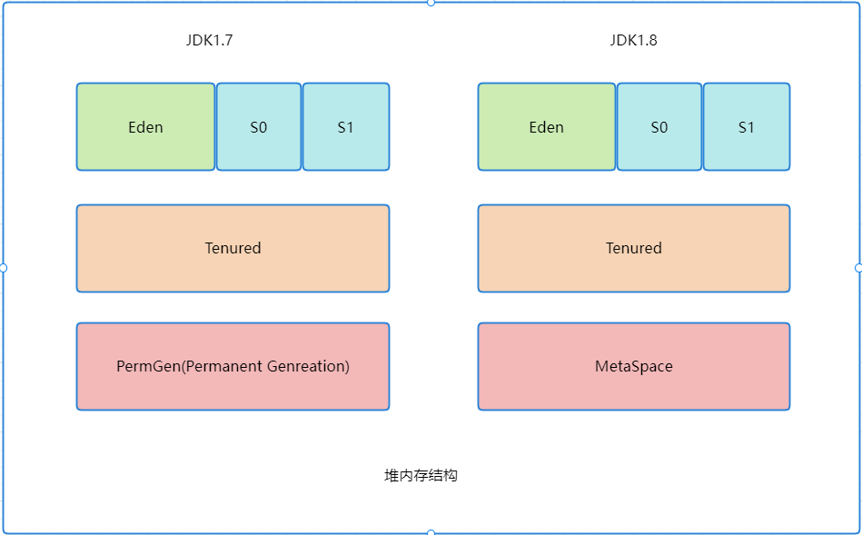

# 内存分配回收原则

### 对象优先在Eden区分配

在大多数情况下，对象在新生代中的Eden区分配。当Eden区没有足够的空间进行分配时，JVM会进行一次Minor GC。

### 大对象直接进入老年代

大对象指的是需要大量连续内存空间的对象，如：字符串，数组等。

大对象直接进入老年代的行为是虚拟机动态决定的，它与具体使用的垃圾收集器和相关参数有关。大对象直接进入老年代是一种优化策略，目的就是避免大对象进入新生代，从而减少新生代垃圾回收的效率和垃圾回收的成本。

### 长期存活的对象进入老年代

在虚拟机中，虚拟机为每个对象都维护了一个对象年龄计数器，用来计算对象的年龄。

我们都知道，对象首先在Eden区分配内存，如果Eden区内存不足，就会进行一次Minor GC，此时对象就会进入到Survivor（S0或S1中）。如果对象经过一次Minor GC后没有被回收，对象的年龄计数器就会加1。

就是说对象没经过一次Minor GC，年龄就会加1，当他的年龄增加到一定的程度（默认15），就会晋升到老年代中。对象晋升到老年代的年龄阈值可以通过-XX:MaxTenuringThreshold参数来设置。

### 动态年龄判定

> 虚拟机并不是永远地要求对象的年龄必须达到了MaxTenuringThreshold=15才能晋升老年代；
>
> 动态年龄判断：Survivor区的对象年龄从小到大进行累加，当累加到X年龄（某个年龄）时占用空间的总和大于50%（可以使用-XX:TargetSurvivorRatio=?来设置保留多少空闲空间，默认值是50），那么比X年龄大的对象都会晋升到老年代；

### 空间担保机制

> JDK 6 Update 24 之前，在发生 Minor GC 之前，虚拟机必须先检查老年代最大可用的连续空间是否大于新生代所有对象总空间，如果这个条件成立，那这一次 Minor GC 可以确保是安全的。如果不成立，则虚拟机会先查看 `-XX:HandlePromotionFailure` 参数的设置值是否允许担保失败(Handle Promotion Failure);如果允许，那会继续检查老年代最大可用的连续空间是否大于历次晋升到老年代对象的平均大小，如果大于，将尝试进行一次 Minor GC，尽管这次 Minor GC 是有风险的;如果小于，或者 `-XX: HandlePromotionFailure` 设置不允许冒险，那这时就要改为进行一次 Full GC。
>
> JDK 6 Update 24 之后的规则变为只要老年代的连续空间大于新生代对象总大小或者历次晋升的平均大小，就会进行 Minor GC，否则将进行 Full GC。

# 判定对象是否可以回收

## 引用计数法

为每个对象维护一个引用计数器：

1. 每当有一个地方引用它，计数器就加1。
2. 每当引用失效，计数器减1.
3. 当计数器的值为0，说明对象没有被引用。

引用计数法虽然简单，但是存在一个问题，就是无法解决循环引用的问题，比如对象A引用了对象B，对象B也引用了对象A，这样对象A的计数器不为0，对象B的引用计数器也不为0，导致对象A和对象B都无法被回收。

## 可达性分析算法

这个算法的基本思想就是通过一系列的称为 **“GC Roots”** 的对象作为起点，从这些节点开始向下搜索，节点所走过的路径称为引用链，当一个对象到 GC Roots 没有任何引用链相连的话，则证明此对象是不可用的，需要被回收。

下图中A到B再到C和D，形成了一个引用链，可达性分析算法指的是如果从某个到GC Root对象是可达的，对象就不可被回收。

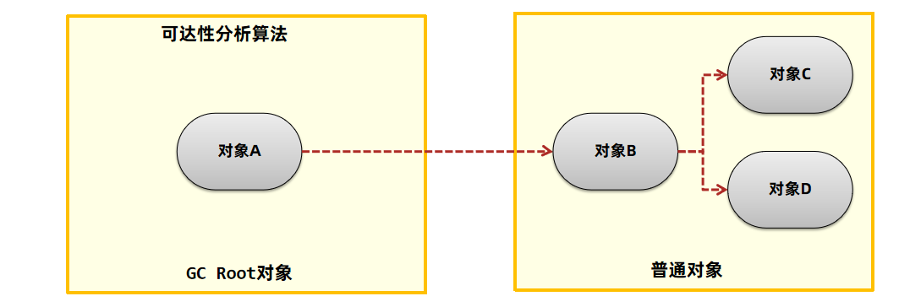

### 哪些对象可以作为 GC Roots ？

- 虚拟机栈(栈帧中的局部变量表)中引用的对象
- 本地方法栈(Native 方法)中引用的对象
- 方法区中类静态属性引用的对象
- 方法区中常量引用的对象
- 所有被同步锁持有的对象
- JNI（Java Native Interface）引用的对象

### 引用类型

**强引用（StrongReference）**

以前我们使用的大部分引用实际上都是强引用，这是使用最普遍的引用。如果一个对象具有强引用，那就类似于**必不可少的生活用品**，垃圾回收器绝不会回收它。当内存空间不足，Java 虚拟机宁愿抛出 OutOfMemoryError 错误，使程序异常终止，也不会靠随意回收具有强引用的对象来解决内存不足问题。

**软引用（SoftReference）**

软引用相对于强引用是一种比较弱的引用关系，如果一个对象只有软引用关联到它，当程序内存不足时，就会将软引用中的数据进行回收。在JDK 1.2版之后提供了SoftReference类来实现软引用，软引用常用于缓存中。

**弱引用（WeakReference）**

弱引用的整体机制和软引用基本一致，区别在于弱引用包含的对象在垃圾回收时，不管内存够不够都会直接被回收。在JDK 1.2版之后提供了WeakReference类来实现弱引用，弱引用主要在ThreadLocal中使用。

弱引用对象本身也可以使用引用队列进行回收。

**虚引用（PhantomReference）**

- 虚引用也叫幽灵引用/幻影引用，不能通过虚引用对象获取到包含的对象。虚引用唯一的用途是当对象被垃圾回收器回收时可以接收到对应的通知。Java中使用PhantomReference实现了虚引用，直接内存中为了及时知道直接内存对象不再使用，从而回收内存，使用了虚引用来实现。

- 终结器引用指的是在对象需要被回收时，终结器引用会关联对象并放置在Finalizer类中的引用队列中，在稍后由一条由FinalizerThread线程从队列中获取对象，然后执行对象的finalize方法，在对象第二次被回收时，该对象才真正的被回收。在这个过程中可以在finalize方法中再将自身对象使用强引用关联上，但是不建议这样做。

### 对象不可达并不会被立即回收

可达性算法中的不可达对象并不是立即死亡的，对象拥有一次自我拯救的机会。对象被系统宣告死亡至少要经历两次标记过程：第一次是经过可达性分析发现没有与GC Roots相连接的引用链，第二次是在由虚拟机自动建立的Finalizer队列中判断是否需要执行finalize()方法。

当对象变成(GC Roots)不可达时，GC会判断该对象是否覆盖了finalize方法，若未覆盖，则直接将其回收。否则，若对象未执行过finalize方法，将其放入F-Queue队列，由一低优先级线程执行该队列中对象的finalize方法。执行finalize方法完毕后，GC会再次判断该对象是否可达，若不可达，则进行回收，否则，对象“复活”每个对象只能触发一次finalize()方法由于finalize()方法运行代价高昂，不确定性大，无法保证各个对象的调用顺序，不推荐大家使用，建议遗忘它。

https://blog.csdn.net/Y_eatMeat/article/details/122851814?spm=1001.2014.3001.5501

# 垃圾回收算法

## 标记清除算法

标记清除算法，顾名思义就是将垃圾回收分为2个阶段，分别是**标记和清除**。

1. 根据可达性分析算法得出的垃圾进行标记

2. 对这些标记为可回收的内容进行垃圾回收

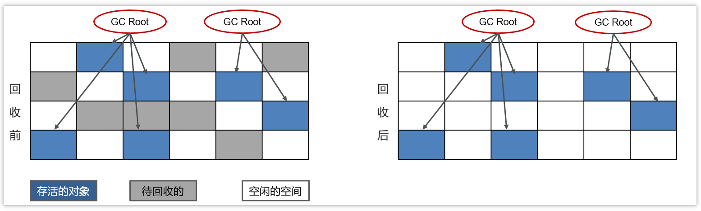

可以看到，标记清除算法解决了引用计数算法中的循环引用的问题，没有从root节点引用的对象都会被回收。

标记清除算法也是有缺点的：

- 效率较低，**标记和清除两个动作都需要遍历所有的对象**，并且在GC时，**需要停止应用程序**，对于交互性要求比较高的应用而言这个体验是非常差的。
- （**重要**）通过标记清除算法清理出来的内存，碎片化较为严重，因为被回收的对象可能存在于内存的各个角落，所以清理出来的内存是不连贯的。

## 复制算法

复制算法的核心就是，**将原有的内存空间一分为二，每次只用其中的一块**，在垃圾回收时，将存活的对象复制到另一个内存空间中，然后将该内存空间清空，交换两个内存的角色，完成垃圾的回收。

如果内存中的垃圾对象较多，需要复制的对象就较少，这种情况下适合使用该方式并且效率比较高，反之，则不适合。

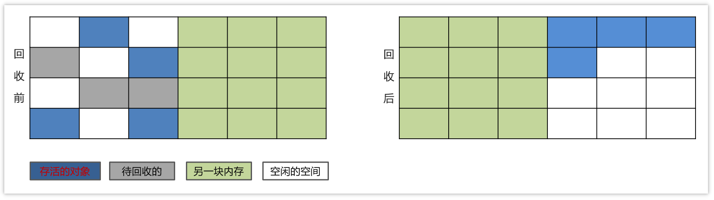

1. 将内存区域分成两部分，每次操作其中一个。
2. 当进行垃圾回收时，将正在使用的内存区域中的存活对象移动到未使用的内存区域。当移动完对这部分内存区域一次性清除。
3. 周而复始。

**优点**：

- 在垃圾对象多的情况下，效率较高
- 清理后，内存无碎片

**缺点**：

- 分配的2块内存空间，在同一个时刻，只能使用一半，内存使用率较低。
- 不适合老年代，如果存活对象数量比较大，复制性能会变得很差。

## 标记整理算法

标记压缩算法是在标记清除算法的基础之上，做了优化改进的算法。和标记清除算法一样，也是从根节点开始，对对象的引用进行标记，在清理阶段，并不是简单的直接清理可回收对象，而是将存活对象都向内存另一端移动，然后清理边界以外的垃圾，从而解决了碎片化的问题。

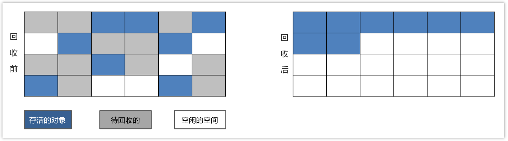

1. 标记垃圾。
2. 需要清除向右边走，不需要清除的向左边走。
3. 清除边界以外的垃圾。

优缺点同标记清除算法，解决了标记清除算法的碎片化的问题，同时，标记压缩算法多了一步，对象移动内存位置的步骤，其效率也有有一定的影响。

与复制算法对比：复制算法标记完就复制，但标记整理算法得等把所有存活对象都标记完毕，再进行整理

## 分代收集算法

在java8时，堆被分为了两份：**新生代和老年代【1：2】**，在java7时，还存在一个永久代。

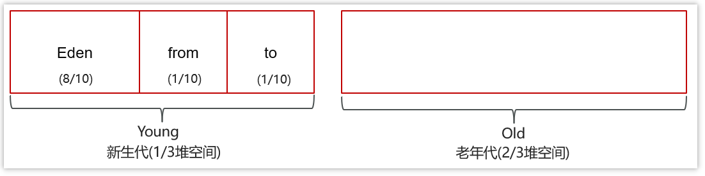

对于新生代，内部又被分为了三个区域。

Eden区，S0区，S1区【8：1：1】当对新生代产生GC：MinorGC【young GC】

当对老年代代产生GC：Major GC 

当对新生代和老年代产生FullGC： 新生代 + 老年代完整垃圾回收，暂停时间长，**应尽力避免**

**工作机制**

- 新创建的对象，都会先分配到eden区

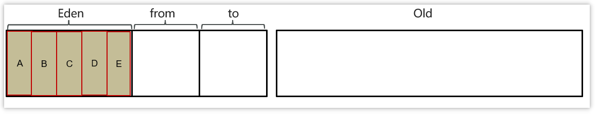

- 当伊甸园内存不足，标记伊甸园与 from（现阶段没有）的存活对象
- 将存活对象采用复制算法复制到 to 中，复制完毕后，伊甸园和 from 内存都得到释放

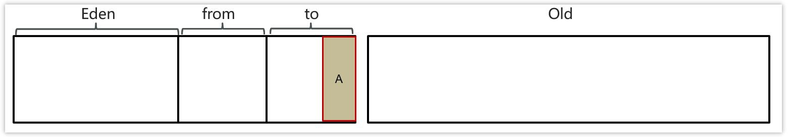

- 经过一段时间后伊甸园的内存又出现不足，标记eden区域to区存活的对象，将存活的对象复制到from区

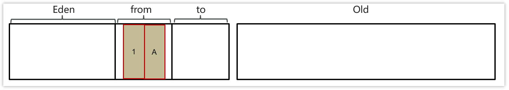

- 当幸存区对象熬过几次回收（最多15次），晋升到老年代（幸存区内存不足或大对象会导致提前晋升）

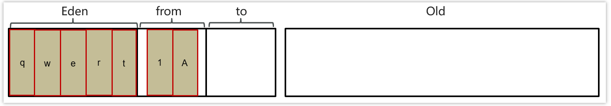

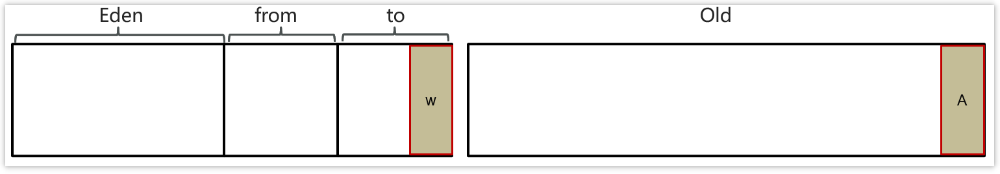

**MinorGC、 Mixed GC 、 FullGC的区别是什么?**

- MinorGC【young GC】发生在新生代的垃圾回收，暂停时间短（STW）
- Mixed GC 新生代 + 老年代部分区域的垃圾回收，G1 收集器特有
- FullGC： 新生代 + 老年代完整垃圾回收，暂停时间长（STW），应尽力避免？

> STW（Stop-The-World）：暂停所有应用程序线程，等待垃圾回收的完成

当前虚拟机的垃圾收集都采用分代收集算法，这种算法没有什么新的思想，只是根据对象存活周期的不同将内存分为几块。一般将 Java 堆分为新生代和老年代，这样我们就可以根据各个年代的特点选择合适的垃圾收集算法。

比如在新生代中，每次收集都会有大量对象死去，所以可以选择“复制”算法，只需要付出少量对象的复制成本就可以完成每次垃圾收集。而老年代的对象存活几率是比较高的，而且没有额外的空间对它进行分配担保，所以我们必须选择“标记-清除”或“标记-整理”算法进行垃圾收集。

# 垃圾收集器

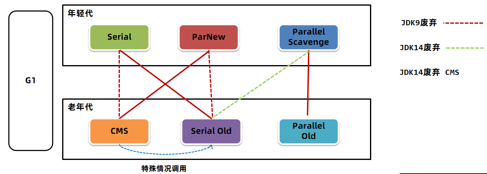


## 串行垃圾收集器

**Serial**和**Serial Old**串行垃圾收集器，是指使用单线程进行垃圾回收，堆内存较小，适合个人电脑

- Serial 作用于新生代，采用复制算法

- Serial Old 作用于老年代，采用标记-整理算法

垃圾回收时，只有一个线程在工作，并且java应用中的所有线程都要暂停（STW），等待垃圾回收的完成。

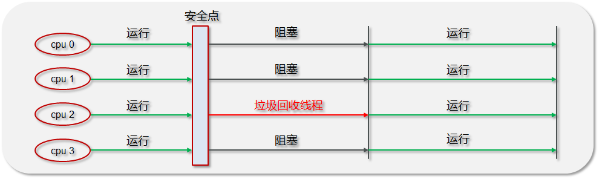

## 并行垃圾收集器

**Parallel New**和**Parallel Old**是一个并行垃圾回收器，**JDK8默认使用此垃圾回收器**

- **Parallel New**作用于新生代，采用复制算法
- **Parallel Old**作用于老年代，采用标记-整理算法

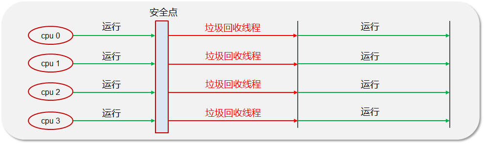

**Parallel Scavenge 收集器**

Parallel Scavenge 收集器也是使用**复制算法**的多线程收集器，它看上去几乎和 ParNew 都一样。侧重于吞吐量。

``` bash
-XX:+UseParallelGC

    使用 Parallel 收集器+ 老年代串行

-XX:+UseParallelOldGC

    使用 Parallel 收集器+ 老年代并行
```

Parallel Scavenge 收集器关注点是吞吐量（高效率的利用 CPU）。CMS 等垃圾收集器的关注点更多的是用户线程的停顿时间（提高用户体验）。所谓吞吐量就是 CPU 中用于运行用户代码的时间与 CPU 总消耗时间的比值。 Parallel Scavenge 收集器提供了很多参数供用户找到最合适的停顿时间或最大吞吐量，如果对于收集器运作不太了解，手工优化存在困难的时候，使用 Parallel Scavenge 收集器配合自适应调节策略，把内存管理优化交给虚拟机去完成也是一个不错的选择。

## CMS

CMS全称 Concurrent Mark Sweep，是一款并发的、使用标记-清除算法的垃圾回收器，该回收器是针对老年代垃圾回收的，是一款以获取最短回收停顿时间为目标的收集器，停顿时间短，用户体验就好。其最大特点是在进行垃圾回收时，应用仍然能正常运行。

参数：XX:+UseConcMarkSweepGC

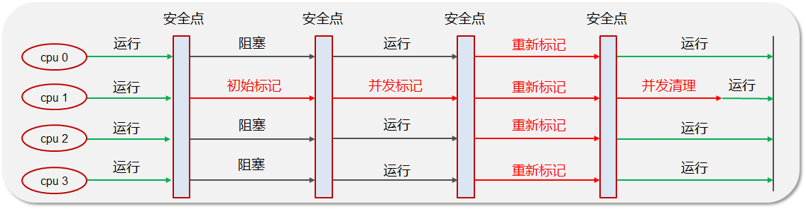

**初始标记：**暂停所有的其他线程，并记录下直接与 root 相连的对象，速度很快 ；(STW)

**并发标记：**同时开启 GC 和用户线程，用一个闭包结构去记录可达对象。但在这个阶段结束，这个闭包结构并不能保证包含当前所有的可达对象。因为用户线程可能会不断的更新引用域，所以 GC 线程无法保证可达性分析的实时性。所以这个算法里会跟踪记录这些发生引用更新的地方。

**重新标记：**重新标记阶段就是为了修正并发标记期间因为用户程序继续运行而导致标记产生变动的那一部分对象的标记记录，这个阶段的停顿时间一般会比初始标记阶段的时间稍长，远远比并发标记阶段时间短。（STW）

**并发清除：**开启用户线程，同时 GC 线程开始对未标记的区域做清扫。

1. 优点：并发收集、低停顿，只有初始标记，重新标记阶段会STW。
2. 缺点：
   - 对 CPU 资源敏感，并发清除阶段比较消耗CPU；
   - 无法处理浮动垃圾（浮动垃圾是指并发清除阶段，用户线程所产生的垃圾）；如果内存回收速度赶不上内存分配速度，会导致并发失败，这时候会启用Serial Old收集，暂停用户线程，产生上时间STW。
   - 它使用的回收算法“标记-清除”算法会导致收集结束时会有大量空间碎片产生。内存碎片过多时，会导致无法为大对象分配空间，老年代虽然有空间，但是没有足够的连续空间，可能会触发Full GC。

## G1（Garbage First）

JDK9之后默认的垃圾回收器是G1（Garbage First）垃圾回收器。Parallel Scavenge关注吞吐量，允许用户设置最大暂停时间 ，但是会减少年轻代可用空间的大小。CMS关注暂停时间，但是吞吐量方面会下降。

**G1收集器一个主要的思想就是：在有限的时间内，回收尽可能多的垃圾。**

而G1设计目标就是将上述两种垃圾回收器的优点融合：

- 应用于新生代和老年代，**在****JDK9****之后默认使用****G1**
- 划分成多个区域，每个区域都可以充当 eden，survivor，old， humongous，其中 humongous 专为大对象准备
- 采用复制算法
- 响应时间与吞吐量兼顾
- 分成三个阶段：新生代回收、并发标记、混合收集
- 如果并发失败（即回收速度赶不上创建新对象速度），会触发 Full GC

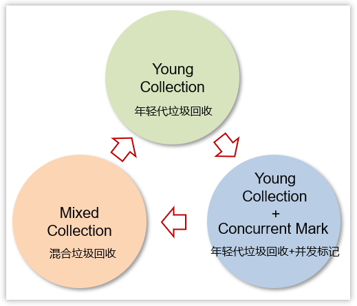

G1的整个堆会被划分成多个大小相等的区域，称之为区Region，区域不要求是连续的。分为Eden、Survivor、Old区。Region的大小通过堆空间大小/2048计算得到，也可以通过参数-XX:G1HeapRegionSize=32m指定(其中32m指定region大小为32M)，Region size必须是2的指数幂，取值范围从1M到32M。

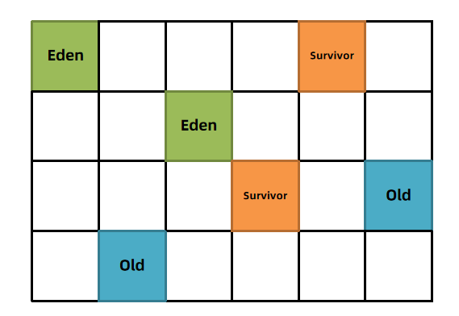

G1垃圾回收有两种方式：

1、年轻代回收（Young GC）

2、混合回收（Mixed GC）

### 年轻代回收 Young GC

年轻代回收（Young GC），回收Eden区和Survivor区中不用的对象。**需要复制对象，需要暂停用户线程,会导致STW**，G1中可以通过参数

-XX:MaxGCPauseMillis=n（默认200）  设置每次垃圾回收时的最大暂停时间毫秒数，G1垃圾回收器会尽可能地保证暂停时间。

1、新创建的对象会存放在Eden区。当G1判断年轻代区不足（max默认60%），无法分配对象时需要回收时会执行Young GC。

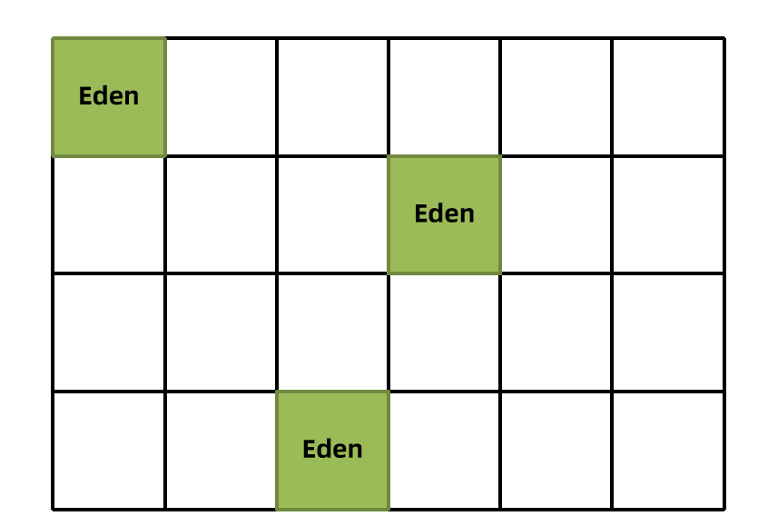

2、标记出Eden和Survivor区域中的存活对象，

3、根据配置的最大暂停时间选择某些区域将存活对象复制到一个新的Survivor区中（年龄+1），清空这些区域。

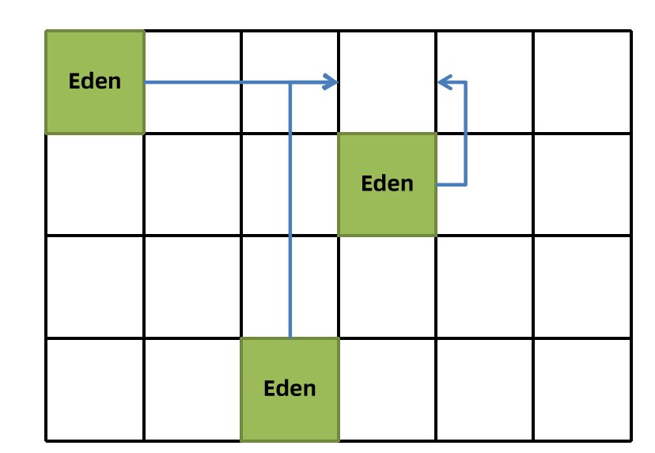

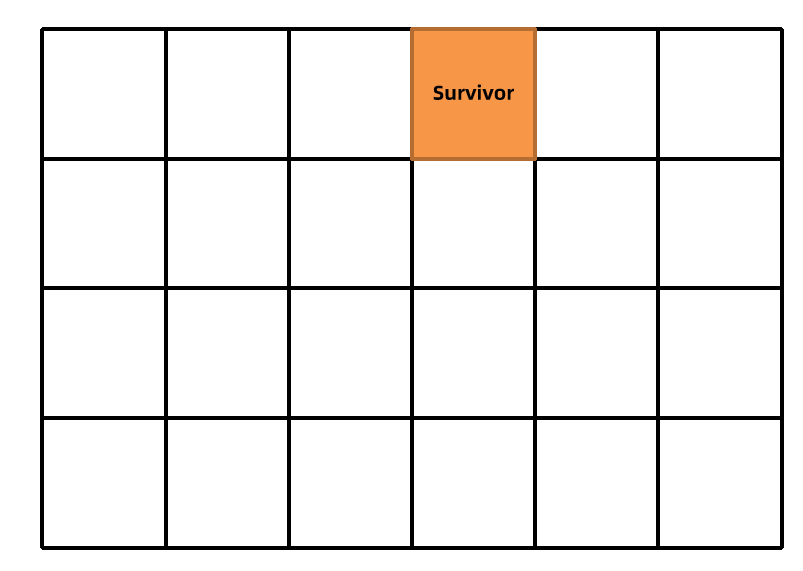

G1在进行Young GC的过程中会去记录每次垃圾回收时每个Eden区和Survivor区的平均耗时，以作为下次回收时的参考依据。这样就可以根据配置的最大暂停时间计算出本次回收时最多能回收多少个Region区域了。

比如 -XX:MaxGCPauseMillis=n（默认200），每个Region回收耗时40ms，那么这次回收最多只能回收4个Region。

4、后续Young GC时与之前相同，只不过Survivor区中存活对象会被搬运到另一个Survivor区。

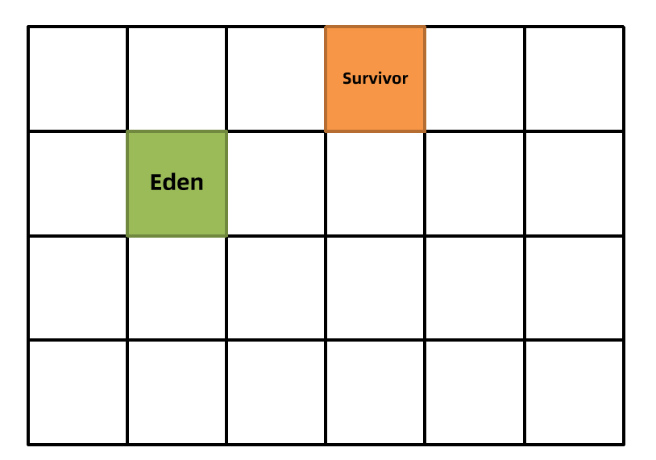

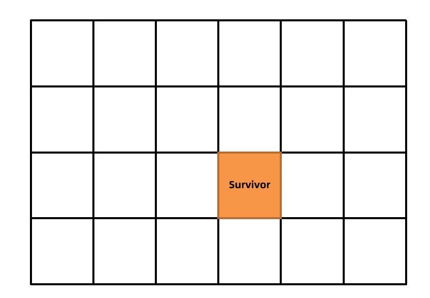

5、当某个存活对象的年龄到达阈值（默认15），将被放入老年代。

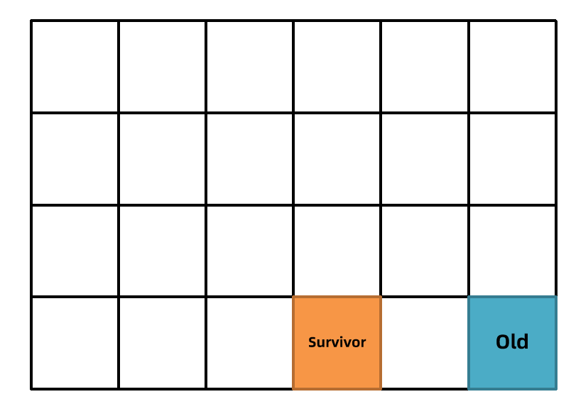

6、部分对象如果大小超过Region的一半，会直接放入老年代，这类老年代被称为Humongous区。比如堆内存是4G，每个Region是2M，只要一个大对象超过了1M就被放入Humongous区，如果对象过大会横跨多个Region。

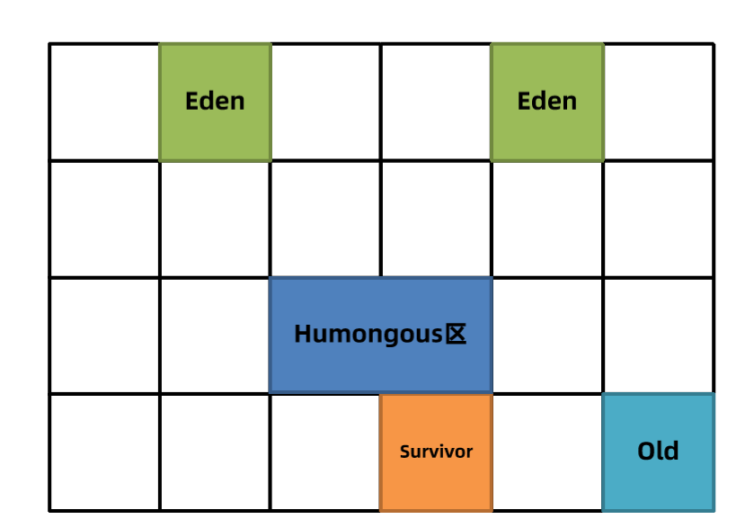

7、多次回收之后，会出现很多Old老年代区，此时总堆占有率达到阈值时

（-XX:InitiatingHeapOccupancyPercent默认45%）会触发混合回收MixedGC。回收所有年轻代和部分老年代的对象以及大对象区。采用复制算法来完成。

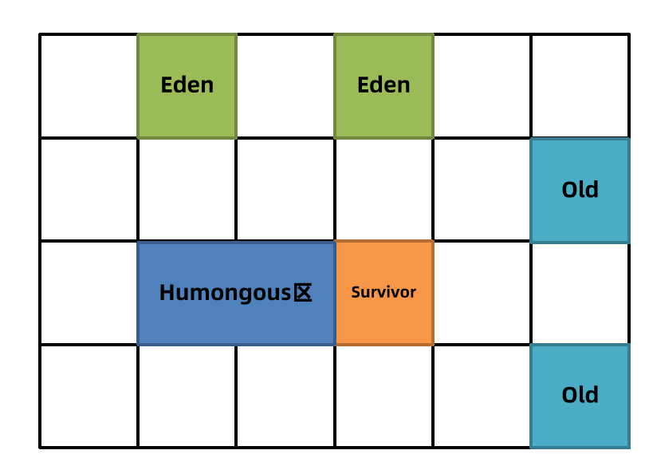

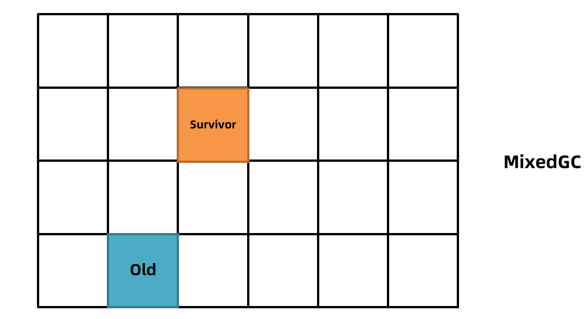

### 混合回收 MixedGC

混合回收分为：初始标记（initial mark）、并发标记（concurrent mark）、最终标记（remark或者Finalize Marking）、并发清理（cleanup）

G1对老年代的清理会选择存活度最低的区域来进行回收，这样可以保证回收效率最高，这也是G1（Garbage first）名称的由来。就是我们前面说的，**利用有限的时间，回收尽可能多的垃圾。**

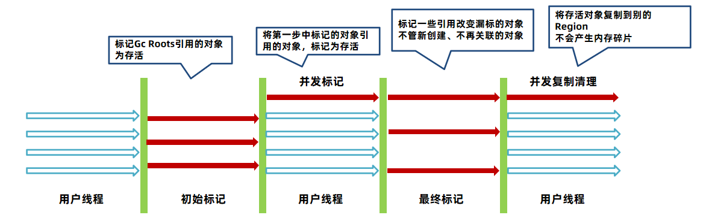

**初始标记：**会STW。标记GCRoots能直接引用的对象，速度比较快。而且借助Minor GC时间同步完成的，所以G1在这个阶段实际上并没有额外的停顿。

**并发标记：**不会STW。会从GCRoots追踪所有存活的对象，这个阶段很耗时，但是和用户线程并发进行，影响不大。

**最终标记：**会STW。停止用户线程，最终标记存活的对象。

**筛选回收：**需要STW。对各个Region回收价值和成本进行排序，根据用户期望的停顿时间制定回收计划，自由选择任意多个Region进行回收，然后把存活的对象复制到新的Region，清除旧的Region，需要复制移动对象，所以会STW。

G1对老年代的清理会选择存活度最低的区域来进行回收，这样可以保证回收效率最高，这也是G1（Garbage first）名称的由来。最后清理阶段使用复制算法，不会产生内存碎片。

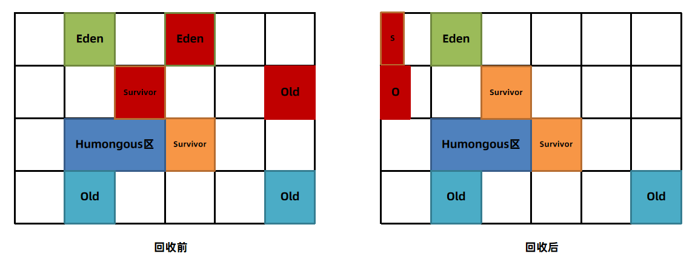

注意：**并发失败**。如果清理过程中发现没有足够的空Region存放转移的对象，会出现Full GC。单线程执行标记-整理算法，此时会导致用户线程的暂停。所以尽量保证应该用的堆内存有一定多余的空间。

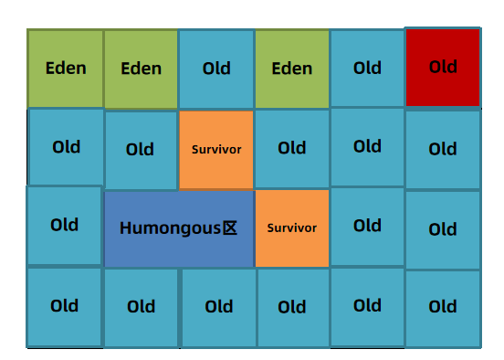

在进行Mixed GC时，无论是新生代还是老年代都基于复制算法，把各个Region中存活的对象，复制到新的空Region中，如果没有空闲的Region来存储存活的对象，就会停止系统程序，然后采用单线程进行标记清除和压缩整理，回收一批Region，这个过程很慢，类似于CMS中”并发收集失败“导致Full GC，如果内存回收的速度还是赶不上内存分配的速度，G1被迫暂停用户线程。导致Full GC，产生长时间STW。

### G1 – Garbage First 垃圾回收器

参数1： `-XX:+UseG1GC`  打开G1的开关，JDK9之后默认不需要打开

参数2：`-XX:MaxGCPauseMillis=毫秒值` 最大暂停的时

**回收年代和算法：**

年轻代+老年代

复制算法

**优点**

对比较大的堆如超过6G的堆回收时，延迟可控

不会产生内存碎片

并发标记的SATB算法效率高

**缺点**

JDK8之前还不够成熟

**适用场景**

JDK8最新版本、JDK9之后建议默认使用

### ZGC 收集器

与 CMS 中的 ParNew 和 G1 类似，ZGC 也采用标记-复制算法，不过 ZGC 对该算法做了重大改进。

ZGC 可以将暂停时间控制在几毫秒以内，且暂停时间不受堆内存大小的影响，出现 Stop The World 的情况会更少，但代价是牺牲了一些吞吐量。ZGC 最大支持 16TB 的堆内存。

ZGC 在 Java11 中引入，处于试验阶段。经过多个版本的迭代，不断的完善和修复问题，ZGC 在 Java15 已经可以正式使用了。

## 总结

垃圾回收器的组合关系虽然很多，但是针对几个特定的版本，比较好的组合选择如下：

JDK8及之前：

ParNew + CMS（关注暂停时间）、Parallel Scavenge + Parallel Old (关注吞吐量)、 G1（JDK8之前不建议，较大堆并且关注暂停时间）

JDK9之后:

G1（默认）

从JDK9之后，由于G1日趋成熟，JDK默认的垃圾回收器已经修改为G1，所以强烈建议在生产环境上使用G1。


