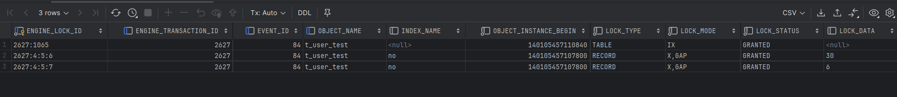
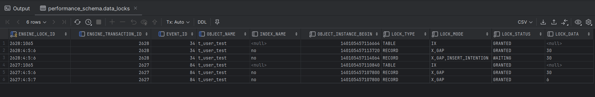
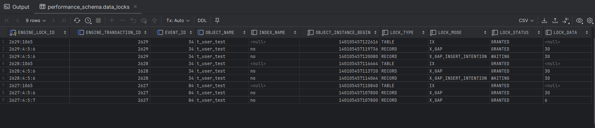
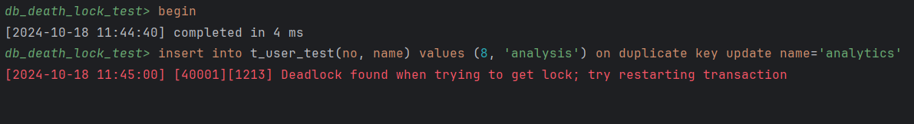
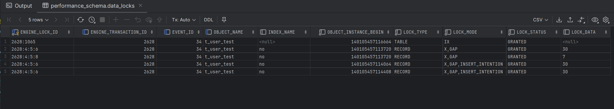

# Insert  into on duplicate key update 死锁问题解析

# 背景

前段时间的需求中有这个么一个场景，每天早上需要通过定时任务到不同的平台拉取一些广告投放的相关数据，涉及的表比较多，数据量也比较大，有的需要全量同步，有的需要增量拉取。对于增量拉取的数据，如果已经存在了的数据则会覆盖原来的数据，保存最新的数据即可。

因为我们的表里基本都设置了唯一索引的，所以我这边也就采用了一个懒人方法，直接使用insert into on duplicate key update 的操作。

``` sql
insert into t_user_test(no, name) values (6, 'analysis') on duplicate key update name='analytics';
```

如果没有冲突，则直接插入，如果有冲突，则进行更新。

由于数据量比较大，我们这边采用的是分批的批量插入。

# 死锁问题

上面的sql语句确实很好用，但是在并发量较大时，多个事务并发执行同一条insert … on duplicate key update … ，容易发生死锁（比如insert的内容相同时），导致操作执行失败。

``` sql
org.springframework.dao.DeadlockLoserDataAccessException:
### Error updating database.  Cause: com.mysql.cj.jdbc.exceptions.MySQLTransactionRollbackException: Deadlock found when trying to get lock; try restarting transaction
### The error may exist in class path resource [mapper/TestMapper.xml]
### The error may involve com.order.addOrder-Inline
### The error occurred while setting parameters
### SQL: 
insert into t_order_test(id,order_id,money,create_time,creator,creator_id) values         (?, ?, ?, ?, ?, ?)         ON DUPLICATE KEY UPDATE money= VALUES(money), update_time = now(),modifier = VALUES(creator), modifier_id = VALUES(creator_id)
### Cause: com.mysql.cj.jdbc.exceptions.MySQLTransactionRollbackException: Deadlock found when trying to get lock; try restarting transaction Deadlock found when trying to get lock; try restarting transaction; nested exception is com.mysql.cj.jdbc.exceptions.MySQLTransactionRollbackException: Deadlock found when trying to get lock; try restarting transaction

```

# 问题复现

## 环境准备

MySQL版本：8.0.13

隔离级别：RR（可重复读）

测试表和数据

```sql
-- 创建测试表
CREATE TABLE `t_user_test`
(
    `id`   int(11) unsigned NOT NULL AUTO_INCREMENT,
    `no`   int(11)     DEFAULT NULL,
    `name` varchar(50) DEFAULT NULL,
    PRIMARY KEY (`id`),
    unique key (`no`)
) ENGINE = InnoDB
  DEFAULT CHARSET = utf8mb4
  ROW_FORMAT = DYNAMIC;
-- 测试数据
insert into t_user_test ( `no`, `name`)
values (1,  'test'),
       (2,  'test'),
       (3,  'test' ),
       (5,  'test'),
       (30,  'test');

```

### 复现步骤

**步骤一：开启三个会话连接，三个事务**

- 连接1，关闭自动提交，开启一个事务，执行sql，但是不提交

  ``` sql
  set autocommit = 0;
  
  begin;
  
  insert into t_user_test(no, name) values (6, 'analysis') on duplicate key update name='analytics';
  
  commit;
  ```

  查看加锁情况

  ``` sql
  select
      ENGINE_LOCK_ID,
      ENGINE_TRANSACTION_ID,
      EVENT_ID,
      OBJECT_NAME,
      INDEX_NAME,
      OBJECT_INSTANCE_BEGIN,
      LOCK_TYPE,
      LOCK_MODE,
      LOCK_STATUS,
      LOCK_DATA
  from performance_schema.data_locks;
  ```

  

  可以看到，当前事务加了3把锁

  **事务一**

  第一把锁：表锁   意向排他锁    这把锁的意义在于防止在insert或update时对表进行ddl操作

  第二把锁：行锁    间隙锁

  第三把锁：行锁    间隙锁

  虽然加了两把GAP间隙锁，但是锁住的5-30之间。间隙锁的意义是，防止update的时候，有其他事务往同一个GAP里面插入数据

- 连接2：关闭自动提交，开启一个事务，执行sql，但是不提交

  ``` sql
  set autocommit = 0;
  
  begin;
  
  insert into t_user_test(no, name) values (7, 'analysis') on duplicate key update name='analytics';
  
  commit;
  ```

  查看加锁情况

  ``` sql
  select
      ENGINE_LOCK_ID,
      ENGINE_TRANSACTION_ID,
      EVENT_ID,
      OBJECT_NAME,
      INDEX_NAME,
      OBJECT_INSTANCE_BEGIN,
      LOCK_TYPE,
      LOCK_MODE,
      LOCK_STATUS,
      LOCK_DATA
  from performance_schema.data_locks;
  ```

  

  

  **事务一**

  第一把锁：表锁   意向排他锁    这把锁的意义在于防止在insert或update时对表进行ddl操作

  第二把锁：行锁    间隙锁

  第三把锁：行锁    间隙锁

  **事务二**

  第一把锁：表锁   意向排他锁    这把锁的意义在于防止在insert或update时对表进行ddl操作

  第二把锁：行锁    间隙锁

  第三把锁：行锁    间隙锁，插入意向锁     waiting状态

  意向插入锁：当我们当前的的insert语句没有检测到任何语义相冲突的间隙锁的时候，是不会加插入意向锁的。插入意向锁的意义就是为了阻塞当前的事务。因为事务一的间隙锁跟当前事务的插入相冲突了。这就是事务二等待的原因。

- 连接3：关闭自动提交，开启一个事务，执行sql，但是不提交

  ``` sql
  set autocommit = 0;
  
  begin;
  
  insert into t_user_test(no, name) values (8, 'analysis') on duplicate key update name='analytics';
  
  commit;
  ```

  查看加锁情况

  ``` sql
  select
      ENGINE_LOCK_ID,
      ENGINE_TRANSACTION_ID,
      EVENT_ID,
      OBJECT_NAME,
      INDEX_NAME,
      OBJECT_INSTANCE_BEGIN,
      LOCK_TYPE,
      LOCK_MODE,
      LOCK_STATUS,
      LOCK_DATA
  from performance_schema.data_locks;
  ```

  

  **事务一**

  第一把锁：表锁   意向排他锁    这把锁的意义在于防止在insert或update时对表进行ddl操作

  第二把锁：行锁    间隙锁

  第三把锁：行锁    间隙锁

  **事务二**

  第一把锁：表锁   意向排他锁    这把锁的意义在于防止在insert或update时对表进行ddl操作

  第二把锁：行锁    间隙锁

  第三把锁：行锁    间隙锁，插入意向锁       waiting状态

  **事务三**

  第一把锁：表锁   意向排他锁    这把锁的意义在于防止在insert或update时对表进行ddl操作

  第二把锁：行锁    间隙锁

  第三把锁：行锁    间隙锁，插入意向锁      waiting状态

  事务三的锁跟事务二的锁是一样的，而且也是等待状态，但是不确定事务三的插入意向锁检测到的是事务一的间隙锁还是事务二的间隙锁？有知道的下伙伴可以帮忙解答一下。

**步骤二：连接1提交事务**

连接三，事务三，发生了死锁



查看加锁情况

``` sql
select
    ENGINE_LOCK_ID,
    ENGINE_TRANSACTION_ID,
    EVENT_ID,
    OBJECT_NAME,
    INDEX_NAME,
    OBJECT_INSTANCE_BEGIN,
    LOCK_TYPE,
    LOCK_MODE,
    LOCK_STATUS,
    LOCK_DATA
from performance_schema.data_locks;
```



我们发现事务二有两把插入意向锁。

死锁的原因：当事务一提交的时候，事务二的插入意向锁检测到事务一已经提交，然后事务二尝试插入，但是事务三也有一把间隙锁，这时候有检测到了事务三有间隙锁，所以事务二有加了一把新的插入意向锁，阻塞事务二的执行。这时候事务二和事务三就形成了一个闭环。事务二等待事务三的间隙锁，事务三等待事务二的间隙锁，所以形成了死锁。

这也间接解释了上面的问题，阻塞事务三执行的是事务二的间隙锁。

## 死锁的形成

1. 事务一在插入的时候会产生一把间隙锁，锁住要插入的间隙
2. 事务二在插入的时候，插入时会检测到事务一的间隙锁，所以事务二会加一把插入意向锁，阻塞事务二的插入。
3. 事务三在插入的时候，会检测到事务二的间隙锁，然后事务三会加一把意向插入锁，阻塞事务三的执行。
4. 事务一提交
5. 事务二检测到事务已提交，会尝试插入数据，然后检测到事务三的间隙锁，然后会加一把新的意向插入锁，阻塞事务二的执行。
6. 事务三等待事务二的锁，事务二等待事务三的锁，形成了闭环，也就是死锁。

# 解决方案

避免在并发高的场景下，使用insert into on duplicate key update操作，使用try...catch捕获duplicate异常，然后使用update操作更新数据即可。