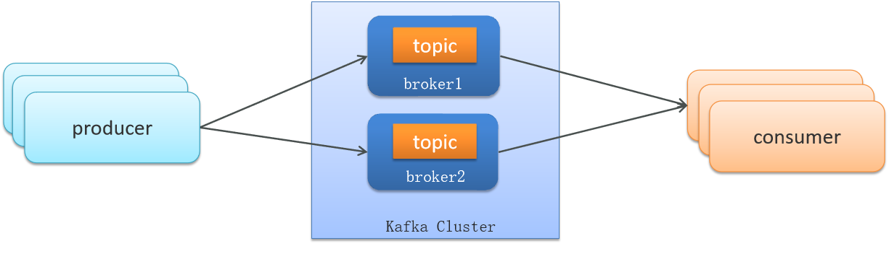

# Kafka知识点总结

# Kafka是什么？应用场景？

Kafka 是一个分布式流式处理平台。

流平台具有三个关键功能：

1. **消息队列**：发布和订阅消息流，这个功能类似于消息队列，这也是 Kafka 也被归类为消息队列的原因。
2. **容错的持久方式存储记录消息流**：Kafka 会把消息持久化到磁盘，有效避免了消息丢失的风险。
3. **流式处理平台：** 在消息发布的时候进行处理，Kafka 提供了一个完整的流式处理类库。

Kafka 主要有两大应用场景：

1. **消息队列**：建立实时流数据管道，以可靠地在系统或应用程序之间获取数据。
2. **数据处理：** 构建实时的流数据处理程序来转换或处理数据流。

# Kafka的一些核心概念

**broker**
Kafka 集群包含一个或多个服务器，服务器节点称为broker。

broker存储topic的数据。如果某topic有N个partition，集群有N个broker，那么每个broker存储该topic的一个partition。

如果某topic有N个partition，集群有(N+M)个broker，那么其中有N个broker存储该topic的一个partition，剩下的M个broker不存储该topic的partition数据。

如果某topic有N个partition，集群中broker数目少于N个，那么一个broker存储该topic的一个或多个partition。在实际生产环境中，尽量避免这种情况的发生，这种情况容易导致Kafka集群数据不均衡。

**Topic**
每条发布到Kafka集群的消息都有一个类别，这个类别被称为Topic。（物理上不同Topic的消息分开存储，逻辑上一个Topic的消息虽然保存于一个或多个broker上但用户只需指定消息的Topic即可生产或消费数据而不必关心数据存于何处）

类似于数据库的表名

**Partition**
topic中的数据分割为一个或多个partition。每个topic至少有一个partition。每个partition中的数据使用多个segment文件存储。partition中的数据是有序的，不同partition间的数据丢失了数据的顺序。如果topic有多个partition，消费数据时就不能保证数据的顺序。在需要严格保证消息的消费顺序的场景下，需要将partition数目设为1。

**Producer**
生产者即数据的发布者，该角色将消息发布到Kafka的topic中。broker接收到生产者发送的消息后，broker将该消息追加到当前用于追加数据的segment文件中。生产者发送的消息，存储到一个partition中，生产者也可以指定数据存储的partition。

**Consumer**
消费者可以从broker中读取数据。消费者可以消费多个topic中的数据。

**Consumer Group**
每个Consumer属于一个特定的Consumer Group（可为每个Consumer指定group name，若不指定group name则属于默认的group）。这是kafka用来实现一个topic消息的广播（发给所有的consumer）和单播（发给任意一个consumer）的手段。一个topic可以有多个CG。topic的消息会复制-给consumer。如果需要实现广播，只要每个consumer有一个独立的CG就可以了。要实现单播只要所有的consumer在同一个CG。用CG还可以将consumer进行自由的分组而不需要多次发送消息到不同的topic。

**Leader**
每个partition有多个副本，其中有且仅有一个作为Leader，Leader是当前负责数据的读写的partition。

**Follower**
Follower跟随Leader，所有写请求都通过Leader路由，数据变更会广播给所有Follower，Follower与Leader保持数据同步。如果Leader失效，则从Follower中选举出一个新的Leader。当Follower与Leader挂掉、卡住或者同步太慢，leader会把这个follower从“in sync replicas”（ISR）列表中删除，重新创建一个Follower。

**Offset**
kafka的存储文件都是按照offset.kafka来命名，用offset做名字的好处是方便查找。例如你想找位于2049的位置，只要找到2048.kafka的文件即可。当然the first offset就是00000000000.kafka

# Kafka如何保证消息不丢失？

使用Kafka在消息的收发过程都会出现消息丢失  , Kafka分别给出了解决方案

- 生产者发送消息到Brocker丢失
- 消息在Brocker中存储丢失
- 消费者从Brocker接收消息丢失

**1. 生产者发送消息到Brocker丢失**

- 设置异步发送

- 重试机制

**2. 消息在Brocker中存储丢失**

- 发送确认机制acks，设置acks=all

| **确认机制**     | **说明**                                                     |
| ---------------- | ------------------------------------------------------------ |
| acks=0           | 生产者在成功写入消息之前不会等待任何来自服务器的响应,消息有丢失的风险，但是速度最快 |
| acks=1（默认值） | 只要集群首领节点收到消息，生产者就会收到一个来自服务器的成功响应 |
| acks=all         | 只有当所有参与赋值的节点全部收到消息时，生产者才会收到一个来自服务器的成功响应 |

**3. 消费者从Brocker接收消息丢失**

- Kafka 中的分区机制指的是将每个主题划分成多个分区（Partition）
- topic分区中消息只能由消费者组中的唯一一个消费者处理，不同的分区分配给不同的消费者（同一个消费者组）

消费者默认是自动按期提交已经消费的偏移量，默认是每隔5s提交一次如果出现重平衡的情况，可能会重复消费或丢失数据。

禁用自动提交偏移量，改为手动：

- 同步提交
- 异步提交
- 同步+异步组合提交

**总结**

需要从三个层面去解决这个问题：

- 生产者发送消息到Brocker丢失
  - 设置异步发送，发送失败使用回调进行记录或重发
  - 失败重试，参数配置，可以设置重试次数
- 消息在Brocker中存储丢失
        发送确认acks，选择all，让所有的副本都参与保存数据后确认
- 消费者从Brocker接收消息丢失
  - 关闭自动提交偏移量，开启手动提交偏移量
  - 提交方式，最好是同步+异步提交

# Kafka如何避免重复消费？

- 关闭自动提交偏移量，开启手动提交偏移量
- 提交方式，最好是同步+异步提交
- 幂等方案

# Kafka如何保证顺序消费？

**应用场景：**

- 即时消息中的单对单聊天和群聊，保证发送方消息发送顺序与接收方的顺序一致
- 充值转账两个渠道在同一个时间进行余额变更，短信通知必须要有顺序

topic分区中消息只能由消费者组中的唯一一个消费者处理，所以消息肯定是按照先后顺序进行处理的。但是它也仅仅是保证Topic的一个分区顺序处理，不能保证跨分区的消息先后处理顺序。 所以，如果你想要顺序的处理Topic的所有消息，那就只提供一个分区。

**总结**

- 问题原因：
  一个topic的数据可能存储在不同的分区中，每个分区都有一个按照顺序的存储的偏移量，如果消费者关联了多个分区不能保证顺序性
- 解决方案：
  - 发送消息时指定分区号
  - 发送消息时按照相同的业务设置相同的key

# Kafka的高可用机制

Kafka的高可用主要依赖于一下两点：

- 集群模式
- 分区备份机制

**1. 集群模式**

- Kafka 的服务器端由被称为 Broker 的服务进程构成，即一个 Kafka 集群由多个 Broker 组成
- 这样如果集群中某一台机器宕机，其他机器上的 Broker 也依然能够对外提供服务。这其实就是 Kafka 提供高可用的手段之一

**2. 分区备份机制**

- 一个topic有多个分区，每个分区有多个副本，其中有一个leader，其余的是follower，副本存储在不同的broker中
- 所有的分区副本的内容是都是相同的，如果leader发生故障时，会自动将其中一个follower提升为leader

**ISR机制**

ISR（in-sync replica）需要同步复制保存的follower。

如果leader失效后，需要选出新的leader，选举的原则如下：
第一：选举时优先从ISR中选定，因为这个列表中follower的数据是与leader同步的
第二：如果ISR列表中的follower都不行了，就只能从其他follower中选取

**总结**

可以从两个层面回答，第一个是集群，第二个是复制机制
**集群**：
一个kafka集群由多个broker实例组成，即使某一台宕机，也不耽误其他broker继续对外提供服务
**复制机制**：

- 一个topic有多个分区，每个分区有多个副本，有一个leader，其余的是follower，副本存储在不同的broker中
- 所有的分区副本的内容是都是相同的，如果leader发生故障时，会自动将其中一个follower提升为leader，保证了系统的容错性、高可用性

**解释一下复制机制中的ISR**

ISR（in-sync replica）需要同步复制保存的follower
分区副本分为了两类，一个是ISR，与leader副本同步保存数据，另外一个普通的副本，是异步同步数据，当leader挂掉之后，会优先从ISR副本列表中选取一个作为leader

# kafka高性能高吞吐的原因

1、磁盘顺序读写：保证了消息的堆积

- 顺序读写，磁盘会预读，预读即在读取的起始地址连续读取多个页面，主要时间花费在了传输时间，而这个时间两种读写可以认为是一样的。
- 随机读写，因为数据没有在一起，将预读浪费掉了。需要多次寻道和旋转延迟。而这个时间可能是传输时间的许多倍。

2、零拷贝：避免 CPU 将数据从一块存储拷贝到另外一块存储的技术

- 传统的数据复制：

  1、读取磁盘文件数据到内核缓冲区

  2、将内核缓冲区的数据copy到用户缓冲区

  2、将用户缓冲区的数据copy到socket的发送缓冲区

  3、将socket发送缓冲区中的数据发送到网卡、进行传输

- 零拷贝：

  磁盘文件->内核空间读取缓冲区->网卡接口->消费者进程

3、分区分段+索引

Kafka的message消息实际上是分布式存储在一个一个小的segment中的，每次文件操作也是直接操作的segment。为了进一步的查询优化，Kafka又默认为分段后的数据文件建立了索引文件，就是文件系统上的.index文件。这种分区分段+索引的设计，不仅提升了数据读取的效率，同时也提高了数据操作的并行度

4、批量压缩：多条消息一起压缩，降低带宽

5、批量读写

6、直接操作page cache，而不是JVM、避免GC耗时及对象创建耗时，且读写速度更高，进程重启、缓存也不会丢失

# Kafka数据清理机制

- Kafka文件存储机制
- 数据清理机制

**Kafka文件存储机制**

**日志的清理策略有两个**
1、根据消息的保留时间，当消息在kafka中保存的时间超过了指定的时间，就会触发清理过程

2、根据topic存储的数据大小，当topic所占的日志文件大小大于一定的阈值，则开始删除最久的消息。需手动开启

**总结**

**Kafka存储结构**

- Kafka中topic的数据存储在分区上，分区如果文件过大会分段存储segment
  - 每个分段都在磁盘上以索引(xxxx.index)和日志文件(xxxx.log)的形式存储 
  - 分段的好处是，第一能够减少单个文件内容的大小，查找数据方便，第二方便kafka进行日志清理。
- **日志的清理策略有两个：**
  - 根据消息的保留时间，当消息保存的时间超过了指定的时间，就会触发清理，默认是168小时（ 7天）
  - 根据topic存储的数据大小，当topic所占的日志文件大小大于一定的阈值，则开始删除最久的消息。（默认关闭）

# Kafka是pull？push？以及优劣势分析

Kafka最初考虑的问题是，customer应该从brokes拉取消息还是brokers将消息推送到consumer，也就是pull还push。

Kafka遵循了一种大部分消息系统共同的传统的设计：producer将消息推送到broker，consumer从broker拉取消息。

一些消息系统比如Scribe和Apache Flume采用了push模式，将消息推送到下游的consumer。

这样做有好处也有坏处：由broker决定消息推送的速率，对于不同消费速率的consumer就不太好处理了。

消息系统都致力于让consumer以最大的速率最快速的消费消息，但不幸的是，push模式下，当broker推送的速率远大于consumer消费的速率时，consumer恐怕就要崩溃了。

**最终Kafka还是选取了传统的pull模式。**

Pull模式的另外一个好处是consumer可以自主决定是否批量的从broker拉取数据。

Push模式必须在不知道下游consumer消费能力和消费策略的情况下决定是立即推送每条消息还是缓存之后批量推送。

如果为了避免consumer崩溃而采用较低的推送速率，将可能导致一次只推送较少的消息而造成浪费。

Pull模式下，consumer就可以根据自己的消费能力去决定这些策略。

Pull有个缺点是，如果broker没有可供消费的消息，将导致consumer不断在循环中轮询，直到新消息到达。

为了避免这点，Kafka有个参数可以让consumer阻塞知道新消息到达(当然也可以阻塞知道消息的数量达到某个特定的量这样就可以批量发