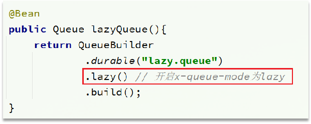
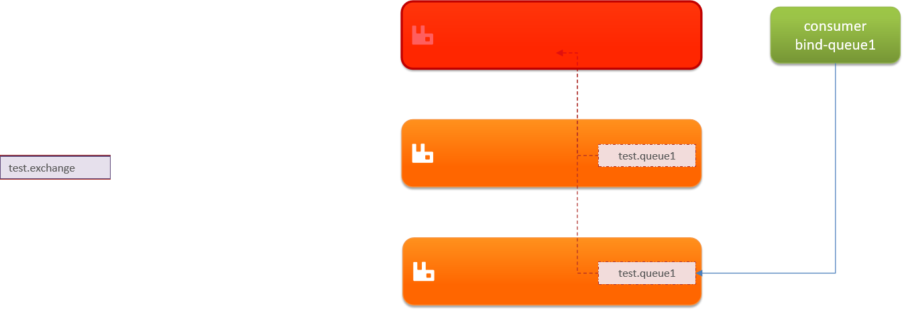
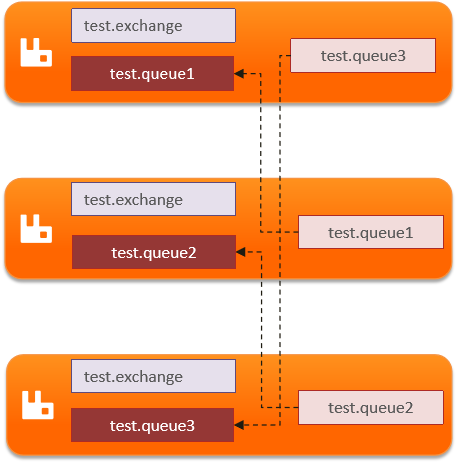

## RabbitMQ知识点总结

## 使用MQ的优点和缺点

### 优点

**解耦**

现在有这么个场景：A系统向B,C,D三个系统发送数据，通过接口的调用来完成。现在要增加个E系统也需要这个消息？后面C系统又不需要这个消息了？这可咋整？负责A系统的人是要奔溃的......


在上面的场景中，A系统跟其它系统严重耦合，A 系统产生一条比较关键的数据，很多系统都需要 A 系统将这个数据发送过来。A 系统要时时刻刻考虑 BCDE 四个系统如果挂了该咋办？要不要重发，要不要把消息存起来？都是令人很头疼的问题。。。

如果使用 MQ，A 系统产生一条数据，发送到 MQ 里面去，哪个系统需要数据自己去 MQ 里面消费。如果新系统需要数据，直接从 MQ 里消费即可；如果某个系统不需要这条数据了，就取消对 MQ 消息的消费即可。这样下来，A 系统压根儿不需要去考虑要给谁发送数据，不需要维护这个代码，也不需要考虑人家是否调用成功、失败超时等情况。


通过引入MQ这一中间件，A系统彻底与其他几个系统解耦了。

**异步**

再来看一个场景，A 系统接收一个请求，需要在自己本地写库，还需要在 BCD 三个系统写库，自己本地写库要 3ms，BCD 三个系统分别写库要 300ms、450ms、200ms。最终请求总延时是 3 + 300 + 450 + 200 = 953ms，接近 1s，用户感觉搞个什么东西，慢死了慢死了。用户通过浏览器发起请求，等待个 1s，这几乎是不可接受的。


一般互联网类的企业，对于用户直接的操作，一般要求是每个请求都必须在 200 ms 以内完成，对用户几乎是无感知的。

如果**使用 MQ**，那么 A 系统连续发送 3 条消息到 MQ 队列中，假如耗时 5ms，A 系统从接受一个请求到返回响应给用户，总时长是 3 + 5 = 8ms，对于用户而言，其实感觉上就是点个按钮，8ms 以后就直接返回了，那是相当流畅了！


**削峰**

每天 0:00 到 12:00，A 系统风平浪静，每秒并发请求数量就 50 个。结果每次一到 12:00 ~ 13:00 ，每秒并发请求数量突然会暴增到 5k+ 条。但是系统是直接基于 MySQL 的，大量的请求涌入 MySQL，每秒钟对 MySQL 执行约 5k 条 SQL。

一般的 MySQL，扛到每秒 2k 个请求就差不多了，如果每秒请求到 5k 的话，可能就直接把 MySQL 给打死了，导致系统崩溃，用户也就没法再使用系统了。但是高峰期一过，到了下午的时候，就成了低峰期，可能也就 1w 的用户同时在网站上操作，每秒中的请求数量可能也就 50 个请求，对整个系统几乎没有任何的压力。


如果使用 MQ，每秒 5k 个请求写入 MQ，A 系统每秒钟最多处理 2k 个请求，因为 MySQL 每秒钟最多处理 2k 个。A 系统从 MQ 中慢慢拉取请求，每秒钟就拉取 2k 个请求，不要超过自己每秒能处理的最大请求数量就 ok，这样下来，哪怕是高峰期的时候，A 系统也绝对不会挂掉。而 MQ 每秒钟 5k 个请求进来，就 2k 个请求出去，结果就导致在中午高峰期（1 个小时），可能有几十万甚至几百万的请求积压在 MQ 中。


这个短暂的高峰期积压是 ok 的，因为高峰期过了之后，每秒钟就 50 个请求进 MQ，但是 A 系统依然会按照每秒 2k 个请求的速度在处理。所以说，只要高峰期一过，A 系统就会快速将积压的消息给解决掉。

### 缺点

* **系统可用性降低**

系统引入的外部依赖越多，越容易挂掉，本来你就是 A 系统调用 BCD 三个系统的接口就好了，人 ABCD 四个系统好好的，没啥问题，你偏加个 MQ 进来，万一MQ 挂了咋整？MQ 挂了，整套系统崩溃了，你不就完了么。

* **系统复杂度提高**

硬生生加个 MQ 进来，你怎么保证消息没有重复消费？怎么处理消息丢失的情况？怎么保证消息传递的顺序性？头大头大，问题一大堆，痛苦不已。

* **一致性问题**

A 系统处理完了直接返回成功了，人都以为你这个请求就成功了；但是问题是，要是 BCD 三个系统那里，BD 两个系统写库成功了，结果 C 系统写库失败了，咋整？你这数据就不一致了。所以消息队列实际是一种非常复杂的架构，你引入它有很多好处，但是也得针对它带来的坏处做各种额外的技术方案和架构来规避掉，最好之后，你会发现，妈呀，系统复杂度提升了一个数量级，也许是复杂了 10 倍。但是关键时刻，用，还是得用的。

## 你们公司生产环境用的是什么消息中间件？
这个首先你可以说下你们公司选用的是什么消息中间件，比如用的是RabbitMQ，然后可以初步给一些你对不同MQ中间件技术的选型分析。

举个例子：比如说ActiveMQ是老牌的消息中间件，国内很多公司过去运用的还是非常广泛的，功能很强大。

但是问题在于没法确认ActiveMQ可以支撑互联网公司的高并发、高负载以及高吞吐的复杂场景，在国内互联网公司落地较少。而且使用较多的是一些传统企业，用ActiveMQ做异步调用和系统解耦。

然后你可以说说RabbitMQ，他的好处在于可以支撑高并发、高吞吐、性能很高，同时有非常完善便捷的后台管理界面可以使用。

另外，他还支持集群化、高可用部署架构、消息高可靠支持，功能较为完善。

而且经过调研，国内各大互联网公司落地大规模RabbitMQ集群支撑自身业务的case较多，国内各种中小型互联网公司使用RabbitMQ的实践也比较多。

除此之外，RabbitMQ的开源社区很活跃，较高频率的迭代版本，来修复发现的bug以及进行各种优化，因此综合考虑过后，公司采取了RabbitMQ。

但是RabbitMQ也有一点缺陷，就是他自身是基于erlang语言开发的，所以导致较为难以分析里面的源码，也较难进行深层次的源码定制和改造，毕竟需要较为扎实的erlang语言功底才可以。

然后可以聊聊RocketMQ，是阿里开源的，经过阿里的生产环境的超高并发、高吞吐的考验，性能卓越，同时还支持分布式事务等特殊场景。

而且RocketMQ是基于Java语言开发的，适合深入阅读源码，有需要可以站在源码层面解决线上生产问题，包括源码的二次开发和改造。

另外就是Kafka。Kafka提供的消息中间件的功能明显较少一些，相对上述几款MQ中间件要少很多。

但是Kafka的优势在于专为超高吞吐量的实时日志采集、实时数据同步、实时数据计算等场景来设计。

因此Kafka在大数据领域中配合实时计算技术（比如Spark Streaming、Storm、Flink）使用的较多。但是在传统的MQ中间件使用场景中较少采用。

| 特性       | ActiveMQ                   | RabbitMQ                                             | RocketMQ                           | kafka                                                        |
| :--------- | :------------------------- | :--------------------------------------------------- | :--------------------------------- | :----------------------------------------------------------- |
| 单机吞吐量 | 万级（比RabbitMQ低）       | 2.6w/s（消息做持久化）                               | 11.6w/s                            | 17.3w/s                                                      |
| 开发语言   | Java                       | Erlang                                               | Java                               | Scala/Java                                                   |
| 时效性     | ms级                       | 微秒级，RabbitMQ特性，延迟最低                       | ms级                               | 在ms级以内                                                   |
| 可用性     | 高，基于主从架构实现高可用 | 高，基于主从架构实现高可用                           | 非常高，分布式架构                 | 非常高，分布式架构，一个数据多个副本，少数己其宕机，数据不会丢失，不会导致不可用 |
| 消息可靠性 | 有较低的概率会丢失消息     | 基本不会丢失                                         | 通过参数优化配置，可做到0丢失      | 通过参数优化配置，可做到0丢失                                |
| 功能支持   | MQ领域的功能极其完善       | 基于Erlang语言开发，并发能力很强，性能极好，延迟很低 | MQ功能较为完善，分布式的，扩展性强 | 功能较为简单，主要支持简单的MQ功能，在大数据领域的实时计算及日志采集被大规模使用 |

##  怎么保证消息可靠性传输


**1.生产者消息丢失**

生产者将数据发送到 RabbitMQ 的时候，可能数据就在半路给搞丢了，因为网络问题啥的，都有可能。

此时可以选择用 RabbitMQ 提供的事务功能，就是生产者发送数据之前开启 RabbitMQ 事务 channel.txSelect ，然后发送消息，如果消息没有成功被 RabbitMQ 接收到，那么生产者会收到异常报错，此时就可以回滚事务 channel.txRollback ，然后重试发送消息；如果收到了消息，那么可以提交事务 channel.txCommit 。

```java
// 开启事务
channel.txSelect
try {
    // 这里发送消息
} catch (Exception e) {
    channel.txRollback

    // 这里再次重发这条消息
}
// 提交事务
channel.txCommit
```

但是问题是，RabbitMQ 事务机制（同步）一搞，基本上吞吐量会下来，因为太耗性能。

所以一般来说，如果你要确保说写 RabbitMQ 的消息别丢，可以开启 confirm 模式，在生产者那里设置开启 confirm 模式之后，你每次写的消息都会分配一个唯一的 id，然后如果写入了 RabbitMQ 中，RabbitMQ 会给你回传一个 ack 消息，告诉你说这个消息 ok 了。如果 RabbitMQ 没能处理这个消息，会回调你的一个 nack 接口，告诉你这个消息接收失败，你可以重试。而且你可以结合这个机制自己在内存里维护每个消息 id 的状态，如果超过一定时间还没接收到这个消息的回调，那么你可以重发。

**2.RabbitMQ消息丢失**

就是 RabbitMQ 自己弄丢了数据，这个你必须开启 RabbitMQ 的持久化，就是消息写入之后会持久化到磁盘，哪怕是 RabbitMQ 自己挂了，恢复之后会自动读取之前存储的数据，一般数据不会丢。除非极其罕见的是，RabbitMQ 还没持久化，自己就挂了，可能导致少量数据丢失，但是这个概率较小。

设置持久化有两个步骤：

创建 queue 的时候将其设置为持久化
这样就可以保证 RabbitMQ 持久化 queue 的元数据，但是它是不会持久化 queue 里的数据的。

第二个是发送消息的时候将消息的 deliveryMode 设置为 2
就是将消息设置为持久化的，此时 RabbitMQ 就会将消息持久化到磁盘上去。

必须要同时设置这两个持久化才行，RabbitMQ 哪怕是挂了，再次重启，也会从磁盘上重启恢复 queue，恢复这个 queue 里的数据。

注意，哪怕是你给 RabbitMQ 开启了持久化机制，也有一种可能，就是这个消息写到了 RabbitMQ 中，但是还没来得及持久化到磁盘上，结果不巧，此时 RabbitMQ 挂了，就会导致内存里的一点点数据丢失。

所以，持久化可以跟生产者那边的 confirm 机制配合起来，只有消息被持久化到磁盘之后，才会通知生产者 ack 了，所以哪怕是在持久化到磁盘之前，RabbitMQ 挂了，数据丢了，生产者收不到 ack ，你也是可以自己重发的。

**3.消费者消息丢失**

RabbitMQ 如果丢失了数据，主要是因为你消费的时候，刚消费到，还没处理，结果进程挂了，比如重启了，那么就尴尬了，RabbitMQ 认为你都消费了，这数据就丢了。

这个时候得用 RabbitMQ 提供的 ack 机制，简单来说，就是你必须关闭 RabbitMQ 的自动 ack ，可以通过一个 api 来调用就行，然后每次你自己代码里确保处理完的时候，再在程序里 ack 一把。这样的话，如果你还没处理完，不就没有 ack 了？那 RabbitMQ 就认为你还没处理完，这个时候 RabbitMQ 会把这个消费分配给别的 consumer 去处理，消息是不会丢的。

开启手动确认：channel.basicAck()确认消息收到，channel.basicNack(）消息没收到。

RabbitMQ 的高可用性
RabbitMQ 是比较有代表性的，因为是基于主从（非分布式）做高可用性的，我们就以 RabbitMQ 为例子讲解第一种 MQ 的高可用性怎么实现。

RabbitMQ 有三种模式：单机模式、普通集群模式、镜像集群模式。

单机模式

单机模式，就是 Demo 级别的，一般就是你本地启动了玩玩儿的 ????，没人生产用单机模式。

普通集群模式（无高可用性）

普通集群模式，意思就是在多台机器上启动多个 RabbitMQ 实例，每个机器启动一个。你创建的 queue，只会放在一个 RabbitMQ 实例上，但是每个实例都同步 queue 的元数据（元数据可以认为是 queue 的一些配置信息，通过元数据，可以找到 queue 所在实例）。你消费的时候，实际上如果连接到了另外一个实例，那么那个实例会从 queue 所在实例上拉取数据过来。


这种方式确实很麻烦，也不怎么好，没做到所谓的分布式，就是个普通集群。因为这导致你要么消费者每次随机连接一个实例然后拉取数据，要么固定连接那个 queue 所在实例消费数据，前者有数据拉取的开销，后者导致单实例性能瓶颈。

而且如果那个放 queue 的实例宕机了，会导致接下来其他实例就无法从那个实例拉取，如果你开启了消息持久化，让 RabbitMQ 落地存储消息的话，消息不一定会丢，得等这个实例恢复了，然后才可以继续从这个 queue 拉取数据。

所以这个事儿就比较尴尬了，这就没有什么所谓的高可用性，这方案主要是提高吞吐量的，就是说让集群中多个节点来服务某个 queue 的读写操作。

镜像集群模式（高可用性）

这种模式，才是所谓的 RabbitMQ 的高可用模式。跟普通集群模式不一样的是，在镜像集群模式下，你创建的 queue，无论元数据还是 queue 里的消息都会存在于多个实例上，就是说，每个 RabbitMQ 节点都有这个 queue 的一个完整镜像，包含 queue 的全部数据的意思。然后每次你写消息到 queue 的时候，都会自动把消息同步到多个实例的 queue 上。


那么如何开启这个镜像集群模式呢？其实很简单，RabbitMQ 有很好的管理控制台，就是在后台新增一个策略，这个策略是镜像集群模式的策略，指定的时候是可以要求数据同步到所有节点的，也可以要求同步到指定数量的节点，再次创建 queue 的时候，应用这个策略，就会自动将数据同步到其他的节点上去了。

这样的话，好处在于，你任何一个机器宕机了，没事儿，其它机器（节点）还包含了这个 queue 的完整数据，别的 consumer 都可以到其它节点上去消费数据。坏处在于，第一，这个性能开销也太大了吧，消息需要同步到所有机器上，导致网络带宽压力和消耗很重！第二，这么玩儿，不是分布式的，就没有扩展性可言了，如果某个 queue 负载很重，你加机器，新增的机器也包含了这个 queue 的所有数据，并没有办法线性扩展你的 queue。你想，如果这个 queue 的数据量很大，大到这个机器上的容量无法容纳了，此时该怎么办呢？


**生产者确认机制**

RabbitMQ提供了publisher confirm机制来避免消息发送到MQ过程中丢失。消息发送到MQ以后，会返回一个结果给发送者，表示消息是否处理成功。

消息失败之后如何处理呢？

- 回调方法即时重发
- 记录日志
- 保存到数据库然后定时重发，成功发送后即刻删除表中的数据

**消息持久化**

MQ默认是内存存储消息，开启持久化功能可以确保缓存在MQ中的消息不丢失。

- 交换机持久化

``` java
@Bean(name = "simpleDirectExchange")
public DirectExchange getSimpleDirectExchange() {
    // 三个参数：交换机名称、是否持久化、是否自动删除
    return new DirectExchange("simpleDirectExchange",true, false);
}
```

- 队列持久化

``` java
@Bean(name = "simpleDirectQueue")
public Queue getSimpleDirectQueue() {
    // 四个参数：队列名称、是否持久化、是否独占、是否自动删除
    return new Queue("simpleDirectQueue", true, false, false);
}
```

- 消息持久化

消息持久化，SpringAMQP中的的消息默认是持久的，可以通过MessageProperties中的DeliveryMode来指定的

``` java
Message msg = MessageBuilder                .withBody(message.getBytes(StandardCharsets.UTF_8))
                .setDeliveryMode(MessageDeliveryMode.PERSISTENT)
                .build();
```

**消费者确认**

RabbitMQ支持消费者确认机制，即：消费者处理消息后可以向MQ发送ack回执，MQ收到ack回执后才会删除该消息。而SpringAMQP则允许配置三种确认模式：

- manual：手动ack，需要在业务代码结束后，调用api发送ack。
- auto：自动ack，由spring监测listener代码是否出现异常，没有异常则返回ack；抛出异常则返回nack
- none：关闭ack，MQ假定消费者获取消息后会成功处理，因此消息投递后立即被删除

我们可以利用Spring的retry机制，在消费者出现异常时利用本地重试，设置重试次数，当次数达到了以后，如果消息依然失败，将消息投递到异常交换机，交由人工处理


**总结**

1. 开启生产者确认机制，确保生产者的消息能到达队列
2. 开启持久化功能，确保消息未消费前在队列中不会丢失
3. 开启消费者确认机制为auto，由spring确认消息处理成功后完成ack
4. 开启消费者失败重试机制，多次重试失败后将消息投递到异常交换机，交由人工处理

## 怎么保证消息顺序消费

保证生产者 - MQServer - 消费者是一对一对一的关系。一个队列只有一个消费者的情况下才能保证顺序，否则只能通过全局ID实现（每条消息都一个msgId，关联的消息拥有一个parentMsgId。可以在消费端实现前一条消息未消费，不处理下一条消息；也可以在生产端实现前一条消息未处理完毕，不发布下一条消息）。

## 消息如何被优先消费

```java
//生产者
Map argss = new HashMap();
argss.put("x-max-priority",10);
//消费者
AMQP.BasicProperties properties = new AMQP.BasicProperties.Builder().priority(5) // 优先级，默认为5，配合队列的 x-max-priority 属性使用
```

## 怎么保证消息幂等(避免重复消费)

导致消息重复消费有以下两种场景：

- 网络抖动，导致重试
- 消费者消费完消息，还没来得及确认，消费者挂了


在消息生产时，MQ 内部针对每条生产者发送的消息生成一个 inner-msg-id，作为去重的依据（消息投递失败并重传），避免重复的消息进入队列；在消息消费时，要求消息体中必须要有一个 bizId（对于同一业务全局唯一，如支付 ID、订单 ID、帖子 ID 等）作为去重的依据，避免同一条消息被重复消费。

解决方案：

- 每条消息设置一个唯一的标识id
- 幂等方案：【 分布式锁、数据库锁（悲观锁、乐观锁），唯一索引，Redis去重 】

## 消息基于什么传输？

由于 TCP 连接的创建和销毁开销较大，且并发数受系统资源限制，会造成性能瓶颈。RabbitMQ 使用信道的方式来传输数据。信道是建立在真实的 TCP 连接内的虚拟连接，且每条 TCP 连接上的信道数量没有限制。

面试题：消息如何分发？

若该队列至少有一个消费者订阅，消息将以循环（round-robin）的方式发送给消费者。每条消息只会分发给一个订阅的消费者（前提是消费者能够正常处理消息并进行确认）。通过路由可实现多消费的功能

## 消息怎么路由？

消息提供方->路由->一至多个队列消息发布到交换器时，消息将拥有一个路由键（routing key），在消息创建时设定。通过队列路由键，可以把队列绑定到交换器上。消息到达交换器后，RabbitMQ 会将消息的路由键与队列的路由键进行匹配（针对不同的交换器有不同的路由规则）；

常用的交换器主要分为一下三种：

**fanout**：如果交换器收到消息，将会广播到所有绑定的队列上

**direct**：如果路由键完全匹配，消息就被投递到相应的队列

**topic**：可以使来自不同源头的消息能够到达同一个队列。使用 topic 交换器时，可以使用通配符

## **多个消费者监听一个队列时，消息如何分发**

**轮询**
默认的策略，消费者轮流，平均地接收消息
**公平分发**
根据消费者的能力来分发消息，给空闲的消费者发送更多消息

```java
//当消费者有x条消息没有响应ACK时，不再给这个消费者发送消息
channel.basicQos(int x)
```

## **消息在什么时候会变成死信**

- 消息拒绝并且没有设置重新入队
- 消息过期
- 消息堆积，并且队列达到最大长度，先入队的消息会变成DL

## RabbitMQ如何实现延时队列

- 延迟队列：进入队列的消息会被延迟消费的队列
- 场景：超时订单、限时优惠、定时发布

**延迟队列=死信交换机+TTL（生存时间）**

**利用TTL（队列的消息存活时间或者消息存活时间），加上死信交换机**

- **死信交换机**


当一个队列中的消息满足下列情况之一时，可以成为死信（dead letter）：

- 消费者使用basic.reject或 basic.nack声明消费失败，并且消息的requeue参数设置为false
- 消息是一个过期消息，超时无人消费
- 要投递的队列消息堆积满了，最早的消息可能成为死信

如果该队列配置了dead-letter-exchange属性，指定了一个交换机，那么队列中的死信就会投递到这个交换机中，而这个交换机称为死信交换机（Dead Letter Exchange，简称DLX）。


**TTL**

TTL，也就是Time-To-Live。如果一个队列中的消息TTL结束仍未消费，则会变为死信，ttl超时分为两种情况：

- 消息所在的队列设置了存活时间
- 消息本身设置了存活时间


**延迟队列插件**

DelayExchange插件，需要安装在RabbitMQ中
RabbitMQ有一个官方的插件社区，地址为：https://www.rabbitmq.com/community-plugins.html 


DelayExchange的本质还是官方的三种交换机，只是添加了延迟功能。因此使用时只需要声明一个交换机，交换机的类型可以是任意类型，然后设定delayed属性为true即可。


**总结**

- 我们当时一个什么业务使用到了延迟队列（超时订单、限时优惠、定时发布…
- 其中延迟队列就用到了死信交换机和TTL（消息存活时间）实现的
- 消息超时未消费就会变成死信（死信的其他情况：拒绝被消费，队列满了）

延迟队列插件实现延迟队列DelayExchange

- 声明一个交换机，添加delayed属性为true
- 发送消息时，添加x-delay头，值为超时时间

## RabbitMQ的pull和push模式？

在 RabbitMQ 中，消费者的消息处理模式可以分为两种：**pull** 模式和 **push** 模式。

Pull 模式：消费者主动从消息中间件中拉取消息。这种模式下，每次接收消息都需要拉取一下队列的信息，由于是拉取的，实用性较差，不能及时有效获取最新的信息，但能有效降低内存消耗⁵。

Push 模式：消息中间件主动将消息推送给消费者。这种模式下，消费者只要启动后，就相当于使用了订阅模式，只要生产者不断推送信息，消费者就会持续接收信息⁵。

默认情况下，RabbitMQ 使用的是 push 模式，只要消息推送到消费者就会自动 ack，然后 RabbitMQ 删除队列中的消息¹。这意味着即使消费者没有处理完上一条消息，它仍然会继续接收新的消息。

然而，这种方式可能会导致问题。比如，如果消费者处理消息的速度赶不上生产者发送消息的速度，或者消费者在处理消息时出现异常，那么就可能会导致消息丢失¹。

为了解决这个问题，RabbitMQ 提供了消费者应答（ack）机制。我们可以启用手动应答模式，在消费端调用 API 手动 ack 确认之后，RabbitMQ 才会从队列删除这条消息¹。这样，只有当消费者处理完一条消息并确认后，才会接收下一条消息。这种方式可以有效防止消息丢失，确保消息的可靠性¹。

总的来说，RabbitMQ 的消费者是否会在处理完一条消息之前接收新的消息，取决于你选择的消息处理模式和是否启用了手动应答机制。


##  RabbitMQ消息堆积怎么处理？

当生产者发送消息的速度超过了消费者处理消息的速度，就会导致队列中的消息堆积，直到队列存储消息达到上限。之后发送的消息就会成为死信，可能会被丢弃，这就是消息堆积问题。


解决消息堆积有三种种思路：

- 增加更多消费者，提高消费速度
- 在消费者内开启线程池加快消息处理速度
- 扩大队列容积，提高堆积上限

**惰性队列**

惰性队列的特征如下：

- 接收到消息后直接存入磁盘而非内存
- 消费者要消费消息时才会从磁盘中读取并加载到内存
- 支持数百万条的消息存储




**总结**

解决消息堆积有三种种思路：

- 增加更多消费者，提高消费速度
- 在消费者内开启线程池加快消息处理速度
- 扩大队列容积，提高堆积上限，采用惰性队列
  - 在声明队列的时候可以设置属性x-queue-mode为lazy，即为惰性队列
  - 基于磁盘存储，消息上限高
  - 性能比较稳定，但基于磁盘存储，受限于磁盘IO，时效性会降低

## RabbitMQ的高可用机制

在生产环境下，使用集群来保证高可用性

- 普通集群

- 镜像集群

- 仲裁队列

**普通集群**

普通集群，或者叫标准集群（classic cluster），具备下列特征：

- 会在集群的各个节点间共享部分数据，包括：交换机、队列元信息。不包含队列中的消息。
- 当访问集群某节点时，如果队列不在该节点，会从数据所在节点传递到当前节点并返回
- 队列所在节点宕机，队列中的消息就会丢失



**镜像集群**

镜像集群：本质是主从模式，具备下面的特征：

- 交换机、队列、队列中的消息会在各个mq的镜像节点之间同步备份。
- 创建队列的节点被称为该队列的主节点，备份到的其它节点叫做该队列的镜像节点。
- 一个队列的主节点可能是另一个队列的镜像节点
- 所有操作都是主节点完成，然后同步给镜像节点
- 主宕机后，镜像节点会替代成新的主



**仲裁队列**

仲裁队列：仲裁队列是3.8版本以后才有的新功能，用来替代镜像队列，具备下列特征：

- 与镜像队列一样，都是主从模式，支持主从数据同步
- 使用非常简单，没有复杂的配置
- 主从同步基于Raft协议，强一致

``` java
@Bean(name = "quorumQueue")
    public Queue quorumQueue() {
        return QueueBuilder
                // 持久化
                .durable("quorumQueue")
                // 仲裁队列
                .quorum()
                .build();
    }
```

**总结**

RabbitMQ的高可用机制有了解过嘛？

- 在生产环境下，我们当时采用的镜像模式搭建的集群，共有3个节点
- 镜像队列结构是一主多从（从就是镜像），所有操作都是主节点完成，然后同步给镜像节点
- 主宕机后，镜像节点会替代成新的主（如果在主从同步完成前，主就已经宕机，可能出现数据丢失）

那出现丢数据怎么解决呢？

我们可以采用仲裁队列，与镜像队列一样，都是主从模式，支持主从数据同步，主从同步基于Raft协议，强一致。
并且使用起来也非常简单，不需要额外的配置，在声明队列的时候只要指定这个是仲裁队列即可