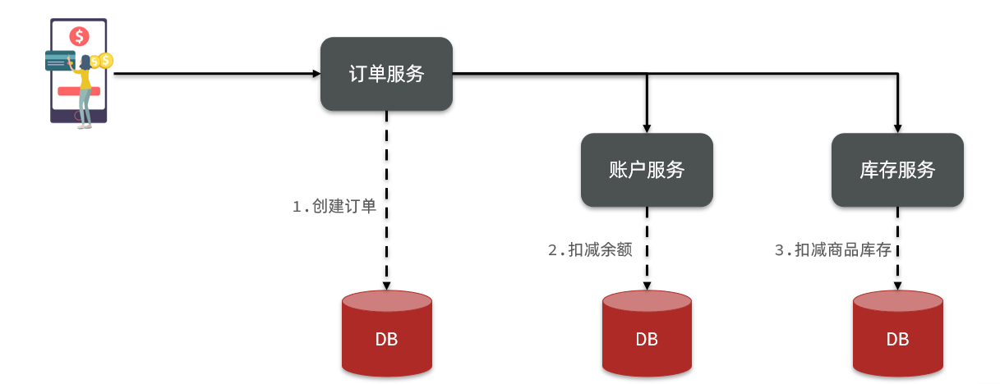
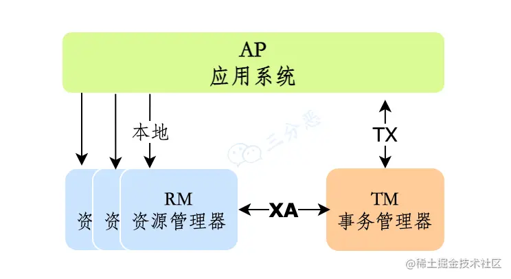
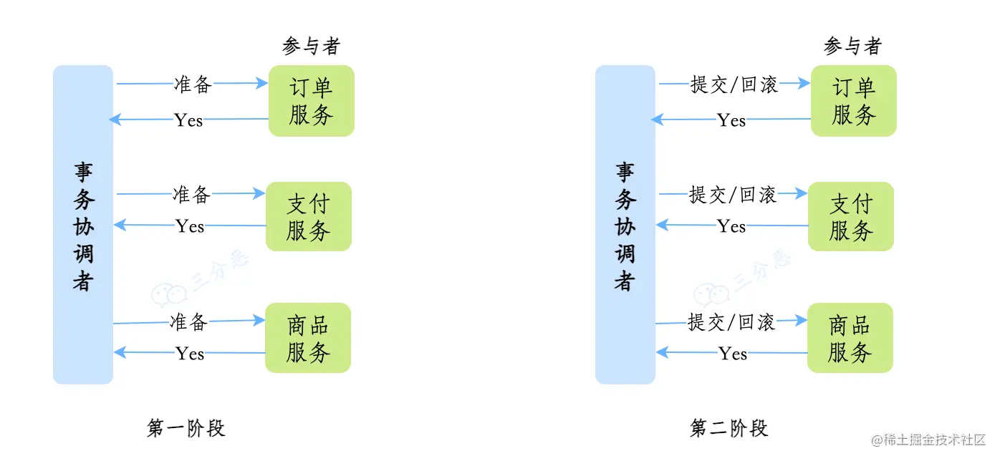
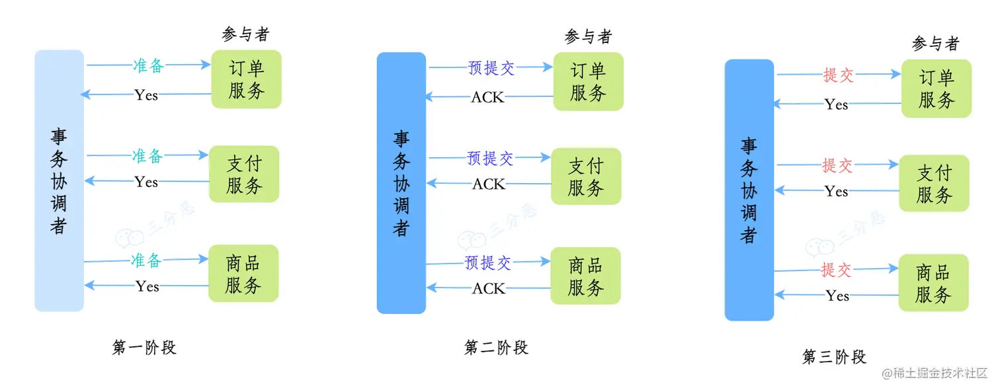
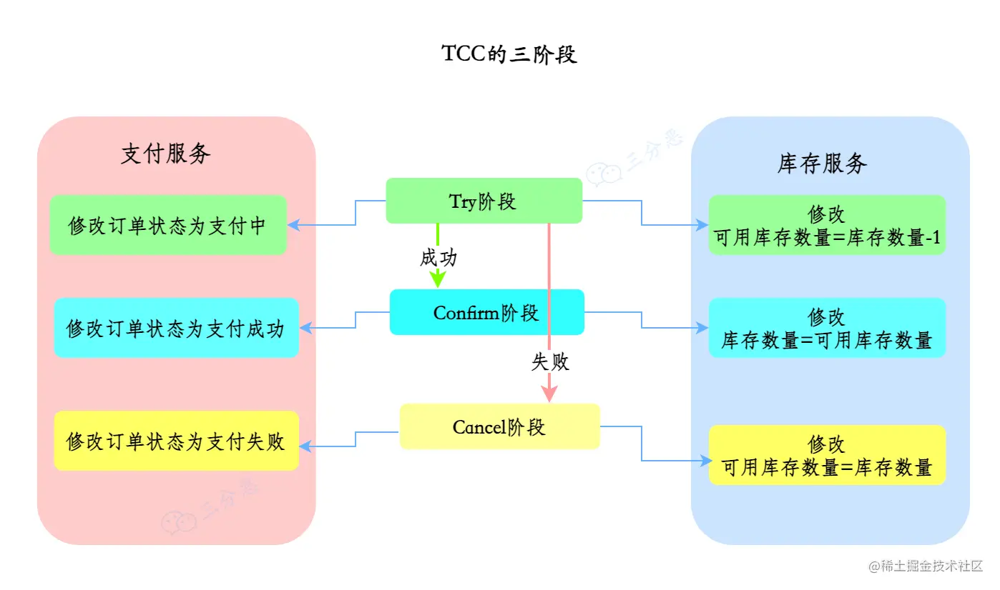
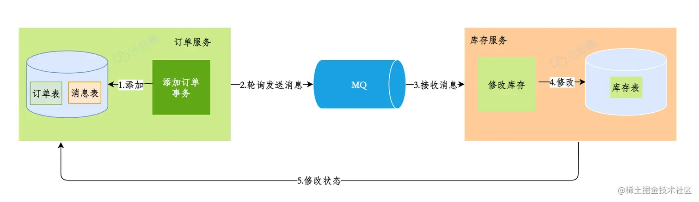
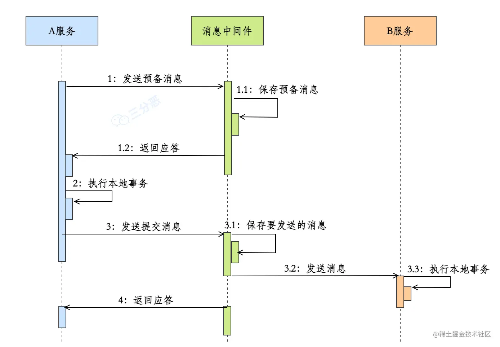
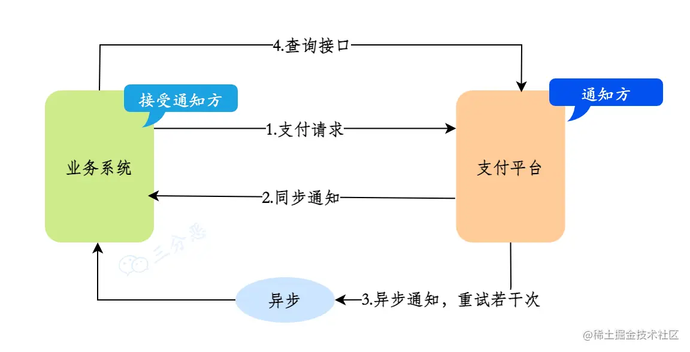
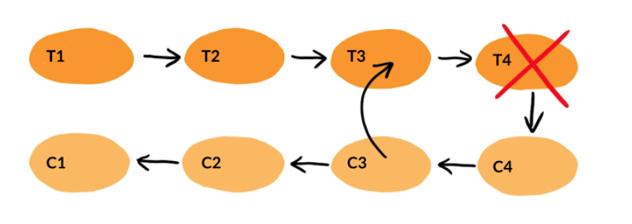

# 分布式事务解决方案

# 什么是事务？

简单来说事务就是对数据库逻辑上的一组操作，要么全都执行成功，要不全都执行失败。

本地事务，也就是传统的**单机事务**。在传统数据库事务中，必须要满足四个原则：

# 什么是分布式事务？

分布式事务是相对本地事务而言的，对于本地事务，利用数据库本身的事务机制，就可以保证事务的ACID特性。

而在分布式环境下，会涉及到多个数据库。

**分布式事务**，就是指不是在单个服务或单个数据库架构下，产生的事务，例如：

- 跨数据源的分布式事务
- 跨服务的分布式事务
- 综合情况

在数据库水平拆分、服务垂直拆分之后，一个业务操作通常要跨多个数据库、服务才能完成。例如电商行业中比较常见的下单付款案例，包括下面几个行为：

- 创建新订单
- 扣减商品库存
- 从用户账户余额扣除金额

完成上面的操作需要访问三个不同的微服务和三个不同的数据库。

订单的创建、库存的扣减、账户扣款在每一个服务和数据库内是一个本地事务，可以保证ACID原则。

但是当我们把三件事情看做一个"业务"，要满足保证“业务”的原子性，要么所有操作全部成功，要么全部失败，不允许出现部分成功部分失败的现象，这就是**分布式系统下的事务**了。

此时ACID难以满足，这是分布式事务要解决的问题

# 分布式事务解决方案？

## 2PC两阶段提交

2PC即Two-Phase Commit，阶段提交。说到2PC，就要先说说分布式事务中的XA协议。

XA协议中有三个角色：

- AP（Application）： 应用系统（服务）
- TM（Transaction Manager）： 事务管理器（群居事务管理）
- RM（Resource Manager）：资源管理器（数据库）

XA协议采用**两阶段提交**方式来管理分布式事务。XA接口提供资源管理器与事务管理器之间进行通信的标准接口。

两阶段提交的思路可以概括为： 参与者将操作成败通知协调者，再由协调者根据所有参与者的反馈情况决定各参与者是否要提交操作还是回滚操作。

### 准备阶段：提交事务请求

1. 事务询问。协调者向所有参与者发送事务内容，询问是否可以执⾏提交操作，并开始等待各参与者进⾏响应；
2. 执⾏事务。各参与者节点，执⾏事务操作，并将Undo和Redo操作计⼊本机事务⽇志，但是不提交事务；
3. 各参与者向协调者反馈事务问询的响应。成功执⾏返回Yes，否则返回No。

### 提交阶段：执行事务提交

**事务提交：**

如果所有的参与者都返回了yes，那么执行**事务提交**。

1. 发送提交请求。协调者向所有参与者发送Commit请求；
2. 事务提交。参与者收到Commit请求后，会**正式执⾏事务提交操作**，并在完成提交操作之后，释放在整个事务执⾏期间占⽤的资源；
3. 反馈事务提交结果。参与者在完成事务提交后，向协调者发送Ack消息确认；
4. 完成事务。协调者在收到所有参与者的Ack后，完成事务。

**事务中断：**

事情总会出现意外，当存在某⼀参与者向协调者发送No响应，或者等待超时。协调者只要⽆法收到所有参与者的Yes响应，就会**中断事务**。

1. 发送回滚请求。协调者向所有参与者发送Rollback请求；

2. 回滚。参与者收到请求后，利⽤本机Undo信息，执⾏Rollback操作。并在回滚结束后释放该事务所占⽤的系统资源；

3. 反馈回滚结果。参与者在完成回滚操作后，向协调者发送Ack消息；

4. 中断事务。协调者收到所有参与者的回滚Ack消息后，完成事务中断。

#### 2PC的优缺点

**优点**： 尽量保证了数据的强一致，实现成本较低，在各大主流数据库都有自己实现，对于MySQL是从5.5开始支持。（强一致性）

**缺点**:

- 单点问题：事务管理器在整个流程中扮演的角色很关键，如果其宕机，比如在第一阶段已经完成，在第二阶段正准备提交的时候事务管理器宕机，资源管理器就会一直阻塞，导致数据库无法使用。
- 同步阻塞：在准备就绪之后，资源管理器中的资源一直处于阻塞，直到提交完成，释放资源。
- 数据不一致：两阶段提交协议虽然为分布式数据强一致性所设计，但仍然存在数据不一致性的可能，比如在第二阶段中，假设协调者发出了事务commit的通知，但是因为网络问题该通知仅被一部分参与者所收到并执行了commit操作，其余的参与者则因为没有收到通知一直处于阻塞状态，这时候就产生了数据的不一致性。

## 3PC三阶段提交

三阶段提交（`3PC`）是二阶段提交（`2PC`）的一种改进版本 ，为解决两阶段提交协议的单点故障和同步阻塞问题。

三阶段提交有这么三个阶段：`CanCommit`，`PreCommit`，`DoCommit`三个阶段。

#### `CanCommit`

1. 事务询问。协调者向所有参与者发送包含事务内容的canCommit的请求，询问是否可以执⾏事务提交，并等待应答；

2. 各参与者反馈事务询问。正常情况下，如果参与者认为可以顺利执⾏事务，则返回Yes，否则返回No。

#### `PreCommit`

在本阶段，协调者会根据上⼀阶段的反馈情况来决定是否可以执⾏事务的PreCommit操作。有以下两种可能：

**执⾏事务预提交**

1. 发送预提交请求。协调者向所有节点发出PreCommit请求，并进⼊prepared阶段；

2. 事务预提交。参与者收到PreCommit请求后，会执⾏事务操作，并将Undo和Redo⽇志写⼊本机事务⽇志；

3. 各参与者成功执⾏事务操作，同时将反馈以Ack响应形式发送给协调者，同事等待最终的Commit或Abort指令。

**中断事务**

加⼊任意⼀个参与者向协调者发送No响应，或者等待超时，协调者在没有

得到所有参与者响应时，即可以中断事务：

1. 发送中断请求。 协调者向所有参与者发送Abort请求；

2. 中断事务。⽆论是收到协调者的Abort请求，还是等待协调者请求过程中出现超时，参与者都会中断事务；

#### `DoCommit`

- 在这个阶段，会真正的进⾏事务提交，同样存在两种可能。

  **执⾏提交**

  1. 发送提交请求。假如协调者收到了所有参与者的Ack响应，那么将从预提交转换到提交状态，并向所有参与者，发送doCommit请求；

  2. 事务提交。参与者收到doCommit请求后，会正式执⾏事务提交操作，并在完成提交操作后释放占⽤资源；

  3. 反馈事务提交结果。参与者将在完成事务提交后，向协调者发送Ack消息；

  4. 完成事务。协调者接收到所有参与者的Ack消息后，完成事务。

  **中断事务**

  在该阶段，假设正常状态的协调者接收到任⼀个参与者发送的No响应，或在超时时间内，仍旧没收到反馈消息，就会中断事务：

  1. 发送中断请求。协调者向所有的参与者发送abort请求；

  2. 事务回滚。参与者收到abort请求后，会利⽤阶段⼆中的Undo消息执⾏事务回滚，并在完成回滚后释放占⽤资源；

  3. 反馈事务回滚结果。参与者在完成回滚后向协调者发送Ack消息；

  4. 中端事务。协调者接收到所有参与者反馈的Ack消息后，完成事务中断

可以看出，三阶段提交解决的只是两阶段提交中**单体故障**和**同步阻塞**的问题，因为加入了超时机制，这里的超时的机制作用于 **预提交阶段** 和 **提交阶段**。如果等待 **预提交请求** 超时，参与者直接回到准备阶段之前。如果等到**提交请求**超时，那参与者就会提交事务了。

**无论是2PC还是3PC都不能保证分布式系统中的数据100%一致**。

## TCC事务补偿机制

**TCC（Try Confirm Cancel）** ，是两阶段提交的一个变种，针对每个操作，都需要有一个其对应的确认和取消操作，当操作成功时调用确认操作，当操作失败时调用取消操作，类似于二阶段提交，只不过是这里的提交和回滚是针对业务上的，所以基于TCC实现的分布式事务也可以看做是对业务的一种补偿机制。

- **Try**：尝试待执行的业务。订单系统将当前订单状态设置为支付中，库存系统校验当前剩余库存数量是否大于1，然后将可用库存数量设置为库存剩余数量-1，。
- **Confirm**：确认执行业务，如果Try阶段执行成功，接着执行Confirm 阶段，将订单状态修改为支付成功，库存剩余数量修改为可用库存数量。
- **Cancel**：取消待执行的业务，如果Try阶段执行失败，执行Cancel 阶段，将订单状态修改为支付失败，可用库存数量修改为库存剩余数量。

**TCC** 是业务层面的分布式事务，保证最终一致性，不会一直持有资源的锁。

- **优点：** 把数据库层的二阶段提交交给应用层来实现，规避了数据库的 2PC 性能低下问题
- **缺点**：
  - TCC 的 Try、Confirm 和 Cancel 操作功能需业务提供，开发成本高。TCC 对业务的侵入较大和业务紧耦合，需要根据特定的场景和业务逻辑来设计相应的操作
  - 空回滚：当在执行try的时候，因为网络阻塞原因等导致执行超时，可能导致全局事务超时而触发二阶段的cancel回滚操作，这时的cancel不能做回滚，就是空回滚。在执行cancel时，应先判断try是否已经执行，如果try未执行，则应该空回滚。
  - 业务悬挂：对于已经回滚的业务，之前被阻塞的try操作恢复了，继续执行try操作，就永远不可能执行confirm或者cancel了，导致事务一直处于中间状态，这就是业务悬挂。在执行try操作时，应该先判断事务是否已经执行过cancel操作，如果执行过cancel操作，应该阻止空回滚后的try操作，避免业务悬挂。

## 本地消息表

本地消息表的核心思想是将分布式事务拆分成本地事务进行处理。

例如，可以在订单库新增一个消息表，将新增订单和新增消息放到一个事务里完成，然后通过轮询的方式去查询消息表，将消息推送到MQ，库存服务去消费MQ。

**执行流程：**

1. 订单服务，添加一条订单和一条消息，在一个事务里提交
2. 订单服务，使用定时任务轮询查询状态为未同步的消息表，发送到MQ，如果发送失败，就重试发送
3. 库存服务，接收MQ消息，修改库存表，需要保证幂等操作
4. 如果修改成功，调用rpc接口修改订单系统消息表的状态为已完成或者直接删除这条消息
5. 如果修改失败，可以不做处理，等待重试

订单服务中的消息有可能由于业务问题会一直重复发送，所以为了避免这种情况可以记录一下发送次数，当达到次数限制之后报警，人工接入处理；库存服务需要保证幂等，避免同一条消息被多次消费造成数据不一致。

本地消息表这种方案实现了最终一致性，需要在业务系统里增加消息表，业务逻辑中多一次插入的DB操作，所以性能会有损耗，而且最终一致性的间隔主要有定时任务的间隔时间决定

## RocketMQ事务消息

消息事务的原理是**将两个事务通过消息中间件进行异步解耦**。

订单服务执行自己的本地事务，并发送MQ消息，库存服务接收消息，执行自己的本地事务，乍一看，好像跟本地消息表的实现方案类似，只是省去 了对本地消息表的操作和轮询发送MQ的操作，但实际上两种方案的实现是不一样的。

消息事务一定要保证业务操作与消息发送的一致性，如果业务操作成功，这条消息也一定投递成功。

**执行流程：**

1. 发送prepare消息到消息中间件
2. 发送成功后，执行本地事务
3. 如果事务执行成功，则commit，消息中间件将消息下发至消费端
4. 如果事务执行失败，则回滚，消息中间件将这条prepare消息删除
5. 消费端接收到消息进行消费，如果消费失败，则不断重试

消息事务依赖于消息中间件的事务消息，例如我们熟悉的RocketMQ就支持事务消息（半消息），也就是只有收到发送方确定才会正常投递的消息。

这种方案也是实现了最终一致性，对比本地消息表实现方案，不需要再建消息表，对性能的损耗和业务的入侵更小。

## 最大努力通知

最大努力通知相比实现会简单一些，适用于一些对最终一致性实时性要求没那么高的业务，比如支付通知，短信通知。

以支付通知为例，业务系统调用支付平台进行支付，支付平台进行支付，进行操作支付之后支付平台会去同步通知业务系统支付操作是否成功，如果不成功，会一直异步重试，但是会有一个最大通知次数，如果超过这个次数后还是通知失败，就不再通知，业务系统自行调用支付平台提供一个查询接口，供业务系统进行查询支付操作是否成功。

**执行流程：**

1. 业务系统调用支付平台支付接口， 并在本地进行记录，支付状态为支付中
2. 支付平台进行支付操作之后，无论成功还是失败，同步给业务系统一个结果通知
3. 如果通知一直失败则根据重试规则异步进行重试，达到最大通知次数后，不再通知
4. 支付平台提供查询订单支付操作结果接口
5. 业务系统根据一定业务规则去支付平台查询支付结果

## SAGA

**Saga**模型是把⼀个分布式事务拆分为多个本地事务，每个本地事务都有相应的执⾏模块和补偿模块（对应TCC中的Confirm和Cancel），当Saga事务中任意⼀个本地事务出错时，可以通过调⽤相关的补偿⽅法恢复之前的事务，达到事务最终⼀致性。这样的SAGA事务模型，是牺牲了⼀定的隔离性和⼀致性的，但是提⾼了long-running事务的可⽤性。

**Saga也分为两个阶段：**

- 一阶段：直接提交本地事务
- 二阶段：成功则什么都不做；失败则通过编写补偿业务来回滚

**Saga 模型由三部分组成：**

**LLT**（Long Live Transaction）：由⼀个个本地事务组成的事务链**。**

**本地事务**：事务链由⼀个个⼦事务（本地事务）组成，LLT =T1+T2+T3+...+Ti。

**补偿**：每个本地事务 Ti 有对应的补偿 Ci。

**Saga的执⾏顺序有两种：**

T1, T2, T3, ..., Tn

T1, T2, ..., Tj, Cj,..., C2, C1，其中0 < j < n

**Saga** **两种恢复策略：**

**向后恢复**（Backward Recovery）：撤销掉之前所有成功⼦事务。如果任意本地⼦事务失败，则补偿已完成的事务。如异常情况的执⾏顺序

T1,T2,T3,..Ti,Ci,...C3,C2,C1。

**向前恢复**（Forward Recovery）：即重试失败的事务，适⽤于必须要成功的场景，该情况下不需要Ci。执⾏顺序：T1,T2,...,Tj（失败）,Tj（重

试）,...,Ti。

显然，向前恢复没有必要提供补偿事务，如果你的业务中，⼦事务（最终）总会成功，或补偿事务难以定义或不可能，向前恢复更符合你的需求。理论上补偿事务永不失败，然⽽，在分布式世界中，服务器可能会宕机，⽹络可能会失败，甚⾄数据中⼼也可能会停电。在这种情况下我们能做些什么？ 最后的⼿段是提供回退措施，⽐如⼈⼯⼲预。

#### 优缺点

**优点**：

- 事务参与者可以基于事件驱动实现异步调用，吞吐高
- 一阶段直接提交事务，无锁，性能好
- 不用编写TCC中的三个阶段，实现简单

**缺点**：

- 软状态持续时间不确定，时效性差
- 没有锁，没有事务隔离，会有脏写

