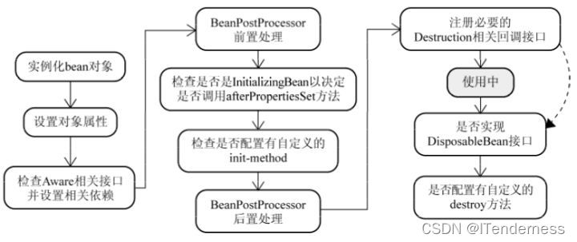

### Spring Bean的生命周期

1. Bean容器中找到配置文件中Spring Bean的定义。
2. 如果有多个构造方法，则要推断构造方法；确定好构造方法之后，进行实例化，Bean 容器利用 Java Reflection API 创建一个 Bean 的实例。
3. 如果涉及一些属性，则利用 `set()`方法对对象的属性进行填充。
4. 如果Bean实现了`BeanNameAware`接口，则调用`setBeanName()`方法，传入Bean的名字。
5. 如果Bean实现了`BeanClassLoaderAware`接口，则调用`setBeanClassLoader()`方法，传入`classLoader`对象的实例。
6. 如果Bean实现了`BeanFactoryAware`接口，则调用`setBeanFactory()`方法，传入`BeanFactory`实例。
7. 同上，如果Bean实现了其他的`*.Aware`接口，就调用相应的方法。
8. 如果有加载这个Bean的Spring容器相关的`BeanPostProcessor`对象，则执行`postProcessBeforeInitialization()`初始化前方法。
9. 如果Bean实现了`InitializingBean`方法，则调用`afterPropertiesSet()`方法。
10. 如果Bean在配置文件中定义包含`init-method`属性，则执行相应的方法。
11. 如果有加载这个Bean的Spring容器相关的`BeanPostProcesser`对象，则执行`postProcesserAfterInitialization()`初始化后方法。
12. 销毁Bean的时候，如果Bean实现了`DisposableBean`接口，则执行`destory()`方法。
13. 销毁Bean的时候，如果Bean在配置文件中配置了`destory-method`属性，则执行指定的方法。

