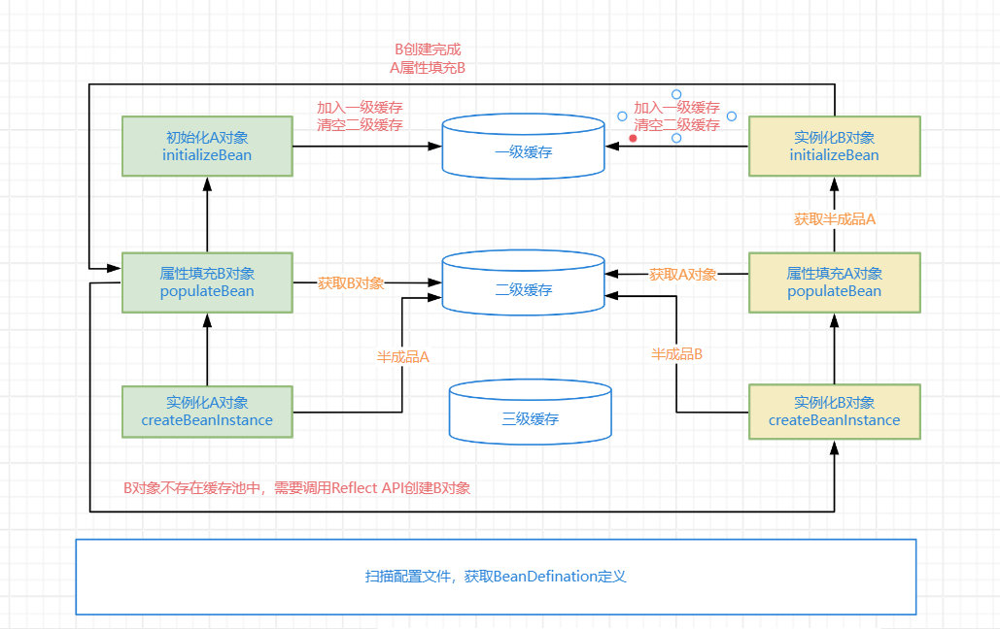
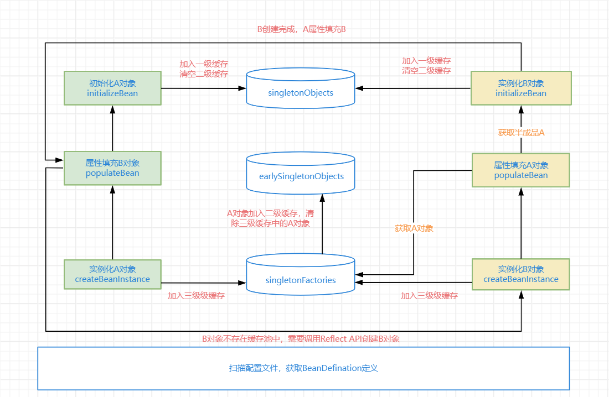
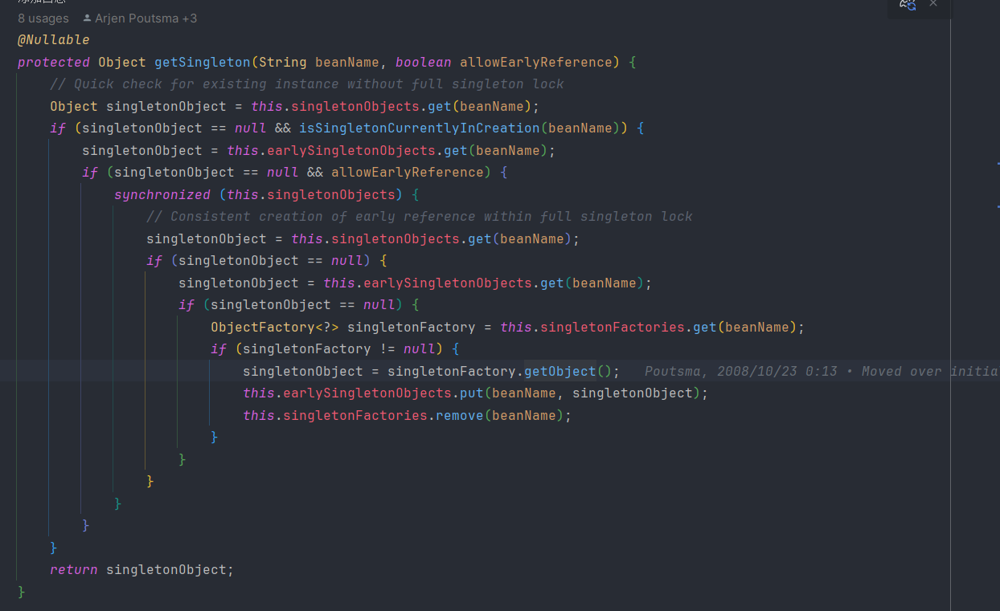
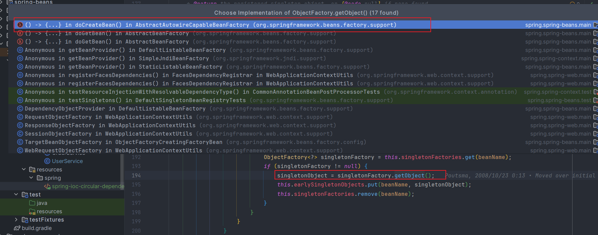
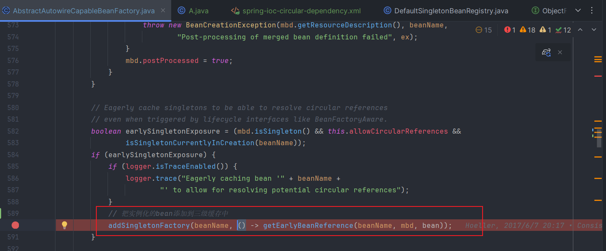
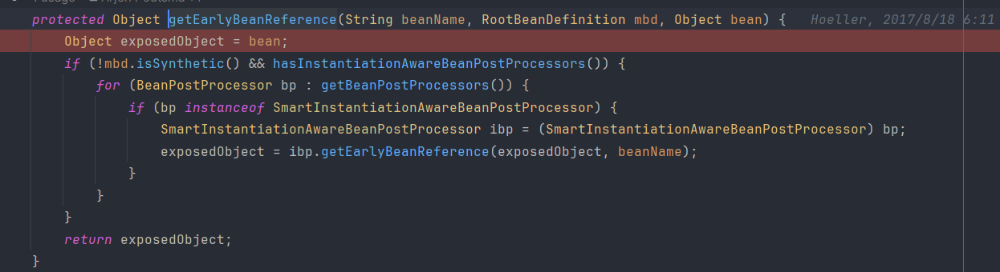
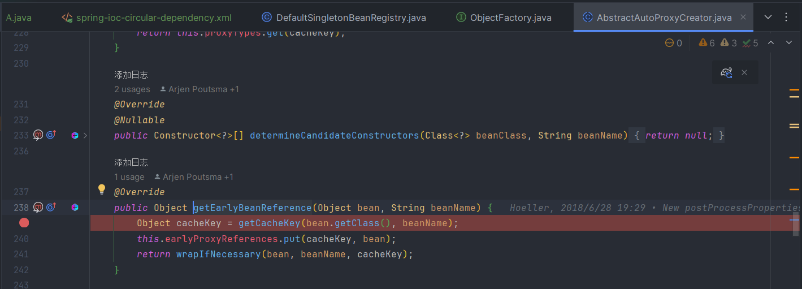

# Spring中是如何解决循环依赖的

# 前言

我们都知道，Spring时使用了三级缓存来解决的循环依赖问题。但是三级缓存是什么？三级缓存又是如何解决循环依赖的呢？为什么需要三级缓存，二级不行吗？带着这些问题，我们一起来研究一下Spring的源码，揭秘上面的问题。

# `SpringBean`的生命周期

要说要Spring的循环依赖，首先要说一下SpringBean的生命周期，因为Spring的循环依赖的发生和解决就是出现在SpringBean的生命周期中，只有了解的SpringBean的生命周期，我们才能更清楚地理解循环依赖。

SpringBean的声明周期大致如下：

1. 扫描配置文件，获取BeanDefination定义
2. 通过反射Reflect API的方式创建Bean对象
3. 对Bean对象进行属性填充，populateBean()
4. 如果Bean实现了BeanNameAware接口，则调用setBeanName()传入Bean的name。
5. 如果Bean实现了BeanClassLoader接口，则调用setBeanClassLoader()，传入classLoad对象。
6. 同上相应的如果实现了*Aware接口，则调用相应的set方法。
7. 如果有加载这个Bean的Spring容器相关的postprocessor对象，则执行postProcessBeforeInitialization()初始化前方法
8. 如果Bean实现了initializeBean方法，则调用afterPropertiesSet()方法
9. 如果Bean在配置文件中定义包含`init-method`属性，则执行相应的方法。
10. 如果有加载这个Bean的Spring容器相关的postprocessor对象，则执行postProcessAfterInitialization()初始化前方法
11. 销毁Bean的时候，如果Bean实现了`DisposableBean`接口，则执行`destory()`方法。
12. 销毁Bean的时候，如果Bean在配置文件中配置了`destory-method`属性，则执行指定的方法。

[简单说说Spring Bean的生命周期](https://blog.csdn.net/Y_eatMeat/article/details/122867341?ops_request_misc=%257B%2522request%255Fid%2522%253A%2522F6B13A31-324B-4D98-8D51-158F0D2B421D%2522%252C%2522scm%2522%253A%252220140713.130102334.pc%255Fblog.%2522%257D&request_id=F6B13A31-324B-4D98-8D51-158F0D2B421D&biz_id=0&utm_medium=distribute.pc_search_result.none-task-blog-2~blog~first_rank_ecpm_v1~rank_v31_ecpm-1-122867341-null-null.nonecase&utm_term=springbean&spm=1018.2226.3001.4450)

# 什么是循环依赖

假设我们有两个类 A 和 B，类A和类B的实例互为成员变量即为循环依赖。简单来说，就是A依赖B，而B也依赖A。这就构成了循环依赖。

``` java
public class A {
	private B b;

	public B getB() {
		return b;
	}

	public void setB(B b) {
		this.b = b;
	}
}


public class B {
	private A a;

	public A getA() {
		return a;
	}

	public void setA(A a) {
		this.a = a;
	}
}
```

循环依赖配置

``` xml
<?xml version="1.0" encoding="UTF-8"?>
<beans xmlns="http://www.springframework.org/schema/beans"
	   xmlns:xsi="http://www.w3.org/2001/XMLSchema-instance"
	   xmlns:aop="http://www.springframework.org/schema/aop"
	   xsi:schemaLocation="http://www.springframework.org/schema/beans
       http://www.springframework.org/schema/beans/spring-beans.xsd
       http://www.springframework.org/schema/aop
       http://www.springframework.org/schema/aop/spring-aop.xsd">


<!--	<bean id="userService" class="com.spring.cycle.UserService">-->
<!--		<property name="orderService" ref="orderService"/>-->
<!--	</bean>-->
<!--	<bean id="orderService" class="com.spring.cycle.OrderService">-->
<!--		<property name="userService" ref="userService"/>-->
<!--	</bean>-->

	<bean id="a" class="com.spring.cycle.A">
		<property name="b" ref="b"/>
	</bean>
	<bean id="b" class="com.spring.cycle.B">
		<property name="a" ref="a"/>
	</bean>

	<!--配置客户service-->
<!--	<bean id="customerService" class="com.spring.cycle.CustomerServiceImpl">-->

<!--	</bean>-->
<!--	<bean id="logger" class="com.spring.cycle.Logger">-->
<!--	</bean>-->

<!--	&lt;!&ndash;第一步:通过aop:config声明aop的配置&ndash;&gt;-->
<!--	<aop:config>-->
<!--		&lt;!&ndash;第二步：通过aop:aspect配置切面,说明：-->
<!--			id：唯一标识名称-->
<!--			ref：指定通知bean对象的引用-->
<!--		&ndash;&gt;-->
<!--		<aop:aspect id="logger" ref="logger">-->
<!--			&lt;!&ndash;第四步：通过aop:pointcut配置切入点表达式,说明：-->
<!--				id：唯一标识名称-->
<!--				expression：指定切入点表达式-->
<!--				切入点表达式组成：-->
<!--					访问修饰符  返回值  包名称  类名称  方法名称  （参数列表）-->
<!--			 &ndash;&gt;-->
<!--			<aop:pointcut id="pt1" expression="execution(public void com.spring.cycle.CustomerServiceImpl.saveCustomer())"/>-->
<!--			&lt;!&ndash;第三步：通过aop:before配置前置通知,说明：-->
<!--				method：指定通知方法名称-->
<!--				pointcut-ref：指定切入点表达式-->
<!--			&ndash;&gt;-->
<!--			<aop:before method="printLog" pointcut-ref="pt1"/>-->
<!--		</aop:aspect>-->
<!--	</aop:config>-->

</beans>

```

# Spring的三级缓存是什么

简单点说，Spring的三级缓存其实就是三个Map，分别用来存储不同阶段的Spring的Bean。

``` java
	/** 一级缓存，用来存储完整的Bean对象。key: Bean的名称，value: Bean的实例 */
	private final Map<String, Object> singletonObjects = new ConcurrentHashMap<>(256);

	/** 三级缓存，存储的是一段lambda表达式，不会直接运行，在调用getObject()方法时才会运行  key: Bean的名称，value: 生成对象的工厂*/
	private final Map<String, ObjectFactory<?>> singletonFactories = new HashMap<>(16);

	/** 二级缓存，用来存提前暴露的Bean对象 key: Bean的名称，value: Bean的早期实例 */
	private final Map<String, Object> earlySingletonObjects = new ConcurrentHashMap<>(16);
```

# 循环依赖是如何发生的



大体流程是这样的：

1. 通过扫描配置文件，需要创建A对象
2. 去一级缓存中获取A，没有A则创建A，createBeanInstance
3. 把A对象的半成品放到了缓存中
4. 实例化A对象之后，对A对象进行属性填充，populateBean，发现A对象依赖B对象
5. 于是去缓存池中找B对象，发现不存在，于是创建B对象，createBeanInstance
6. 把B对象的半成品放到了缓存中
7. 实例化B对象之后，对B对象进行属性填充，populateBean，发现B对象依赖A对象
8. 在二级缓存中找到A对象的半成品，B对象完成属性填充
9. 初始化B对象initializeBean，B对象完成创建，把B对象放入到一级缓存中去，清空二级缓存
10. 然后A对象可以在一级缓存中获取B对象，完成属性填充
11. 初始化A对象initializeBean，A对象创建完成，把A对象加入到一级缓存中，清除二级缓存

加入到一级缓存后清除二级缓存是为了保证对象只有一个实例。

# 为什么需要三级缓存

  从上面的分析我们可以看出，解决循环依赖使用一级缓存 + 二级缓存就可以了，为什么还要三级缓存呢？

大家想一下，有这么一种情况，就是我们给A对象添加了代理AOP，在B对象进行属性填充的时候，需要注入的应该是A的代理对象，从上面的流程中可以看出，使用二级缓存并不能满足。

其实也不能说是不能满足，只要让A对象提前AOP就好了，这样B对象在进行属性填充的时候，注入的就是A的代理对象了。

但是Spring的原则是在对象初始化之后，initializeBean之后，postProcessAfterInitialization中，进行AOP的。而且，也并不是每个Bean都需要进行AOP的。

所以Spring的选择是，在Bean实例化之后，将Bean包装成一个ObjectFactory放到了三级缓存singletonFactories中；




大致步骤如下：

1. 通过扫描配置文件，需要创建A对象
2. 去一级缓存中获取A，一级缓存中没有A，去二级缓存中查找A，二级缓存中没有A，去三级缓存中查找A，没有A则创建A，createBeanInstance
3. 把A对象的半成品ObjectFactory放到了三级缓存中
4. 实例化A对象之后，对A对象进行属性填充，populateBean，发现A对象依赖B对象
5. 去一级缓存中获取B，一级缓存中没有B，去二级缓存中查找B，二级缓存中没有B，去三级缓存中查找B，没有B则创建B，createBeanInstance
6. 把B对象的半成品ObjectFactory放到了三级缓存中
7. 实例化B对象之后，对B对象进行属性填充，populateBean，发现B对象依赖A对象
8. 去一级缓存中获取A，一级缓存中没有A，去二级缓存中查找A，二级缓存中存在A，获取A对象，B对象完成属性填充，删除三级缓存中的A，把A添加到二级缓存中去
9. 初始化B对象initializeBean，B对象完成创建，把B对象放入到一级缓存中去，清空三级缓存，二级缓存中的B
10. 然后A对象可以在一级缓存中获取B对象，完成属性填充
11. 初始化A对象initializeBean，A对象创建完成，把A对象加入到一级缓存中，清除二级缓存

**在出现AOP时：**

- DefaultSingletonBeanRegistry





- AbstractAutowireCapableBeanFactory



- AbstractAutowireCapableBeanFactory



- AbstractAutoProxyCreator



在出现AOP的循环依赖时

**拿到 ObjectFactory 对象后，调用 ObjectFactory.getObject() 方法最终会调用 getEarlyBeanReference() 方法。**

**getEarlyBeanReference 这个方法主要逻辑大概描述下如果 bean 被 AOP 切面代理则返回的是 beanProxy 对象，如果未被代理则返回的是原 bean 实例。**

**这时我们会发现能够拿到 bean 实例（属性未填充），然后从三级缓存移除，放到二级缓存 earlySingletonObjects 中，而此时 B 注入的是一个半成品的实例 A 对象。**

不过随着 B 初始化完成后，A 会继续进行后续的初始化操作，最终 B 会注入的是一个完整的 A 实例，因为在内存中它们是同一个对象。

# 总结

Spring是利用三级缓存解决循环依赖的。通过提前暴露对象，将把成品的对象放入到缓存中，完成循环依赖中对象的属性注入。

在没有AOP的情况下，二级缓存就可以解决循环依赖。

但是在AOP的循环依赖中，则需要三级缓存来解决循环依赖。因为Spring的原则是初始化之后再进行对象的增强。如果只有二级缓存，则必须提前AOP，再实例化之后就对对象进行AOP增强。也并非所有的都对象都需要进行提前的AOP，使用三级缓存解决了这个问题。

在出现AOP的循环依赖时

**拿到 ObjectFactory 对象后，调用 ObjectFactory.getObject() 方法最终会调用 getEarlyBeanReference() 方法。**

**getEarlyBeanReference 这个方法主要逻辑大概描述下如果 bean 被 AOP 切面代理则返回的是 beanProxy 对象，如果未被代理则返回的是原 bean 实例。**