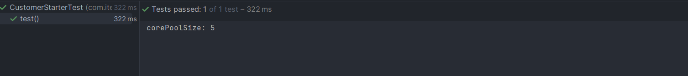

# SprintBoot自定义Starter

# 前言

前几天面试，有人问到了SpringBoot自动装配的原理，紧接着问了知道如何自定义一个SpringBoot的Starter吗？今天来实操一下，顺便记录一下。

# 操作步骤

## 1. 创建一个`spring-boot-threadpool-starter`


## 2. 导入`SpringBoot`依赖

```xml
<?xml version="1.0" encoding="UTF-8"?>
<project xmlns="http://maven.apache.org/POM/4.0.0" xmlns:xsi="http://www.w3.org/2001/XMLSchema-instance"
    xsi:schemaLocation="http://maven.apache.org/POM/4.0.0 https://maven.apache.org/xsd/maven-4.0.0.xsd">
    <modelVersion>4.0.0</modelVersion>
    <groupId>com.springboot</groupId>
    <artifactId>spring-boot-threadpool-starter</artifactId>
    <version>0.0.1-SNAPSHOT</version>
    <name>spring-boot-threadpool-starter</name>
    <description>spring-boot-threadpool-starter</description>
    <properties>
        <java.version>1.8</java.version>
        <project.build.sourceEncoding>UTF-8</project.build.sourceEncoding>
        <project.reporting.outputEncoding>UTF-8</project.reporting.outputEncoding>
        <spring-boot.version>2.3.12.RELEASE</spring-boot.version>
    </properties>
    <dependencies>
        <dependency>
            <groupId>org.springframework.boot</groupId>
            <artifactId>spring-boot-starter</artifactId>
        </dependency>

        <dependency>
            <groupId>org.springframework.boot</groupId>
            <artifactId>spring-boot-starter-test</artifactId>
            <scope>test</scope>
            <exclusions>
                <exclusion>
                    <groupId>org.junit.vintage</groupId>
                    <artifactId>junit-vintage-engine</artifactId>
                </exclusion>
            </exclusions>
        </dependency>
    </dependencies>
    <dependencyManagement>
        <dependencies>
            <dependency>
                <groupId>org.springframework.boot</groupId>
                <artifactId>spring-boot-dependencies</artifactId>
                <version>${spring-boot.version}</version>
                <type>pom</type>
                <scope>import</scope>
            </dependency>
        </dependencies>
    </dependencyManagement>

</project>

```

## 3. 创建`ThreadPoolAutoConfiguration`

```java
@Configuration
public class CustomerThreadPoolConfiguration {

    @Bean
    @ConditionalOnClass({ThreadPoolExecutor.class})
    public ThreadPoolExecutor getThreadPoolExecutor() {
        return new ThreadPoolExecutor(5, 10, 60L, TimeUnit.SECONDS, new ArrayBlockingQueue<>(10));
    }
}

```

## 4. 在`spring-boot-threadpool-starter`工程的 resources 包下创建`META-INF/spring.factories`文件

``` shell
org.springframework.boot.autoconfigure.EnableAutoConfiguration=\
  com.springboot.CustomerThreadPoolConfiguration
```

## 5. 新建一个工程，引入`spring-boot-threadpool-starter`

``` xml
<?xml version="1.0" encoding="UTF-8"?>
<project xmlns="http://maven.apache.org/POM/4.0.0"
         xmlns:xsi="http://www.w3.org/2001/XMLSchema-instance"
         xsi:schemaLocation="http://maven.apache.org/POM/4.0.0 http://maven.apache.org/xsd/maven-4.0.0.xsd">
    <parent>
        <artifactId>springboot-project</artifactId>
        <groupId>com.springboot</groupId>
        <version>1.0-SNAPSHOT</version>
    </parent>
    <modelVersion>4.0.0</modelVersion>

    <artifactId>springboot-customer-starter</artifactId>
    <dependencies>
        <dependency>
            <groupId>com.springboot</groupId>
            <artifactId>spring-boot-threadpool-starter</artifactId>
            <version>0.0.1-SNAPSHOT</version>
        </dependency>
    </dependencies>

</project>
```

```java
@SpringBootTest
 class CustomerStarterTest {
    @Autowired
    private ThreadPoolExecutor myThreadPool;

    @Test
    void test() {
        System.out.println("corePoolSize: " + myThreadPool.getCorePoolSize());
    }
}
```



测试成功！！！

# 总结

Spring Boot 通过`@EnableAutoConfiguration`开启自动装配，通过 SpringFactoriesLoader 最终加载`META-INF/spring.factories`中的自动配置类实现自动装配，自动配置类其实就是通过`@Conditional`按需加载的配置类，想要其生效必须引入`spring-boot-starter-xxx`包实现起步依赖。