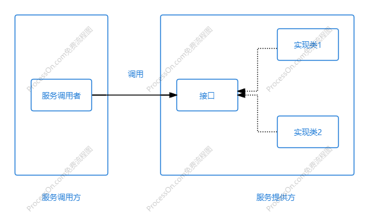
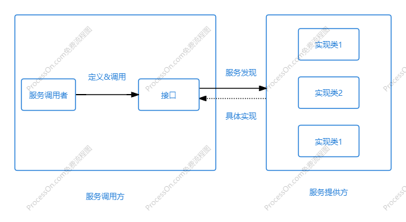
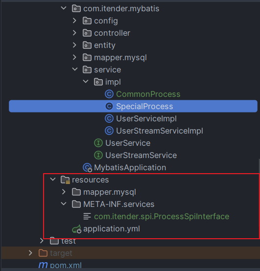

# Java面试之Java的SPI机制

# 背景

大环境影响，公司效益不好，前段时间被迫离职了，重新加入到了找工作的大部队中。前几天面试中，不止一次的被问到了SPI机制。第一次被问到的时候有点懵，因为真的没有了解过关于SPI机制相关的知识，也是触及到自己的知识盲区。面试完之后查阅了相关的资料，才了解到SPI机制原来这么的简单。最近正好也有时间，把它写下来，送给跟我一样的小伙伴们。

# SPI的概念

## API

说到SPI，就必须要先说一下API，API在我们日常的开发工作中是可以经常见到的，比如，我们再写一个业务方法的时候，首先会定义一个接口，然后在定义这个接口的实现类。在调用这个方法的时候，通过依赖注入，把接口注入到调用方，就可以调用我们的业务方法了。

流程很简单，大概是下面的这个样子：



**接口和实现类都在服务的提供方**

如上图所示，服务调用方无需关心接口的定义与实现，只进行调用即可，**接口、实现类都是由服务提供方提供**。服务提供方提供的接口与其实现方法就可称为**API**，API中所定义的接口无论是在概念上还是具体实现，都更接近服务提供方（实现方），通常接口与实现类在同一包中；

## SPI

SPI的全程是Service Provider Interface，字面意思就是服务提供者的接口，也就是由服务提供者定义的接口。

SPI的实现流程，大致如下：



**接口在服务调用方，实现类在服务的提供方**

服务提供方按接口规范实现服务，服务调用方通过某种机制为这个接口寻找到这个服务， SPI的特点很明显：接口的定义（调用方提供）与具体实现是隔离的（服务提供方提供），使用接口的实现类需要依赖某种服务发现机制。

通过对比，我们可以看出接口在**API**与**SPI**中的含义还是有很大的不同，总的来说，**API 中的接口是更像是服务提供者给调用者的一个功能列表，而 SPI 中更多强调的是，服务调用者对服务实现的一种约束。**

SPI就好比我要生产一批零件，我提供标准，然后找不同的厂商按照我的标准去生产。

# SPI的使用

## 定义接口

1. 创建一个standard的项目

```java
/**
 * @author analytics
 * @date 2024/10/17 20:20
 * @description
 */
public interface ProcessSpiInterface {

    /**
     * 处理逻辑接口方法
     *
     * @return
     */
    String process();
}
```

2. 创建具体实现的项目，依赖standard项目

``` xml
<dependency>
    <groupId>com.itender.spi</groupId>
    <artifactId>java-spi-interface</artifactId>
    <version>0.0.1-SNAPSHOT</version>
    <scope>compile</scope>
</dependency>
```

然后实现process接口

``` java
/**
 * @author analytics
 * @date 2024/10/17 20:29
 * @description 通用处理
 */
public class CommonProcess implements ProcessSpiInterface {
    @Override
    public String process() {
        return "这是一个通用处理的方法";
    }
}

/**
 * @author analytics
 * @date 2024/10/17 20:29
 * @description 特殊处理
 */
public class SpecialProcess implements ProcessSpiInterface {
    @Override
    public String process() {
        return "这是一个特殊处理的方法";
    }
}
```

添加配置文件



要在resources目录下，MATE-INF下services创建文件。文件名为standard接口的全路径

``` java
com.itender.spi.ProcessSpiInterface
```

内容为具体实现类的全路径

```java
com.itender.mybatis.service.impl.CommonProcess
com.itender.mybatis.service.impl.SpecialProcess
```

3. 创建一个spi的server也就是服务

   添加具体实现服务的依赖

   ``` xml
   <dependency>
       <groupId>com.springboot</groupId>
       <artifactId>springboot-mybatis</artifactId>
       <version>1.0-SNAPSHOT</version>
   </dependency>
   ```

   然后创建测试类

   ``` java
   /**
    * @author analytics
    * @date 2024/10/17 20:35
    * @description
    */
   public class SpiTest {
       public static void main(String[] args) {
           new SpiTest().process();
       }
   
       public void process( ) {
           ServiceLoader<ProcessSpiInterface> searchServiceLoader = ServiceLoader.load(ProcessSpiInterface.class);
           for (ProcessSpiInterface process : searchServiceLoader) {
               String result = process.process();
               System.out.println(result);
           }
       }
   
   }
   ```

   输出结果

   ``` properties
   这是一个通用处理的方法
   这是一个特殊处理的方法
   
   Process finished with exit code 0
   
   ```

   

# SPI的原理

上面我们简单讲了一下SPI的使用和实现。接下来就研究一下SPI的实现原理。

通过上面的测试我们可以看到，核心的逻辑是 `ServiceLoader.load()` 方法，这个方法有点类似于 `Spring` 中的根据接口获取所有实现类一样。

点开 `ServiceLoader` 我们可以看到有一个常量 `PREFIX`，如下所示，这也是为什么我们必须在这个路径下面创建配置文件，因为` JDK` 代码里面会从这个路径里面去读取我们的文件。

``` java
public final class ServiceLoader<S>
    implements Iterable<S>
{

    private static final String PREFIX = "META-INF/services/";
   
    
    public static <S> ServiceLoader<S> load(Class<S> service,
                                            ClassLoader loader)
    {
        return new ServiceLoader<>(service, loader);
    }
    
    public static <S> ServiceLoader<S> load(Class<S> service) {
        ClassLoader cl = Thread.currentThread().getContextClassLoader();
        return ServiceLoader.load(service, cl);
    }
    
    private ServiceLoader(Class<S> svc, ClassLoader cl) {
        service = Objects.requireNonNull(svc, "Service interface cannot be null");
        loader = (cl == null) ? ClassLoader.getSystemClassLoader() : cl;
        acc = (System.getSecurityManager() != null) ? AccessController.getContext() : null;
        reload();
    }
    
    public void reload() {
        providers.clear();
        lookupIterator = new LazyIterator(service, loader);
    }
    .........
}
```

同时又因为在读取文件的时候使用了 `class` 的路径名称，因为我们使用 `load` 方法的时候只会传递一个` class`，所以我们的文件名也必须是接口的全路径。

通过 `load` 方法我们可以看到底层构造了一个 `java.util.ServiceLoader.LazyIterator` 迭代器。

``` java
    public void reload() {
        providers.clear();
        lookupIterator = new LazyIterator(service, loader);
    }
```

在迭代器中的 `parse` 方法中，就获取了配置文件中的实现类名称集合，然后在通过反射创建出具体的实现类对象存放到 `LinkedHashMap<String,S> providers = new LinkedHashMap<>();` 中。

``` java
private Iterator<String> parse(Class<?> service, URL u)
        throws ServiceConfigurationError
    {
        InputStream in = null;
        BufferedReader r = null;
        ArrayList<String> names = new ArrayList<>();
        try {
            in = u.openStream();
            r = new BufferedReader(new InputStreamReader(in, "utf-8"));
            int lc = 1;
            while ((lc = parseLine(service, u, r, lc, names)) >= 0);
        } catch (IOException x) {
            fail(service, "Error reading configuration file", x);
        } finally {
            try {
                if (r != null) r.close();
                if (in != null) in.close();
            } catch (IOException y) {
                fail(service, "Error closing configuration file", y);
            }
        }
        return names.iterator();
    }
```

- LazyIterator

``` java
private class LazyIterator
        implements Iterator<S>
    {
    private boolean hasNextService() {
        if (nextName != null) {
            return true;
        }
        if (configs == null) {
            try {
                String fullName = PREFIX + service.getName();
                if (loader == null)
                    configs = ClassLoader.getSystemResources(fullName);
                else
                    configs = loader.getResources(fullName);
            } catch (IOException x) {
                fail(service, "Error locating configuration files", x);
            }
        }
        while ((pending == null) || !pending.hasNext()) {
            if (!configs.hasMoreElements()) {
                return false;
            }
            pending = parse(service, configs.nextElement());
        }
        nextName = pending.next();
        return true;
    }
}
```

在我们日常的开发中最常见的SPI实现就是Sl4j日志框架了。

# SPI的优缺点

在我们日常的开发中最常见的SPI实现就是Sl4j日志框架了。

## 优点

- 解耦：将接口的定义与具体的实现分离，可以实现运行时根据业务实际场景启用或者替换具体实现类。
- 依赖倒置原则：面向接口编程，而不是面向具体的实现。

## 缺点

一个很明显的缺点那就是做不到按需加载，通过源码我们看到了是会将所有的实现类都进行创建的，这种做法会降低性能，如果某些实现类实现很耗时了话将影响加载时间。同时实现类的命名也没有规范，让使用者不方便引用

# 总结

Java 中的 SPI 提供了一种比较特别的服务发现和调用机制，通过接口将服务调用与服务提供者分离，将接口提供给第三方实现扩展，体现了依赖倒置的设计思想，是高内聚、低耦合的一种体现。但SPI也有缺点，就是加载一个接口，会把所有实现类都加载进来，可能会加载到不需要的冗余服务。总的来说，SPI是一种非常不错的扩展、集成的思路。

