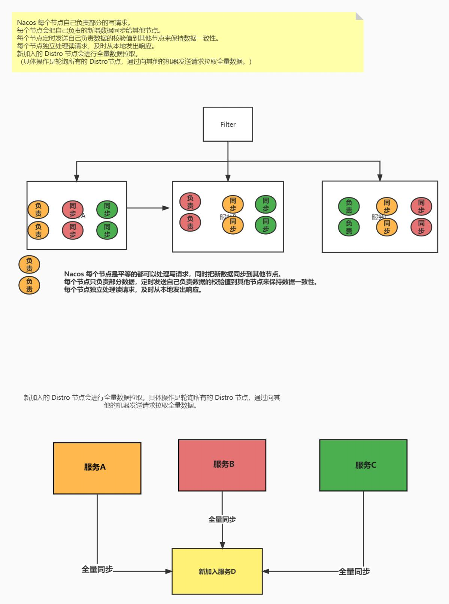

# `SpringCloud`面试题总结

## 1. 公共篇

### 1.1 Spring Cloud是什么？

Spring Cloud是一个微服务框架，它提供了一系列分布式系统解决方案。它利用了Spring Boot的开发便利性巧妙地简化了分布式系统基础设施的开发，如服务发现注册、配置中心、消息总线、负载均衡、断路器、数据监控等，都可以用Spring Boot的开发风格做到一键启动和部署。

Spring Cloud并没有重复制造轮子，它只是将各家公司开发的比较成熟、经得起实际考验的服务框架组合起来，通过Spring Boot风格进行再封装屏蔽掉了复杂的配置和实现原理，最终给开发者留出了一套简单易懂、易部署和易维护的分布式系统开发工具包。

### 1.2 请简述Spring Cloud的优势和特点？

**优点：**

  1.耦合度比较低。不会影响其他模块的开发。

  2.减轻团队的成本，可以并行开发，不用关注其他人怎么开发，先关注自己的开发。

  3.配置比较简单，基本用注解就能实现，不用使用过多的配置文件。

  4.微服务跨平台的，可以用任何一种语言开发。

  5.每个微服务可以有自己的独立的数据库也有用公共的数据库。

  6.直接写后端的代码，不用关注前端怎么开发，直接写自己的后端代码即可，然后暴露接口，通过组件进行服务通信。

**缺点：**

 1.部署比较麻烦，给运维工程师带来一定的麻烦。

 2.针对数据的管理比麻烦，因为微服务可以每个微服务使用一个数据库。

 3.系统集成测试比较麻烦

 4.性能的监控比较麻烦。【最好开发一个大屏监控系统】

### 1.3 SpringCloud常见组件有哪些？

`SpringCloud`包含的组件很多，有很多功能是重复的。其中最常用组件包括：

- 注册中心组件：**Eureka**、**Nacos**等
- 负载均衡组件：**Ribbon**，Loadbalancer
- 远程调用组件：**OpenFeign**、**RestTemplate**
- 网关组件：**Zuul**、**Gateway**
- 服务保护组件：**Hystrix**、**Sentinel**
- 服务配置管理组件：**SpringCloudConfig**、**Nacos**

### 1.4 微服务设计遵循的原则

**单一职能原则**：让每个微服务能够独立有界限的工作，每个服务只关注自己的业务。做到高内聚，低耦合。

**服务自治原则**：每个服务能够做到独立开发，独立测试，独立构建，独立部署，独立运行。与其他服务进行解耦。

**轻量级通信原则**：让每个服务之间的调用都是轻量级的，并且能够跨平台，跨语言。比如采用Restful风格，消息队列等进行通信。

**粒度进化原则**：对每个微服务的粒度进行把控，其实没有统一的标准，结合实际的具体业务场景。不要过度设计，服务的力度随着业务和用户的发展而发展。

## 2. Nacos篇

### 2.1 Nacos1.x作为注册中心的原理？

1. 服务提供者通过open Api使用http发送注册
2. 服务调用者查询服务提供方列表
3. 定时拉取注册信息（每隔10s）
4. 检测到服务提供者异常，基于UDP协议推送更新
5. 定时心跳（5s），检测服务状态
6. 定时心跳任务检查
7. 集群数据同步任务使用Distro协议


### 2.2 Nacos的服务注册表结构是怎样的？

| 模型名称      | 解释                                                   |
| ------------- | ------------------------------------------------------ |
| **NameSpace** | 命名空间，实现环境隔离，默认值Public                   |
| **Group**     | 分组，不同的Service可以组成一个组，默认值Defualt-Group |
| **Service**   | 服务名称                                               |
| **Cluster**   | 集群，对指定的微服务虚拟化分，默认值Default            |
| **Instance**  | 示例，某个服务的具体实例                               |

Nacos采用了数据的分级存储模型，最外层是**Namespace**，用来隔离环境。然后是**Group**，用来对服务分组。接下来就是服务（**Service**）了，一个服务包含多个实例，但是可能处于不同机房，因此Service下有多个集群（**Cluster**），Cluster下是不同的实例（**Instance**）。

对应到Java代码中，Nacos采用了一个多层的Map来表示。结构为Map<String, Map<String, Service>>，其中最外层Map的key就是namespaceId，值是一个Map。内层Map的key是group拼接serviceName，值是Service对象。Service对象内部又是一个Map，key是集群名称，值是Cluster对象。而Cluster对象内部维护了两个Instance的集合，分别是临时实例和永久实例。

如图：


### 2.3 Nacos中的Distro协议？

- Nacos每个节点自己负责部分的写请求
- 每个节点会把自己负责新增的数据同步给其他节点
- 每个节点定时发送自己负责数据的校验值到其他节点保持数据一致性
- 每个节点单独处理读请求，及时从本地发出相应
- 新加入的Distro节点会进行数据全量的拉取（具体的操作是轮询所有的Distro节点，通过向其他机器发送请求拉取全量的数据）



### 2.4 Nacos1.x配置中心长轮询机制？

客户端会轮询的向服务器发送一个长连接请求，这个长连接最多30s就会超时，服务端在收到客户端的请求会先判断当前是否有配置更新，有更新则立即返回。如果没有更新，服务端会将这个请求拿住 “hold” 29.5s加入队列，最后的0.5s在检测配置文件，无论有没有更新都会进行正常的返回，但是在等待的29.5s期间，如果有配置的更新可以提前结束并返回。


### 2.5  Nacos2.x客户端探活机制？

Nacos服务端会启动一个定时任务，每隔3s执行一次，查看所有的连接是否有超过20s没有通信。如果有超过20s没有通信，服务端就会给客户端发送一个请求，进行探活。如果能正常返回就表示这个服务为正常服务，如果不能正常返回就将其连接删除。


### 2.6 Nacos如何支撑阿里内部数十万服务注册压力？

Nacos内部接收到注册的请求时，不会立即写数据（不会立即把服务添加到注册表中），而是将服务注册的任务放入一个阻塞队列就立即响应给客户端。然后利用线程池读取阻塞队列中的任务，异步来完成实例更新，从而提高并发写能力。

### 2.7 Nacos如何避免并发读写冲突问题？

Nacos在更新实例列表时，会采用CopyOnWrite技术，首先将旧的实例列表拷贝一份，然后更新拷贝的实例列表，再用更新后的实例列表来覆盖旧的实例列表。

这样在更新的过程中，就不会对读实例列表的请求产生影响，也不会出现脏读问题了。

### 2.8 Nacos与Eureka的区别有哪些？

Nacos与Eureka有相同点，也有不同之处，可以从以下几点来描述：

**相同点：**

**接口方式**：Nacos与Eureka都对外暴露了Rest风格的API接口，用来实现服务注册、发现等功能。

**不同点：**

**实例类型**：Nacos的实例有永久和临时实例之分；而Eureka只支持临时实例
**健康检测**：Nacos对临时实例采用心跳模式检测，对永久实例采用主动请求来检测；Eureka只支持心跳模式
**服务发现**：Nacos支持定时拉取和订阅推送两种模式；Eureka只支持定时拉取模式

- Nacos服务发现有主动拉取和订阅推送两种模式
  - 主动拉取模式：消费者定期主动从Nacos拉取服务列表缓存到本地，服务调用的时候优先读取本地缓存中的服务列表
  - 订阅推送：消费者订阅Nacos中的服务列表，并基于UDP协议来接收服务变更通知，Nacos服务中的列表更新时，会推送UDP广播给所有的订阅者。

**功能作用**：Nacso既可以做注册中心，也可以做配置中心；Eureka只能做配置中心

## 3. Eureka篇

### 3.1 什么是Eureka？

Eureka作为SpringCloud的服务注册功能服务器，他是服务注册中心，系统中的其他服务使用Eureka的客户端将其连接到Eureka Service中，并且保持心跳，这样工作人员可以通过Eureka Service来监控各个微服务是否运行正常。

### 3.2 Eureka怎么实现高可用？

搭建Eureka集群。注册多台Eureka服务，然后每台Eureka服务互相注册。

Eureka 实现高可用的基本方法是通过运行多个 Eureka 服务器实例，并且它们之间相互注册。以下是实现 Eureka 高可用的步骤：

1. 启动多个 Eureka 服务器实例，并配置不同的服务URL。
2. 每个 Eureka 实例都会把其他实例当作 peer， 相互注册。
3. 应用客户端会同时向这些 Eureka 实例注册和获取服务信息。

### 3.3 简述Eureka自我保护机制？

默认情况下，如果Eureka Service在一定时间内没有接收到某个微服务的心跳，Eureka Service会进入自我保护模式，在该模式下Eureka Service会保护服务注册表中的信息，不在删除注册表中的数据，当网络故障恢复后，Eureka Servic 节点会自动退出自我保护模式

Eureka服务端会检查最近15min内所有Eureka实例正常心跳的占比，如果低于85%就会触发自我保护机制。如果出发了自我保护自己，Eureka将暂时把这些失效的服务保护起来，不让其过期。但这些服务也不是永远不会过期，Eureka再启动完成后，每隔60s会检查一次服务的健康状态，如果这些被保护起来的服务经过一段时间（90s）后还没有恢复，就会把这些服务剔除。如果在此期间服务恢复了并且实例心跳占比超过85%时，就会关闭自我保护机制。


> 阈值的计算方式：
>
> 每分钟 能接受最少的续租次数 = 微服务实例总数 * （60 s / 实例的续约时间间隔：30s ） * 有效的心跳比率 默认 85%
>
> 100 乘以（60 /30） 乘以 85% = 170

## 4. Ribbon篇

### 4.1 Ribbon是什么？

- Srping Cloud ribbon是基于Netfix Ribbo实现的一套客户端 负债均衡工具
- Ribbon是Netflix发布的开源项目，主要功能是提供客户端的软件负载均衡算法，将Netflix的中间层服务连接在一起。Ribbon客户端组件提供一系列完善的配置项如连接超时，重试等。简单的说，就是在配置文件中列出Load Balancer(简称LB)后面所有的机器，Ribbon会自动的帮助你基于某种规则(如简单轮询，随机连接等)去连接这些机器。我们也很容易使用Ribbon实现自定义的负载均衡算法。

### 4.2 Ribbon的负载均衡策略


Ribbon 是一个客户端负载均衡器，它提供了多种可插拔的负载均衡算法，允许请求按照特定逻辑分发到各个服务实例。在 Spring Cloud 中，Ribbon 常与 Eureka 结合使用，以实现对服务实例的调用。以下是几种 Ribbon 支持的负载均衡策略：

1. **轮询 (Round Robin)：**
   轮询是最简单的负载均衡策略之一。Ribbon 客户端会依次向每个服务实例发送请求，一旦到达列表末尾，它将返回到列表的开头，并继续这个过程。
2. **随机 (Random)：**
   随机策略会从所有可用的服务实例中随机选择一个来发送请求。
3. **权重响应时间 (WeightedResponseTimeRule)：**
   根据每个服务实例的平均响应时间来计算其权重。响应时间越快的实例，被选中的概率越高。这个策略将定时重新计算实例权重。
4. **最少并发请求 (BestAvailableRule)：**
   这种策略会选择并发请求最少的服务实例。
5. **可用性过滤 (AvailabilityFilteringRule)：**
   这种策略会过滤掉故障实例和并发连接数超过设定阈值的实例，对剩余的服务实例使用轮询策略。
6. **区域感知轮询 (ZoneAvoidanceRule)：**
   这种策略结合了区域性能和服务实例的可用性，来均衡服务实例的请求。通常用在有多个区域的环境中。
7. **重试 (RetryRule)：**
   对选定的负载均衡策略进行封装，增加了重试功能。例如，它可以在使用轮询策略时，如果选定的实例无法访问，就重试下一个实例。
8. **首选服务 (PredicateBasedRule)：**
   你可以定制一个基于特定条件的规则，该规则使用一个布尔条件（断言）来选择服务实例。

Ribbon 默认的负载均衡策略是轮询。Ribbon 允许用户自定义负载均衡策略，你可以实现 IRule 接口来创建你自己的负载均衡规则。

要注意的是，从 Spring Cloud Netflix 2.1.0.RELEASE 版本起，Ribbon 已被声明为维护模式，并推荐使用 Spring Cloud LoadBalancer 替代 Ribbon 实现客户端负载均衡。

另外，由于 Netflix 宣布对 Ribbon 项目停止维护，Spring Cloud 也趋向于逐渐抛弃 Ribbon，转而使用自身的 Spring Cloud LoadBalancer 解决方案，它提供了类似功能和更好的整合。

### 4.3 Ribbon的工作原理是什么？

Ribbon是Netflix开源的一款客户端负载均衡工具，它主要用于对云端中间服务的访问进行控制。Ribbon可以工作在服务发现工具如Eureka之上，提供一系列负载均衡算法和配置选项。Ribbon的工作原理包括以下几个方面：

**客户端服务发现：**
Ribbon首先通过集成的服务发现机制（例如Eureka）获取到服务实例列表。这个过程是动态的，意味着当服务实例的状态变更时，Ribbon能够获取到最新的服务列表。

**缓存服务实例列表：**
Ribbon会在本地缓存服务发现得到的服务实例列表。此后的所有请求都会使用这个缓存列表，直到下一次刷新。

**负载均衡策略：**
Ribbon实现了多种负载均衡策略，可以基于特定算法选择服务实例。默认的负载均衡策略是轮询（Round Robin），其他的策略包括随机（Random）、响应时间加权（Response Time Weighted）等。

**请求执行：**
对于每个外部请求调用，Ribbon提供了一系列的请求执行和故障处理功能，例如重试机制、断路器模式、超时控制等。

**故障切换(Failover)：**
如果请求某个服务实例失败，Ribbon可以根据配置的策略进行重试，可能是在同一实例上重试，也可以切换到其他的实例上重试。

**API与配置：**
Ribbon允许开发者通过代码或配置文件来定义和改写负载均衡规则和行为，提供了较高的灵活性。

**集成与封装：**
Ribbon可以与其他Netflix OSS组件如Hystrix（断路器）、Feign（声明式HTTP客户端）等集成，来构建更加强大和复杂的微服务调用链。

通过上述的工作原理，Ribbon使得客户端可以有更加细致和智能的控制服务实例的选择，跨多个实例分散负载，提高整个微服务架构的可用性和效率。随着 Spring Cloud 的发展，Ribbon 已经逐渐被Spring Cloud LoadBalancer这样的项目所替代，因为它提供了一个更为简单、现代化的客户端负载均衡解决方案。


### 4.4 Nginx与Ribbon的区别

- Nginx是反向代理同时可以实现负载均衡，nginx拦截客户端请求采用负载均衡策略根据upstream配置进行转发，相当于请求通过nginx服务器进行转发。

- Ribbon是客户端负载均衡，从注册中心读取目标服务器信息，然后客户端采用轮询策略对服务直接访问，全程在客户端操作。

## 5. Feign篇

### 5.1 什么是Feign

Feign是一个声明式的Web服务客户端，是由Netflix提供的一种工具，后来被纳入了Spring Cloud的一部分。简言之，Feign旨在简化HTTP API客户端的开发工作。

使用Feign，你可以通过创建一个接口，再通过注解来配置这个接口对应的HTTP请求细节，从而实现对Web服务的调用。Feign内部封装了HTTP请求的细节，并提供了类似Spring MVC风格的编程体验。

Feign的关键特性包括：

**声明式的HTTP客户端**：通过简单的Java接口和Spring MVC风格的注解，定义服务绑定的接口。

**集成Ribbon**：Feign内置了Ribbon客户端负载均衡。

**集成Hystrix**：可选择集成Hystrix来添加断路器的功能，提高系统的弹性和容错能力。

**自动化和可插拔**：提供编码器和解码器，方便自动化处理请求和响应，也允许用户自定义这些组件以满足特定需求。

**易于集成Eureka**：与Eureka集成后，Feign能够利用服务发现机制来查找服务实例并发起调用。

**日志记录**：支持在Feign调用的过程中进行详细的日志记录。

### 5.2 如何在Feign中自定义请求拦截器？

在Feign中，你可以自定义请求拦截器以便在发送请求前修改请求模板（比如添加头信息、添加查询参数等）。自定义请求拦截器涉及实现RequestInterceptor接口，并重写其中的apply方法，然后将拦截器注册到Feign配置中。

以下是在Spring Cloud应用中创建和注册自定义Feign请求拦截器的步骤：

#### 步骤1：创建自定义拦截器类

``` java
import feign.RequestInterceptor;
import feign.RequestTemplate;

public class CustomRequestInterceptor implements RequestInterceptor {

    @Override
    public void apply(RequestTemplate template) {
        // 例如为所有请求添加一个自定义的请求头
        template.header("X-Custom-Header", "CustomValue");
        // 还可以添加其他逻辑，比如添加查询参数等
        // template.query("myParam", "myValue");
    }
}
```

#### 步骤2：注册拦截器为Spring Bean

在你的Spring配置中，创建并注册这个拦截器：

``` java
import org.springframework.context.annotation.Bean;

public class FeignConfig {

    @Bean
    public RequestInterceptor customRequestInterceptor() {
        return new CustomRequestInterceptor();
    }
}

```

#### 步骤3：指定Feign客户端使用自定义配置

在你的Feign客户端接口上，使用`configuration`属性来指定使用这个配置类：

``` java
@FeignClient(name = "myclient", configuration = FeignConfig.class)
public interface MyClient {
    // ...
}

```

在上面的MyClient定义中，@FeignClient注解的configuration属性被设置为FeignConfig.class，这样Feign就知道应该使用你提供的请求拦截器了。

**可选：全局使用拦截器**
如果你想让每个Feign客户端都使用这个请求拦截器，你可以直接将CustomRequestInterceptor声明为一个Bean，而不是在FeignConfig类中声明。这样，每个使用@FeignClient的接口都会默认使用这个请求拦截器。

    import org.springframework.context.annotation.Bean;
    import org.springframework.context.annotation.Configuration;
    
    @Configuration
    public class GlobalFeignConfiguration {
    
        @Bean
        public RequestInterceptor customRequestInterceptor() {
            return new CustomRequestInterceptor();
        }
    }

记得，如果使用Feign请求拦截器进行认证或添加敏感信息，确保从安全的配置源获取这些敏感信息，并妥善处理以防泄漏。

### 5.3 Feign怎样实现认证的传递？

实现接口RequestInterceptor，通过header实现认证传递

``` java
package feign;
public interface RequestInterceptor {
 void apply(RequestTemplate template);
}
```

### 5.4 为什么Feign第一次调用耗时很长？

ribbon默认是懒加载的，只有第一次调用的时候才会生成ribbon对应的组件，这就会导致首次调用的会很慢的问题。

``` yaml
ribbon:
  eager-load:
    enabled: true
    clients: easyexcelService
```

### 5.5 Feign的性能优化？

Feign底层默认是 JDK自带的HttpURLConnection，它是单线程发送HTTP请求的，不能配置线程

池，我们使用Okhttp或者HttpClient来发送http请求，并且它们两个都支持线程池。

常见HTTP客户端

**HttpClient**

HttpClient 是 Apache Jakarta Common 下的子项目，用来提供高效的、最新的、功能丰富的

支持 Http 协 议的客户端编程工具包，并且它支持 HTTP 协议最新版本和建议。HttpClient 相

比传统 JDK 自带的 URLConnection，提升了易用性和灵活性，使客户端发送 HTTP 请求变得

容易，提高了开发的效率。

**Okhttp**

一个处理网络请求的开源项目，是安卓端最火的轻量级框架，由 Square 公司贡献，用于替代 

HttpUrlConnection 和 Apache HttpClient。OkHttp 拥有简洁的 API、高效的性能，并支持

多种协议 （HTTP/2 和 SPDY）。

**HttpURLConnection**

HttpURLConnection 是 Java 的标准类，它继承自 URLConnection，可用于向指定网站发送 

GET 请求、 POST 请求。HttpURLConnection 使用比较复杂，不像 HttpClient 那样容易使

用。

**RestTemplate**

RestTemplate 是 Spring 提供的用于访问 Rest 服务的客户端，RestTemplate 提供了多种便捷

访问远程 HTTP 服务的方法，能够大大提高客户端的编写效率。

### 5.7 Feign和OpenFeign有何区别？

Feign和OpenFeign都是声明式的HTTP客户端，用于简化微服务间的远程调用。尽管它们有相似的设计目标和功能，但它们在某些方面存在差异。

**Feign：**
Feign是由Netflix开发的一个项目，旨在提供一个简化的方法来调用HTTP API。Feign的核心是其注解支持，允许开发者通过声明接口和注解来定义服务调用，而无需编写具体的HTTP请求代码。Feign整合了Ribbon（客户端负载均衡器）和Hystrix（熔断器），提供了负载均衡和熔断机制。

**OpenFeign：**
OpenFeign（或称为Feign的Spring Cloud集成）是Spring Cloud对Feign的扩展。Spring Cloud OpenFeign是Feign的Spring Boot风格的封装，**提供了对Spring MVC注解的支持**，让Feign更加容易集成到Spring ecosystem中。**OpenFeign也整合了Spring Cloud的其他组件**，比如服务发现和Spring Cloud LoadBalancer，作为Ribbon的替代。

关键差异：

社区和维护：Feign是由Netflix维护，而OpenFeign是由Spring Cloud团队维护。
集成和配置：OpenFeign更好地与Spring Cloud和Spring Boot生态进行集成，提供自动配置和易用性。
兼容性和特性：OpenFeign支持Spring MVC注解，并且与Spring Cloud的其他组件（如服务发现客户端）有更好的兼容性。这包括使用Spring Cloud提供的负载均衡器和熔断器机制，而不是Netflix的Ribbon和Hystrix。
易用性：OpenFeign向开发者提供更加简洁的声明式REST客户端体验，尤其在编写与Spring框架集成的应用程序时。
对于大多数使用Spring Cloud搭建微服务系统的项目，推荐使用OpenFeign，因为它提供了更好的集成性、更容易的配置和更符合Spring生态的特性。如果你正在使用的是纯Netflix的微服务堆栈，或是不使用Spring Cloud的项目，那么使用原生的Feign可能会更合适。

### 5.8 OpenFeign的底层原理

[OpenFeign的底层原理](https://blog.csdn.net/Y_eatMeat/article/details/137843287?spm=1001.2014.3001.5502)


## 6. Sentinel篇

### Sentinel的限流与Gateway的限流有什么差别？

限流算法常见的有三种实现：滑动时间窗口、令牌桶算法、漏桶算法。Gateway则采用了基于Redis实现的令牌桶算法。

而Sentinel内部却比较复杂：

默认限流模式是基于滑动时间窗口算法
排队等待的限流模式则基于漏桶算法
而热点参数限流则是基于令牌桶算法

**1、计数器固定窗口算法**

计数器固定窗口算法是最简单的限流算法，实现方式也比较简单。就是通过维护一个单位时间内的计

数值，每当一个请求通过时，就将计数值加1，当计数值超过预先设定的阈值时，就拒绝单位时间内

的其他请求。如果单位时间已经结束，则将计数器清零，开启下一轮的计数。

但是这种实现会有一个问题，举个例子:

假设我们设定1秒内允许通过的请求阈值是99，如果有用户在时间窗口的最后几毫秒发送了99

个请求，紧接着又在下一个时间窗口开始时发送了99个请求，那么这个用户其实在一秒内成功

请求了198次，显然超过了阈值但并不会被限流。其实这就是临界值问题，那么临界值问题要

怎么解决呢？


**2、计数器滑动窗口算法**

计数器滑动窗口法就是为了解决上述固定窗口计数存在的问题而诞生。前面说了固定窗口存在临界值

问题，要解决这种临界值问题，显然只用一个窗口是解决不了问题的。假设我们仍然设定1秒内允许

通过的请求是200个，但是在这里我们需要把1秒的时间分成多格，假设分成5格（格数越多，流量过

渡越平滑），每格窗口的时间大小是200毫秒，每过200毫秒，就将窗口向前移动一格。为了便于理

解，可以看下图


图中将窗口划为5份，每个小窗口中的数字表示在这个窗口中请求数，所以通过观察上图，可知在当

前时间快（200毫秒）允许通过的请求数应该是70而不是200（只要超过70就会被限流），因为我们

最终统计请求数时是需要把当前窗口的值进行累加，进而得到当前请求数来判断是不是需要进行限

流。

那么滑动窗口限流法是完美的吗？

细心观察的我们应该能马上发现问题，滑动窗口限流法其实就是计数器固定窗口算法的一个变种。流

量的过渡是否平滑依赖于我们设置的窗口格数也就是统计时间间隔，格数越多，统计越精确，但是具

体要分多少格我们也说不上来呀...

**3、漏桶算法**

上面所介绍的两种算法都不能非常平滑的过渡，下面就是漏桶算法登场了

什么是漏桶算法？

漏桶算法以一个常量限制了出口流量速率，因此漏桶算法可以平滑突发的流量。其中漏桶作为流量容

器我们可以看做一个FIFO的队列，当入口流量速率大于出口流量速率时，因为流量容器是有限的，

当超出流量容器大小时，超出的流量会被丢弃。

下图比较形象的说明了漏桶算法的原理，其中水龙头是入口流量，漏桶是流量容器，匀速流出的水是

出口流量。


漏桶算法的特点

漏桶具有固定容量，出口流量速率是固定常量（流出请求）

入口流量可以以任意速率流入到漏桶中（流入请求）

如果入口流量超出了桶的容量，则流入流量会溢出（新请求被拒绝）

不过因为漏桶算法限制了流出速率是一个固定常量值，所以漏桶算法不支持出现突发流出流量。但是

在实际情况下，流量往往是突发的。

**4、令牌桶算法**

令牌桶算法是漏桶算法的改进版，可以支持突发流量。不过与漏桶算法不同的是，令牌桶算法的漏桶

中存放的是令牌而不是流量。那么令牌桶算法是怎么突发流量的呢？

最开始，令牌桶是空的，我们以恒定速率往令牌桶里加入令牌，令牌桶被装满时，多余的令牌会被丢

弃。当请求到来时，会先尝试从令牌桶获取令牌（相当于从令牌桶移除一个令牌），获取成功则请求

被放行，获取失败则阻塞活拒绝请求。


令牌桶算法的特点

最多可以存发b个令牌。如果令牌到达时令牌桶已经满了，那么这个令牌会被丢弃

每当一个请求过来时，就会尝试从桶里移除一个令牌，如果没有令牌的话，请求无法通过。

令牌桶算法限制的是平均流量，因此其允许突发流量（只要令牌桶中有令牌，就不会被限流）


### Sentinel的线程隔离与Hystix的线程隔离有什么差别?

Hystix默认是基于线程池实现的线程隔离，每一个被隔离的业务都要创建一个独立的线程池，线程过多会带来额外的CPU开销，性能一般，但是隔离性更强。

Sentinel是基于信号量（计数器）实现的线程隔离，不用创建线程池，性能较好，但是隔离性一般。

### 谈谈Sentienl服务熔断过程

服务熔断一般有三种状态：

**熔断关闭状态（Closed）**

服务没有故障时，熔断器所处的状态，对调用方的调用不做任何限制。

**熔断开启状态（Open）**

后续对该服务接口的调用不再经过网络，直接执行本地的fallback方法。

**半熔断状态（Half-Open）**

尝试恢复服务调用，允许有限的流量调用该服务，并监控调用成功率。如果成功率达到预期，则

说明服务已恢复，进入熔断关闭状态；如果成功率仍旧很低，则重新进入熔断关闭状态。


## 7. Gateway篇

### 7.1 什么是Spring Cloud Gateway？

Spring Cloud Gateway 是一个构建于 Spring Framework 5、Project Reactor 和 Spring Boot 2 之上的动态、可编程的API网关。它用于提供一种简单有效的方式来对API请求进行路由、转发和处理，并且与Spring生态系统紧密集成，提供了对Spring Cloud Discovery Client的支持，从而能够实现服务发现和负载均衡的功能。

Spring Cloud Gateway 的主要特点包括：

**基于路由的API网关**：它可以根据一系列预定义的路由来转发请求到不同的后端微服务。每个路由都由一个ID、一个目标URI、一组断言和一组过滤器定义。

**集成断言和过滤器机制**：网关的行为可以通过断言和过滤器来控制。断言用于匹配请求是否满足某些条件，而过滤器用于在请求发送到下游服务之前或后执行一些操作。

**响应式编程支持**：内部使用WebFlux，是响应式编程模式的API网关，保持高吞吐量和低延迟。

**服务发现集成**：能够与Eureka、Consul等服务发现工具结合，自动从服务注册中心获取路由的目标地址。

**断路器集成**：可以集成Hystrix断路器或Resilience4J来提供降级和熔断机制，提升API的健壮性。

**安全集成**：可以与Spring Security集成，为API网关提供OAuth2、JWT等认证和授权支持。

**跨域资源共享（CORS）支持**：提供CORS的配置和处理能力，方便构建跨域的Web应用。

**全局过滤器**：支持全局过滤器，可对所有的路由统一执行如日志记录、请求限流等功能。

**动态路由**：提供了接口和事件模型，可以在不重启Gateway的情况下动态更新路由规则。

Spring Cloud Gateway 的设计目标是替代Netflix的Zuul 1.x网关，其使用的是异步非阻塞模型，适用于处理更加琐碎、更高频次的请求。由于使用了最新的Spring框架，Spring Cloud Gateway 提供了更好的性能和更灵活的编程模型，非常适合现代微服务架构中对API网关的需求。


### 7.2 Spring Cloud Gateway的核心组件有哪些？

Spring Cloud Gateway 是构建在 Spring Framework 5、Project Reactor 和 Spring Boot 2 之上的API Gateway。它提供了对微服务架构中请求路由、过滤和监控的支持。这里是 Spring Cloud Gateway 的一些核心组件：

**Route（路由）：**
路由是Gateway构建的基本模块，它由一个ID、一个目标URI、一组谓词（Predicate）和一组过滤器（Filter）构成。如果聚合的谓词是真，就代表请求的目标URI。

**Predicate（谓词）：**
谓词是一个Java 8 Function，输入类型是ServerWebExchange。可以使用它来匹配来自HTTP请求的不同属性，如路径、方法或头部信息。

**Filter（过滤器）：**
这用于修改请求和响应。过滤器可以在发送代理请求之前或之后执行某些操作。它们可以被分为GatewayFilter（作用于单个路由）和GlobalFilter（影响所有路由）。

**GatewayHandlerMapping：**
负责匹配连接到Gateway的每个请求，并且为这些请求指定路由。

**GatewayWebHandler**：
负责处理通过GatewayHandlerMapping匹配到的请求。它将请求发送到路由指定的URI。

**RouteLocator：**
负责提供一份路由定义。可以配置静态路由定义（如在配置文件中定义）或通过RouteLocatorBuilder动态构建路由。

**ProxyExchange：**
用于处理代理请求的帮助类。如果需要在Filter中构造代理请求，可以使用此组件。

**Actuator API：**
提供对Gateway进行实时监控和管理的功能。你可以通过actuator端点看到路由信息、过滤器、监控等。

**Gateway Controller Endpoint：**
一个基于Web的Endpoint，用来动态地添加、删除和修改路由信息。

Spring Cloud Gateway 使用这些组件提供强大的路由能力，并通过过滤器链来提供对请求和响应的微妙控制。这些组件共同工作以确保Gateway是高可扩展、易于维护和部署的。它为微服务架构中的路由转发、请求过滤和服务鉴权提供了丰富的功能支持。


### 7.3 为何需要使用API网关？

API网关在现代微服务架构中扮演着核心角色，原因如下：

**请求路由：**
API网关可以将客户端的请求路由到正确的微服务实例，无需让客户端关心微服务的具体位置。

**负载均衡：**
通过API网关分发请求，可以实现跨多个微服务实例的负载均衡，提高系统的可用性和弹性。

**认证和授权：**
在API网关层统一进行用户认证和授权校验，可以简化各个微服务的安全实现，也可作为防护的第一道门槛。

**协议转换与适配：**
处理从外部应用到微服务之间协议转换的问题，例如将外部HTTP/REST请求转换为内部RPC调用等。

**服务发现集成：**
API网关通常和服务发现机制集成，能够动态地发现服务实例的变化并调整路由。

**请求聚合：**
对于需要聚合多个微服务调用以返回一个统一响应的情况，API网关可以减少客户端的网络请求次数和复杂度。

**限流和熔断：**
API网关可以对流量进行控制，包括请求的限流和熔断，以防止系统过载和故障蔓延。

**跨域资源共享（CORS）处理：**
在网关层统一处理CORS问题，避免在各个微服务中重复配置。

**API版本管理：**
管理API的多个版本和维护向后兼容性，甚至可以实现平滑过渡和弃用计划。

缓存：
提供响应缓存功能，减少对后端微服务的请求次数，提升响应速度和减轻后端服务的负载。

**监控和日志：**
集中记录请求日志并提供统计数据，有助于监控API的使用情况和性能。

**错误处理和统一的错误返回：**
在API网关层统一处理和格式化微服务可能返回的各种错误响应。

**安全性增强：**
作为防护层，对数据进行预处理，如过滤、验证等，有助于保护后端微服务不受攻击。

**链路追踪：**
网关是实施链路追踪的理想位置，可以为进出的请求加上追踪标识。
