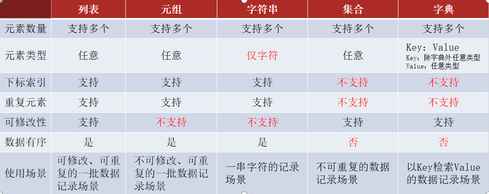

## Python学习笔记-数据容器

## 1. 前言

- 什么是容器？

容器是一种可以存储多个元素的Python数据类型

- python中的容器有哪些？

list(列表)、tuple(元组)、str(字符串)、set(集合)、dict(字典)

- 数据容器可以从以下视角进行简单的分类：
  - 是否支持下标索引
    支持：列表、元组、字符串 - 序列类型
    不支持：集合、字典 - 非序列类型
  - 是否支持重复元素：
    支持：列表、元组、字符串 - 序列类型
    不支持：集合、字典 - 非序列类型
  - 是否可以修改
    支持：列表、集合、字典
    不支持：元组、字符串



## 2. 容器分类

### 2.1 list 列表 

**列表：一批数据，可修改、可重复的存储场景**

- 列表的常用操作

``` python
"""
演示数据容器之：list列表的常用操作
"""

my_list = ["itheima", "itcast", "python"]

# 1. 查找元素下标
index = my_list.index("itheima")
print(index)

# 2. 添加元素，到任意下标位置
my_list.insert(1, "java")
print(my_list)

# 3. 添加元素，到末尾
my_list.append("Hadoop")
print(my_list)

# 4. 合并，追加到尾部
my_list.extend([1, 2, 3])
print(my_list)

# 5. 删除
my_list = ["itheima", "itcast", "python"]
# 5.1 删除，指定下标
del my_list[2]
print(my_list)

# 5.2 删除，返回被删除的元素
my_list = ["itheima", "itcast", "python"]
element = my_list.pop(1)
print(element)

# 5.3 删除，列表中第一个匹配的元素
my_list = ["itheima", "itcast", "python"]
my_list.remove("itcast")
print(my_list)

# 6. 清空
my_list = ["itheima", "itcast", "python"]
my_list.clear()
print(my_list)

# 7. 统计列表中元素的个数
my_list = ["itheima", "itheima", "itcast", "python"]
count = my_list.count("itheima")
print(count)

# 8. 集合的大小，长度
my_list = ["itheima", "itheima", "itcast", "python"]
length = len(my_list)
print(length)

```

- 列表的循环操作

``` python
"""
演示使用while和for循环遍历列表
"""


def list_while_func():
    """
    使用while循环遍历列表的演示函数
    :return: None
    """
    mylist = ["传智教育", "黑马程序员", "Python"]
    # 循环控制变量：通过下标索引来控制，默认是0
    # 每一次循环，将下标索引变量+1
    # 循环条件：下标索引变量 < 列表的元素数量

    # 定义一个变量，用来标记列表的下标
    index = 0       # 初始下标为0
    while index < len(mylist):
        # 通过index变量取出对应下标的元素
        element = mylist[index]
        print(f"列表的元素：{element}")

        # 至关重要：将循环变量（index）每一次循环都+1
        index += 1


def list_for_func():
    """
    使用for循环遍历列表的演示函数
    :return:
    """
    mylist = [1, 2, 3, 4, 5]
    # for 临时变量 in 数据容器:
    for element in mylist:
        print(f"列表的元素有：{element}")


if __name__ == '__main__':
    # list_while_func()
    list_for_func()
```

### 2.2 tuple 元组 

**元组：一批数据，不可修改、可重复的存储场景**

- 元组的基本操作

``` python
"""
演示tuple元组的定义和操作
"""

# 定义元组
t1 = (1, "Hello", True)
t2 = ()
t3 = tuple()
print(f"t1的类型是：{type(t1)}, 内容是：{t1}")
print(f"t2的类型是：{type(t2)}, 内容是：{t2}")
print(f"t3的类型是：{type(t3)}, 内容是：{t3}")

# 定义单个元素的元素
t4 = ("hello",)
print(f"t4的类型是：{type(t4)}, t4的内容是：{t4}")
# 元组的嵌套
t5 = ((1, 2, 3), (4, 5, 6))
print(f"t5的类型是：{type(t5)}, 内容是：{t5}")

# 下标索引去取出内容
num = t5[1][2]
print(f"从嵌套元组中取出的数据是：{num}")

# 元组的操作：index查找方法
t6 = ("传智教育", "黑马程序员", "Python")
index = t6.index("黑马程序员")
print(f"在元组t6中查找黑马程序员，的下标是：{index}")
# 元组的操作：count统计方法
t7 = ("传智教育", "黑马程序员", "黑马程序员", "黑马程序员", "Python")
num = t7.count("黑马程序员")
print(f"在元组t7中统计黑马程序员的数量有：{num}个")
# 元组的操作：len函数统计元组元素数量
t8 = ("传智教育", "黑马程序员", "黑马程序员", "黑马程序员", "Python")
num = len(t8)
print(f"t8元组中的元素有：{num}个")
# 元组的遍历：while
index = 0
while index < len(t8):
    print(f"元组的元素有：{t8[index]}")
    # 至关重要
    index += 1

# 元组的遍历：for
for element in t8:
    print(f"2元组的元素有：{element}")

# 修改元组内容，报错，不能修改
# t8[0] = "itcast"

# 定义一个元组
t9 = (1, 2, ["itheima", "itcast"])
print(f"t9的内容是：{t9}")
t9[2][0] = "黑马程序员"
t9[2][1] = "传智教育"
print(f"t9的内容是：{t9}")

```

### 2.3 set 集合 

**集合：一批数据，去重存储场景**

- set的常用操作

``` python
"""
演示数据容器集合的使用
"""

# 定义集合
my_set = {"传智教育", "黑马程序员", "itheima", "传智教育", "黑马程序员", "itheima", "传智教育", "黑马程序员", "itheima"}
my_set_empty = set()  # 定义空集合
print(f"my_set的内容是：{my_set}, 类型是：{type(my_set)}")
print(f"my_set_empty的内容是：{my_set_empty}, 类型是：{type(my_set_empty)}")

# 添加新元素
my_set.add("Python")
my_set.add("传智教育")  #
print(f"my_set添加元素后结果是：{my_set}")

# 移除元素
my_set.remove("黑马程序员")
print(f"my_set移除黑马程序员后，结果是：{my_set}")

# 随机取出一个元素
my_set = {"传智教育", "黑马程序员", "itheima"}
element = my_set.pop()
print(f"集合被取出元素是：{element}, 取出元素后：{my_set}")

# 清空集合, clear
my_set.clear()
print(f"集合被清空啦，结果是：{my_set}")

# 取2个集合的差集
set1 = {1, 2, 3}
set2 = {1, 5, 6}
set3 = set1.difference(set2)
print(f"取出差集后的结果是：{set3}")
print(f"取差集后，原有set1的内容：{set1}")
print(f"取差集后，原有set2的内容：{set2}")

# 消除2个集合的差集
set1 = {1, 2, 3}
set2 = {1, 5, 6}
set1.difference_update(set2)
print(f"消除差集后，集合1结果：{set1}")
print(f"消除差集后，集合2结果：{set2}")

# 2个集合合并为1个
set1 = {1, 2, 3}
set2 = {1, 5, 6}
set3 = set1.union(set2)
print(f"2集合合并结果：{set3}")
print(f"合并后集合1：{set1}")
print(f"合并后集合2：{set2}")

# 统计集合元素数量len()
set1 = {1, 2, 3, 4, 5, 1, 2, 3, 4, 5}
num = len(set1)
print(f"集合内的元素数量有：{num}个")

# 集合的遍历
# 集合不支持下标索引，不能用while循环
# 可以用for循环
set1 = {1, 2, 3, 4, 5}
for element in set1:
    print(f"集合的元素有：{element}")

```

### 2.4 dict 字典 

**字典：一批数据，可用Key检索Value的存储场景**

- 字典的常用操作

``` python
"""
演示字典的常用操作
"""
my_dict = {"周杰轮": 99, "林俊节": 88, "张学油": 77}

# 新增元素
my_dict["张信哲"] = 66
print(f"字典经过新增元素后，结果：{my_dict}")

# 更新元素
my_dict["周杰轮"] = 33
print(f"字典经过更新后，结果：{my_dict}")

# 删除元素
score = my_dict.pop("周杰轮")
print(f"字典中被移除了一个元素，结果：{my_dict}, 周杰轮的考试分数是：{score}")

# 清空元素, clear
my_dict.clear()
print(f"字典被清空了，内容是：{my_dict}")

# 获取全部的key
my_dict = {"周杰轮": 99, "林俊节": 88, "张学油": 77}
keys = my_dict.keys()
print(f"字典的全部keys是：{keys}")

# 遍历字典
# 方式1：通过获取到全部的key来完成遍历
for key in keys:
    print(f"字典的key是:{key}")
    print(f"字典的value是：{my_dict[key]}")

# 方式2：直接对字典进行for循环，每一次循环都是直接得到key
for key in my_dict:
    print(f"2字典的key是:{key}")
    print(f"2字典的value是：{my_dict[key]}")

# 统计字典内的元素数量, len()函数
num = len(my_dict)
print(f"字典中的元素数量有：{num}个")

```

### 2.5 容器通用功能

``` python
"""
演示数据容器的通用功能
"""
my_list = [1, 2, 3, 4, 5]
my_tuple = (1, 2, 3, 4, 5)
my_str = "abcdefg"
my_set = {1, 2, 3, 4, 5}
my_dict = {"key1": 1, "key2": 2, "key3": 3, "key4": 4, "key5": 5}

# len元素个数
print(f"列表 元素个数有：{len(my_list)}")
print(f"元组 元素个数有：{len(my_tuple)}")
print(f"字符串元素个数有：{len(my_str)}")
print(f"集合 元素个数有：{len(my_set)}")
print(f"字典 元素个数有：{len(my_dict)}")

# max最大元素
print(f"列表 最大的元素是：{max(my_list)}")
print(f"元组 最大的元素是：{max(my_tuple)}")
print(f"字符串最大的元素是：{max(my_str)}")
print(f"集合 最大的元素是：{max(my_set)}")
print(f"字典 最大的元素是：{max(my_dict)}")

# min最小元素
print(f"列表 最小的元素是：{min(my_list)}")
print(f"元组 最小的元素是：{min(my_tuple)}")
print(f"字符串最小的元素是：{min(my_str)}")
print(f"集合 最小的元素是：{min(my_set)}")
print(f"字典 最小的元素是：{min(my_dict)}")

# 类型转换: 容器转列表
print(f"列表转列表的结果是：{list(my_list)}")
print(f"元组转列表的结果是：{list(my_tuple)}")
print(f"字符串转列表结果是：{list(my_str)}")
print(f"集合转列表的结果是：{list(my_set)}")
print(f"字典转列表的结果是：{list(my_dict)}")

# 类型转换: 容器转元组
print(f"列表转元组的结果是：{tuple(my_list)}")
print(f"元组转元组的结果是：{tuple(my_tuple)}")
print(f"字符串转元组结果是：{tuple(my_str)}")
print(f"集合转元组的结果是：{tuple(my_set)}")
print(f"字典转元组的结果是：{tuple(my_dict)}")

# 类型转换: 容器转字符串
print(f"列表转字符串的结果是：{str(my_list)}")
print(f"元组转字符串的结果是：{str(my_tuple)}")
print(f"字符串转字符串结果是：{str(my_str)}")
print(f"集合转字符串的结果是：{str(my_set)}")
print(f"字典转字符串的结果是：{str(my_dict)}")

# 类型转换: 容器转集合
print(f"列表转集合的结果是：{set(my_list)}")
print(f"元组转集合的结果是：{set(my_tuple)}")
print(f"字符串转集合结果是：{set(my_str)}")
print(f"集合转集合的结果是：{set(my_set)}")
print(f"字典转集合的结果是：{set(my_dict)}")

# 进行容器的排序
my_list = [3, 1, 2, 5, 4]
my_tuple = (3, 1, 2, 5, 4)
my_str = "bdcefga"
my_set = {3, 1, 2, 5, 4}
my_dict = {"key3": 1, "key1": 2, "key2": 3, "key5": 4, "key4": 5}

print(f"列表对象的排序结果：{sorted(my_list)}")
print(f"元组对象的排序结果：{sorted(my_tuple)}")
print(f"字符串对象的排序结果：{sorted(my_str)}")
print(f"集合对象的排序结果：{sorted(my_set)}")
print(f"字典对象的排序结果：{sorted(my_dict)}")

print(f"列表对象的反向排序结果：{sorted(my_list, reverse=True)}")
print(f"元组对象的反向排序结果：{sorted(my_tuple, reverse=True)}")
print(f"字符串对象反向的排序结果：{sorted(my_str, reverse=True)}")
print(f"集合对象的反向排序结果：{sorted(my_set, reverse=True)}")
print(f"字典对象的反向排序结果：{sorted(my_dict, reverse=True)}")

```


